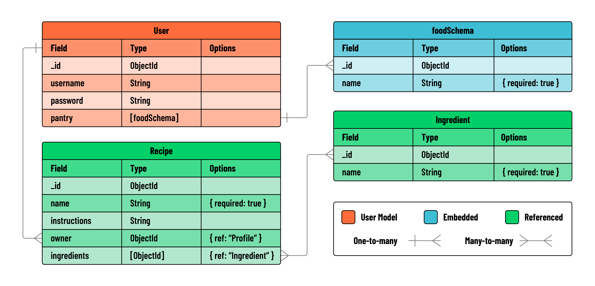

# Cookbook Lab: Relating Data with MEN Stack

## Overview

In this lab you’ll create the Cookbook app, a dynamic pantry manager for cooking enthusiasts! For this exercise, you’ll be practicing embedding a new data schema within a user model. Users will have the power to perform full CRUD operations to manage their pantry items with ease. They’ll also have the opportunity to explore other users’ pantries, drawing inspiration and sharing their love for cooking.

MVP: Your task is to perform full crud on items in a User’s `pantry` - an embedded data schema on the `user` model.

## User stories and application planning

Use the following user stories to guide the functionality and features of your application:

- As a User (AAU), I want to sign up for an account and sign in, so that I can access my personal user profile and manage my pantry.
- AAU, I want an easy and consistent way to navigate through the site, whether I am signed in or not. I need to quickly access options to sign up, sign in, view my pantry, or sign out, depending on my current status.
- AAU, I need a dedicated page to view all items in my pantry, to easily manage and review what I have stored.
- AAU, I want to easily find and click on an ‘Add New Item’ link, which takes me to a form for adding new items to my pantry
- AAU, after filling out the pantry item form, I want to submit it and receive confirmation that the item has been saved in my pantry.
- AAU, I need the ability to edit and delete items in my pantry, allowing me full control over managing my stored items.
- AAU, I am interested in viewing a list of all other app users, to foster a sense of community and interaction within the app.
- AAU, I want the option to click on another user’s profile and view all the items in their pantry, to exchange ideas or find inspiration for my own pantry.

## Data modeling and ERD

Your task is to create a `Pantry`, an embedded array within the `User` model. This array represents the user’s collection of food items. Because the pantry holds foods, the name of our schema will be `foodSchema`.

### Create the `Food` schema

Each user’s pantry will contain an array of `foods`, each defined by a simple schema:

| Property | Type   | Required |
| -------- | ------ | -------- |
| name     | String | true     |

1. Begin by defining `foodSchema` in the `user` model file using the `new mongoose.Schema` method. Include the necessary properties for food items.
2. Next, modify `userSchema` to include the `foodSchema`. Do this by adding a property named `pantry`. This property will utilize the `foodSchema` to represent a list of food items associated with a user.

Take at look at this ERD (Entity-Relationship Diagram) to help you visualize the relationships between these entities, `User` and `foodSchema`:

> [!NOTE]
> For this exercise, you can ignore the schemas for recipe and ingredient. Additional sections of this lab explore relating data using referencing.

## RESTful routes for managing data

Reference this chart when building your RESTful routes in your controller.

| Action | Route                               | HTTP Verb |
| ------ | ----------------------------------- | --------- |
| Index  | `/users/:userId/foods`              | GET       |
| New    | `/users/:userId/foods/new`          | GET       |
| Create | `/users/:userId/foods`              | POST      |
| Show   | `/users/:userId/foods/:itemId`      | GET       |
| Edit   | `/users/:userId/foods/:itemId/edit` | GET       |
| Update | `/users/:userId/foods/:itemId`      | PUT       |
| Delete | `/users/:userId/foods/:itemId`      | DELETE    |

## Structure and Setup

### 1. Build the controller

- Create a file called foods.js in the controllers directory.
- Require all essential modules at the top of foods.js
- Export your router for use in server.js

### 2. Use the controller in server

- Import the foods controller in server.js.
- Use middleware to direct incoming requests to /users/:userId/foods to the foods controller.

### 3. Add middleware

- Now you’ll need to add two middleware functions to your application:

  - one that restricts access to logged-in users only
  - one that makes the user object available to view templates via `res.locals`.

- Create a middleware folder in your project root. Inside this folder:

  - Create a file named `is-signed-in.js`.This function should:

    - include logic that checks if `req.session.user` exists.
    - If it does, allows the request to continue on the normal chain by invoking `next()`
    - If a user session does not exist, the user should be redirected to the sign in page.

  - Create a file named `pass-user-to-view.js` in the same `middleware` folder. This function should:

    - include logic that assigns `req.session.user` to `res.locals.user` (available in our views).
    - If no user is found, we set it to `null`. Then allow the request to continue on the normal chain by invoking `next()`.

- Import and include both middleware functions above all of the routes and controllers in `server.js`.

> [!TIP]
> These middleware functions should run before any routes that check for a valid user or require a user to be signed in to view a page.
> For this application, users must be signed in to view any of the routes associated with their pantry. Therefore, `isSignedIn` should come above the `foods` controller, but not before `auth`.

### 4. Build the `nav` partial

- Create a directory called `partials` inside the `views` directory.
- Inside partials, create a new file called `_navbar.ejs`
- This nav should have a `home` link displayed on every page.
- Other links should be
- rendered conditionally based on whether or not a `user` is signed in.
- If a `user` is signed in, they should see links to “View my Pantry” or “Sign Out”.
- If a `user` is not signed in, they should see links to “Sign In” or “Sign Up”.
