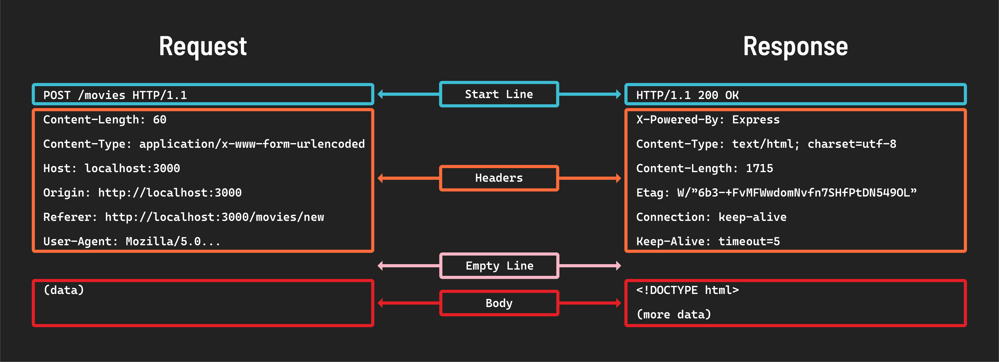

# Lecture: HTTP Request Response Cycle

## Module: Intro

**Hypertext Transfer Protocol** (HTTP) is a set of _rules_ apps follow when communicating with each other. The _rules_ are to ensure client and server can reliably communicate with each other. The request/response cycle interactions make up the **protocol**.

### The Cycle

1. Client sends an HTTP **request** (i.e. User clicking a link).
2. Server issues an HTTP response to said **request** (i.e. Responds with the new HTML page and renders in browser).

### Stages of the Request/Response Cycle

1. User _interacts_ with the client software (i.e. User clicking a link, submitting form, or navigating to a URL) the browser _prepares_ to send a **request** to the server.
2. Client software processes user interaction and relays the HTTP **request**. Browser turns the action into an HTTP **request** including the selection of the correct **method** (i.e. `GET` or `POST`), the URL, and more details like the browser type.
3. The server _receives_ the **request** and decides what action to take.
4. The server _prepares_ its **response**.
5. Server _returns_ a **response** message. The **response** includes a **status** code (i.e. `200` for success) and the data requested.
6. The clients _processes_ the **response**. The browser receives the **response** and acts on it (i.e. Rendering a page).
7. Once the client receives the **response** the request/response cycle has ended and no further HTTP communication occurs.

## Module: HTTP Methods

HTTP Methods indicate the desired action to be performed on a given resource on the server. Also known as **HTTP Verbs**.

### Four Primary HTTP Methods

- `GET`: Requests a specific resource from the server (Retrieves data).
- `POST`: Sends data to the server (i.e. Creates a new resource).
- `PUT`: Sends data to the server to update an existing resource.
- `DELETE`: Requests removal of a specified resource from the server.
- Other methods [described here](https://developer.mozilla.org/en-US/docs/Web/HTTP/Reference/Methods).

## Module: HTTP Request/Response Messages

HTTP messages are how requests and responses are made between clients and servers. They are handled by the browser/server and follow a specific format and there are two main types of messages:

1. Request for info.
2. Response to request.

Both types of messages have a _Start line_, followed by _Headers_, and _Empty line_, and the _Body_ of the message.

### Breakdown of Each Part

- **_Start line_**: Every HTTP request message begins with a start line with **method** followed by `path/endpoint` such as: `GET /movies`.
  - **HTTP Method**: Action to be performed.
  - **Path/endpoint**: Location of server resource the request is targeting.
  - **HTTP Status Codes**: Result of the request/response transaction.
    - **1xx (Informational)**: The server got request.
    - **2xx (Success)**: The request worked and processed.
    - **3xx (Redirection)**: Server tells client to make another request at a different location (Usually automatic).
    - **4xx (Client Error)**: Indicates mistake on client end.
    - **5xx (Server Error)**: Indicates that server could not complete request. Issue on server end.
    - **Other** request status codes [found here](https://developer.mozilla.org/en-US/docs/Web/HTTP/Reference/Status).
- **_Message headers_**: HTTP headers act as the messenger that carries more info and instruction alongside the main content.
  - **Request headers**: Accompany HTTP request and provide context about the request to help the server understand.
  - **Response headers**: Included in the HTTP response from the server and give the client extra info about the response and how to handle it.
- **_Message body_**: Carries the actual data that needs to be communicated. When client sends a request to the server it may include data necessary for said request (Common in `POST` requests like a form submission). The server response often includes a body which contains requested data (i.e. HTML to be displayed).

## Module: Send HTTP Requests from Browser

Browser provide several ways to initiate and HTTP request depending on the scenario (i.e. `GET` for using address bar, `POST/GET` for form submission or search bars, `GET` for link clicking, and `All` for executing JS).

### Uniform Resource Locator (URL)

Commonly known as a web address. Its primary function is to _identify_ and _locate_ a resource (i.e. `GET`).

> [!NOTE]
> Other methods such as `POST` or `PUT` require more info than a URL can provide that is included in the request message.

#### Anatomy of a URL

- **_Common URLs_**: `https://evanmarshall.dev`
  - The `https://` is the protocol and the rest is the domain name.
- **_Local URLs_**: Used for local development.
  - `http://localhost:3000/tacos` (Server runs locally on computer): The `http://` again is the protocol, `localhost` is the domain name, `:3000` is the port, and `/tacos` is the path.
- **_Complex URLs w/ Query Parameters_**: Typically used for specific and dynamic request on the internet (Interacting with online resources). The **query** is to allow users to find specific info on a website.
  - `https://developer.mozilla.org/search?q=reduce`: The `https://` is the protocol, `developer.` is the subdomain, `mozilla.org` is the domain name, `/search` is the path, `?` is the query, and `q=reduce` are the parameters (key=value pair).
