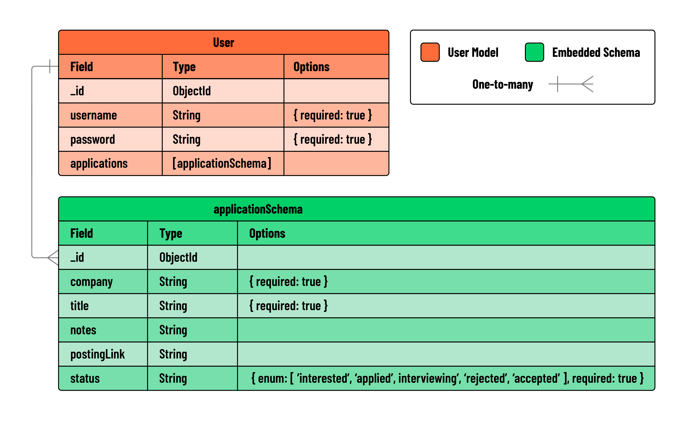

# Skyrockit

## Shaping the data

The foundation of any complex application lies in how its data is structured. For Skyrockit, our focus will be on creating a well-defined schema for “job application” data. For this build, we are choosing to **embed** our job application data directly within our user model. This approach not only simplifies the data architecture, but also improves performance by making data retrieval more efficient.

## User Story

> As a user, I want to be able to add new job applications that I’m thinking about applying to or have already applied to. For each job, I should be able to note down important stuff like the company’s name, the job title, what stage the application is at, and if I want, some personal notes and the link to the job posting. As a user, I want to see all the jobs I’ve applied for in one place. This page should just show the job title and the company name for each job to keep it simple and easy to look at. As a user, I need to be able to click on any job in my list and see all the details about it on a new page. This includes everything I’ve recorded about that job application. As a user, when I’m looking at all the details of a job application, I want to be able to change any of the information. There should be an easy-to-find link that takes me to a different page where I can make these changes and then save them. As a user, if I’m looking at the details of a job application, I want a simple way to delete it completely, like clicking a ‘Delete’ button.

You might notice that the above user stories give us a good idea of what CRUD functions a user might want to perform on our applications. Also, take note of how our first user story gives us some context as to how we might structure our data (“company name”, “job title”, “status”, and optional “notes”) While these categories may not be the final names we give for data in our schema, they give us a high level guide we can refer back to when making decisions about how we structure data.

## Planning the routes

Let's go ahead and establish the RESTful routing for app:

| Action | Route                                             | HTTP Verb |
| ------ | ------------------------------------------------- | --------- |
| Index  | `/users/:userId/applications`                     | GET       |
| New    | `/users/:userId/applications/new`                 | GET       |
| Create | `/users/:userId/applications`                     | POST      |
| Show   | `/users/:userId/applications/:applicationId`      | GET       |
| Edit   | `/users/:userId/applications/:applicationId/edit` | GET       |
| Update | `/users/:userId/applications/:applicationId`      | PUT       |
| Delete | `/users/:userId/applications/:applicationId`      | DELETE    |

**Note**: We are including the `userId` in the route since we are nesting our applications within the user object.

## Create an ERD

After we’ve nailed down our user stories, our next step is to map out our data’s structure. For this, we create an ERD, or Entity Relationship Diagram. This visual tool will chart out the names we’ll use for our data properties, the types of data we’ll be working with, and how different pieces of data are connected.

An ERD is like a blueprint for your data. It doesn’t involve any coding, but it’s essential for planning and understanding your data’s layout, both for you and anyone else who works on the project. As your application evolves and becomes more complex, you can update the ERD to keep pace. It’s a living document that guides you through the development journey, ensuring you and your team always have a clear picture of how your data is organized and connected.

Below is an example of the ERD we will be using for Skyrockit:

- Use draw.io, excalidraw, and mermaid (built into github repos) to create ERDs.

## Embedding data

In our ERD, we’ve opted for an **_embedded relationship model_**, where the job application data is directly incorporated into the **user** model. This approach was intentional because it makes data retrieval much easier in our application. By embedding the application data within the user’s document, we minimize the need for multiple database read operations. Since users are already logged in, their associated applications are embedded within their own user document.

This embedded model enhances performance by reducing the need for extensive database queries. It’s a strategic decision that aligns well with the typical flow and structure of our application.

For those curious about the nuances between embedding and referencing data in MongoDB, and when to use each approach, consider exploring [this informative article](https://www.mongodb.com/docs/manual/data-modeling/). It offers a deeper dive into data modeling strategies, helping you make informed choices in your MongoDB schema design for future projects!

## Overview of Skyrockit

As we wrap up the Skyrockit project, let’s reflect on our journey and the architecture of the application we’ve developed.

Understanding CRUD and user stories
Our starting point was the user stories, which outlined the need for CRUD functionalities in the app. These included creating, viewing, updating, and deleting job applications - all essential actions for a user-centered job application tracker.

Data architecture and user-application relationship
Our app was designed to have individual users, each with their own set of job applications. These applications are unique to each user, emphasizing a one-to-many relationship: a single User is linked to multiple Applications, but each Application is specifically tied to one User. To efficiently manage this relationship, we chose to embed the Application data directly within the User data.

This embedding means that each User document in our database contains its own collection of Application sub-documents. The advantage of this approach is clear: we can retrieve all of a User’s Applications with just one database query, enhancing efficiency and performance. Moreover, this structure ensures data privacy and integrity, as users can only access and interact with the Applications they have created, maintaining a distinct separation or ‘silo’ for each user within the application.

Navigating with req.session.user
In a user-centric application, where data (like job applications) is closely tied to individual user accounts, it’s essential to constantly identify the active user. This ensures that the data being accessed, modified, or deleted is correct and specific to the logged-in user. The use of req.session.user effectively maintains user state across different requests, which is a fundamental aspect of personalized web services.

The custom middleware that transfers req.session.user to req.locals.user simplifies the process of passing the current user’s data to views. This design pattern enhances security and user experience by ensuring that actions and data are relevant to the currently logged-in user, thus preventing unauthorized access or modification of other users’ data.

Implementing CRUD functionality in 5 repeatable steps
We began by determining the appropriate RESTful route for each functionality.
Then, we created the UI elements to initiate the corresponding HTTP requests.
Each route was defined in our controller module to handle these requests.
Controller actions were then implemented to carry out the necessary CRUD operations.
For GET requests, we rendered view templates, passing along the necessary data. This involved creating and coding view templates where needed. For operations that altered data (POST, PUT, DELETE), we implemented redirects to relevant routes, ensuring a seamless user experience.
This approach allowed us to systematically build each feature of Skyrockit, ensuring it met both our initial user stories and the functionality required for an effective job application tracking system.
