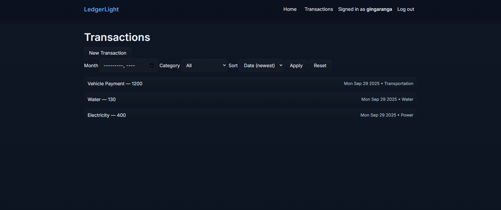

# LedgerLight


A simple, secure, session‑based personal finance tracker built with the MEN stack (MongoDB, Express, Node) and EJS templates. Track income and expenses, filter by month or category, and manage your transactions with full CRUD—only you can see and modify your own data.



## Overview

LedgerLight was built to practice full‑stack fundamentals: secure authentication, authorization, RESTful routing, server‑rendered views, and a clean, accessible UI. It implements per‑user data ownership, CSRF protection, a strict Content Security Policy, and Mongo‑backed sessions so you can deploy with confidence.

### Core features

- Account registration and login with bcrypt password hashing
- Session‑based auth with MongoDB session store; logout support
- Transactions: create, read, update, delete (CRUD)
- Per‑user authorization: only the owner can view/edit/delete their data
- Filters and sorting on transactions list:
  - Filter by month (YYYY‑MM) and category
  - Sort by date or title, ascending/descending
- CSRF protection and Helmet security headers (including a restrictive CSP)
- Method override to support PUT/DELETE from HTML forms (`?_method=PUT`)
- Flash messages and clean, accessible server‑rendered EJS views

## Getting started

### Deployed app and planning materials

- Deployed app: [https://ledger-light-3d68c6f45346.herokuapp.com](https://ledger-light-3d68c6f45346.herokuapp.com)
- Trello (planning): [https://trello.com/b/zVqBrZsS/ledger-light](https://trello.com/b/zVqBrZsS/ledger-light)

If you share those links, we’ll update them here.

### Prerequisites

- Node.js 18+ (LTS recommended)
- pnpm (project uses a `pnpm-lock.yaml`)
- A MongoDB instance/connection string

### Environment configuration

Create a `.env` file at the project root with:

```ini
MONGO_URI=mongodb+srv://<user>:<password>@<cluster>/<db>?retryWrites=true&w=majority
SESSION_SECRET=<a-long-random-string>
PORT=1986            # optional, defaults to 1986
NODE_ENV=development # optional
```

Required vars are validated on boot. If any are missing, the server will exit with a helpful error.

### Install and run

```sh
pnpm install
pnpm dev
```

Then open [http://localhost:1986](http://localhost:1986).

Available scripts:

- `pnpm dev` – start in watch mode with nodemon
- `pnpm start` – start the server (production‑style)

### Quick tour

- Home: `/`
- Register: `/auth/register`
- Sign in: `/auth/login`
- Transactions index: `/transactions`
  - Query params: `?month=YYYY-MM&category=Food&sort=date_desc`

Forms that change state include a CSRF token; when creating your own forms, include:

```ejs
<% if (csrfToken) { %>
  <input type="hidden" name="_csrf" value="<%= csrfToken %>">
<% } %>
```

HTML forms can use PUT/DELETE via the `method-override` query param:

```html
<form action="/transactions/<%= tx._id %>?_method=DELETE" method="post">
  <button type="submit">Delete</button>
  <!-- include the CSRF hidden input as above -->
</form>
```

## Data model

User

- `email` (unique, required)
- `username` (unique, required, lowercase)
- `passwordHash` (bcrypt)

Transaction

- `title` (required)
- `amount` (Number, required)
- `date` (Date, defaults to now)
- `category` (String)
- `notes` (String)
- `owner` (ObjectId → User, required)

## Technologies used

- Runtime: Node.js, pnpm
- Web framework: Express 5
- Views: EJS templating
- Database/ODM: MongoDB + Mongoose
- Sessions: express‑session + connect‑mongo
- Auth: bcrypt for password hashing
- Security: Helmet (CSP, headers), custom CSRF middleware, SameSite=strict cookies
- Utilities: method‑override, morgan
- Styling: custom CSS with modern variables and accessible focus styles

## Attributions

- Typeface: Inter by Rasmus Andersson — served via Google Fonts, licensed under the SIL Open Font License. [https://fonts.google.com/specimen/Inter](https://fonts.google.com/specimen/Inter)

If you add third‑party icons, images, or other assets that require attribution, list them here with links to the source and license.

## Configuration notes

- Default port is `1986`. Override with `PORT`.
- The CSP is intentionally strict. If you load external assets (e.g., fonts, analytics), update the Helmet `contentSecurityPolicy` directives in `server.js` accordingly (e.g., add `fontSrc: ["'self'", "https:", "data:"]`).
- Sessions are stored in MongoDB and cookies are `HttpOnly` and `SameSite=strict`. In production, cookies are marked `Secure`.

## Next steps (stretch goals)

- Budgets and category summaries; charts (e.g., Chart.js) for monthly trends
- Export/import (CSV), and bulk actions
- Recurring transactions and reminders
- Pagination and full‑text search
- Tags in addition to categories; custom category management
- Account types (cash, bank, credit) and multi‑currency support
- Password reset flow, email verification, optional 2FA
- Rate limiting and login throttling; audit logging
- API endpoints (JSON) and a small SPA client
- Dockerfile and one‑click deployment scripts

## Project structure

```text
.
├── .env
├── .gitignore
├── package.json
├── pnpm-lock.yaml
├── pnpm-workspace.yaml
├── README.md
├── server.js
├── config/
│   └── index.js
├── controllers/
│   ├── authController.js
│   └── transactionsController.js
├── middleware/
│   ├── auth.js
│   ├── csrf.js
│   └── flash.js
├── models/
│   ├── transaction.js
│   └── user.js
├── public/
│   ├── images/
│   │   ├── app-screenshot.png
│   │   └── example-trello.png
│   ├── js/
│   │   └── main.js
│   └── styles/
│       ├── auth.css
│       ├── globals.css
│       ├── partials.css
│       └── transactions.css
├── routes/
│   ├── auth.js
│   ├── index.js
│   └── transactions.js
└── views/
    ├── index.ejs
    ├── auth/
    │   ├── login.ejs
    │   └── register.ejs
    ├── partials/
    │   ├── _flash.ejs
    │   ├── _head.ejs
    │   └── _navbar.ejs
    └── transactions/
        ├── edit.ejs
        ├── index.ejs
        ├── new.ejs
        └── show.ejs
```

## Deployment (Heroku)

Below is a minimal, production‑safe setup for deploying to Heroku using the official Node.js buildpack.

1. Create the app and set config vars

```sh
# create an app (or use the Heroku Dashboard GitHub integration)
heroku create ledger-light

# required configuration
heroku config:set MONGO_URI="<your-mongodb-uri>"
heroku config:set SESSION_SECRET="<a-long-random-string>"
heroku config:set NODE_ENV=production
```

1. Ensure the web process starts your server

Heroku runs `pnpm start` by default. This project’s start script runs `node server.js`, which is compatible.

Optional: add a Procfile if you prefer explicitness:

```procfile
web: node server.js
```

1. Trust proxy for secure cookies (recommended)

Heroku terminates TLS at the router. To allow `secure` cookies to be set correctly behind the proxy, enable trust proxy in production (place before session middleware):

```js
// server.js
if (process.env.NODE_ENV === "production") {
  ledgerApp.set("trust proxy", 1);
}
```

1. Deploy

```sh
# if using git push workflow
git push heroku main

# then open the app
heroku open
```

If you run into CSP issues after adding third‑party assets, update the Helmet `contentSecurityPolicy` directives in `server.js` (e.g., allow external font or script hosts).
