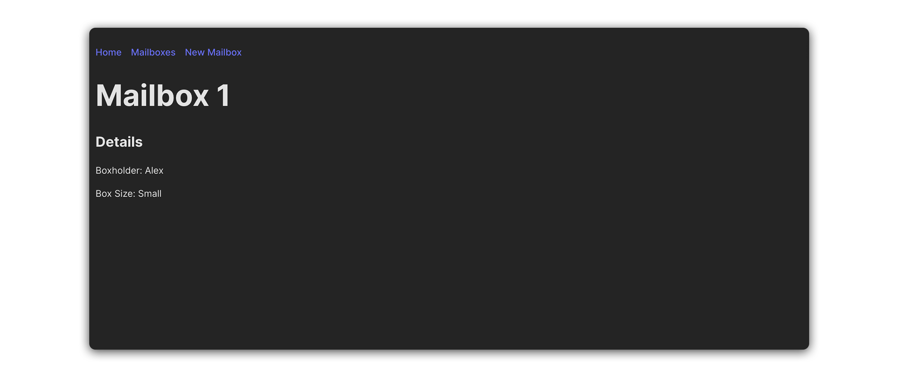
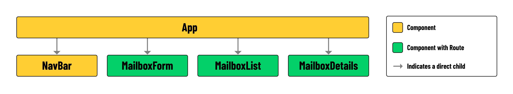

# React Router DOM Lab - Reactville Mailbox

## Overview

Each “mailbox” in this lab represents a type of post office box, often called a PO Box. In this lab, each mailbox will have:

- A unique box number (`_id`)
- The name of the box owner (`boxOwner`)
- The size of the box (`boxSize`), such as Small, Medium, or Large





## App Structure



In the list below, you'll find a brief description of the role of each component in our app:

- **App**: The root component that orchestrates the entire application.
- **NavBar**: Provides navigation links.
- **MailboxForm**: Allows users to enter details for and submit new mailboxes.
- **MailboxList**: Displays an index list of all mailboxes.
- **MailboxDetails**: Shows details about a specific mailbox.

## User Stories

- As a user, I should see a nav bar with links at the top of each page in the application.
- As a user, clicking on the 'Home' link should navigate me to a landing page that displays the text 'Post Office'.
- As a user, clicking on the 'New Mailbox' link should navigate me to a page with a form for submitting new mailboxes.
- As a user, when viewing the form on the 'New Mailbox' page, I should see a `<form>` with an `<input>` for the name of the `boxOwner` and a `<select>` menu for the `boxSize`. The `<select>` menu should include three options: 'Small', 'Medium', and 'Large'.
- As a user, I should not be required to select a box number when creating a new mailbox. When a new mailbox is created, it should be assigned a box number, or `_id`, automatically. This number should increment based on the number of mailboxes that already exist.
- As a user, when I submit the 'New Mailbox' form, I should be redirected to the 'Mailboxes' page (`/mailboxes`) where I will see the newly created mailbox added to the list.
- As a user, clicking on the 'Mailboxes' link should navigate me to a 'Mailboxes' page.
- As a user, when viewing the 'Mailboxes' page, I should be able to see a list of all the existing mailboxes. Each mailbox in the list should be a square container with a box number `_id`.
- As a user, when viewing the 'Mailboxes' list page, I want to be able to click on a mailbox, and be directed to a mailbox details page.
- As a user, when viewing the details page, I should see details about a specific mailbox. The details should include the box number (`_id`), the name of the box owner, and the box size.
- As a user, I should see the message 'Mailbox Not Found!' if I navigate to the details page for a mailbox that does not exist.

## Instructions

To get started, follow the steps below:

1. Start by creating each of the components listed below. After creating each component, be sure to import them at the top of `src/App.jsx`.
   - `src/components/NavBar/NavBar.jsx`
   - `src/components/MailboxForm/MailboxForm.jsx`
   - `src/components/MailboxList/MailboxList.jsx`
   - `src/components/MailboxDetails/MailboxDetails.jsx`
2. Within `NavBar.jsx`, import `NavLink` from `react-router` and create a `<NavLink>` for each destination in the table below:

   | Destination | `to`           | Text Content |
   | ----------- | -------------- | ------------ |
   | Home        | `/`            | Home         |
   | MailboxList | `/mailboxes`   | Mailboxes    |
   | MailboxForm | `/new-mailbox` | New Mailbox  |

3. In `App.jsx`, import `Route` and `Routes` from `react-router` and create a `<Route>` for each destination in the table below:

   | Destination    | `path`                  | `element`              |
   | -------------- | ----------------------- | ---------------------- |
   | Home           | `/`                     | `<h1>Post Office</h1>` |
   | MailboxList    | `/mailboxes`            | `<MailboxList />`      |
   | MailboxDetails | `/mailboxes/:mailboxId` | `<MailboxDetails />`   |
   | MailboxForm    | `/new-mailbox`          | `<MailboxForm />`      |

4. In `App.jsx`, import `useState` from `react` and create a new `useState` variable called `mailboxes`. Set its initial state to an empty array (`[]`).
5. In `App.jsx`, build the scaffolding for a function called `addBox`. It should accept form data for a new mailbox and `setMailboxes` state accordingly.

## Hints

1. The `mailboxes` `useState` variable will be used to store an array of objects, each object representing a mailbox. Each mailbox object should adhere to the shape outlined below:

```json
{
  _id: 1,
  boxSize: 'Small',
  boxOwner: 'Alex',
};

```

2. New mailboxes should receive a box number or `_id` property automatically. A good place to handle this would be the `addBox` function in `App.jsx`. The value of the `_id` property can be derived by adding 1 to the current `length` of `mailboxes` state. This value can be added to the submitted form data before the object is set in state.
3. When building out `MailboxDetails.jsx`, the `useParams()` hook will be useful. You can use the value extracted from the URL params to `find()` a specific mailbox in `mailboxes` state.

```jsx
// src/components/MailboxDetails/MailboxDetails.jsx

const { mailboxId } = useParams();
const selectedBox = props.mailboxes.find(
  (mailbox) => mailbox._id === Number(mailboxId)
);
```

4. From the user stories:
   - “Each mailbox in the list should be a square container with a box number `_id`.”
   - We’ve included a CSS class called `.mail-box`, where should you place it?
