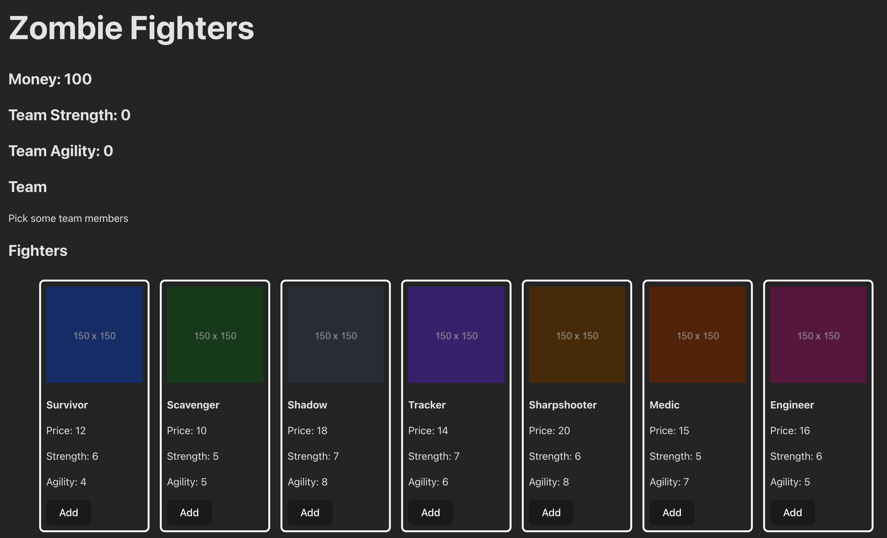

# React - State Management Lab

## Overview

Welcome to the React State Management Lab! In this lab, we’ll interact with state to better understand how to manage it in a React application. Your task is to assemble a team of characters to survive a zombie apocalypse. You will:

- Add characters to your team from a given list.
- Remove characters from your team.
- Display the team’s total cost, strength, and agility.

## Getting Started

1. Create a new state variable named team and set the initial state to an empty array [].
2. Create a new state variable named money and set the initial state to 100.
3. Create a new state variable named zombieFighters and set the initial state to the fighters array of objects.
4. Display the list of zombieFighters by mapping the array into the UI of App.jsx.
5. Display the current value of money in the UI.
6. Create a function named handleAddFighter(). It should accept a fighter object as an argument. This function will be triggered when you click the Add button for any character in the zombieFighters list.

- When you click Add on a character, this function should add the selected character’s object to the existing team state array. This is how you build your team.
- You’ll also need to remove the character from the zombieFighters state so they can’t be added again. To do this, you’ll need to determine which character needs to be removed. Notice how each fighter has a unique id? Maybe you could use that to help you decide which one needs to be removed.
- Once the character to be removed is identified, the zombieFighters state should be updated to exclude this character. This can be achieved by creating a new array that filters out the selected character. Once you have the new array, use it to set the zombieFighters state.
- Each character comes with a price. Upon adding a character to your team, subtract the character’s price from your current money value. Think of it as spending money to recruit a team member.
- Before adding a character to the team, check if you have enough money to afford them. If your money is less than the character’s price, you shouldn’t be able to add them. In such cases, log a message to the console, such as "Not enough money".

7. Now that you can add characters to your team let’s focus on displaying and managing them within your application’s interface.

- First, verify if your team array has any characters in it. If the team array length is 0, display Pick some team members! in the UI.
- If there are characters in your team, display each one in the UI. For each character in the team array, show their name, image, price, strength, and agility. Follow the same pattern you used to display the array of all characters.

8. Display the team’s total strength: In this step, you’ll create a variable to keep track of the total strength of your team and display it in the UI.

- Create a regular variable named totalStrength. This does not need to be a state variable.
- Calculate the total strength of the team and assign it to the totalStrength variable. This calculation should sum up the strength values of all characters currently on the team!
- Show the value of totalStrength in the UI. If the team array is empty, totalStrength should be 0.

> 🧠 Why doesn’t totalStrength need to be a state variable? Recall that every time a component is re-rendered in React, the code in that component re-runs. When the component re-renders, we can calculate the total strength of the team based on the data from the team state at that time.

> If the team state changes, a re-render will be triggered, and totalStrength will be recalculated with the new team data.

> Put another way, the only reason to create state variables is to use them to trigger re-renders or persist data between re-renders. Creating unneeded state variables only serves to add unnecessary complications.

> With this in mind, what value are we holding in state now that could also be a regular variable? You don’t need to refactor your existing code to remove it from state - just identifying it is valuable.

9. Display the team’s total agility: Create a variable for the total agility of your team and display this value in the UI.

- Create a variable named totalAgility. Just like with totalStrength, this should not be a state variable.
- Just like with strength, calculate the total agility of the team and assign it to the totalAgility variable. This should be the sum of the team members’ agility values.
- The value of totalAgility should be displayed in the UI. As with strength, if your team is empty, totalAgility will be 0.

10. Add a Remove button to each of the characters on your team. This button, when clicked, should call a handler function to remove the character from your team.
11. Create a function named handleRemoveFighter(). It should accept a fighter object as an argument. This handler function is key to managing your team. This function enables you to remove characters and adjust your total money.

- This function will be executed when you click the Remove button for a character in your team.
- In the function, determine which character needs to be removed based on user interaction (This will look very similar to what you did in the handleAddFighter() function).
- Once the character to be removed is identified, the team state should be updated to exclude this character. This can be achieved by creating a new array that filters out the selected character. Once you have the new array, use it to set the team state.
- The character that was removed from the team state should be added to the zombieFighters array.
- Increase the money state by the price of the removed character, effectively refunding the cost to your budget.
- Ensure that the UI reflects the removal of the character from your team. This includes updates to the total strength and agility displays, as well as the available money.

## Hints

- You should never change state directly. If you need to make a copy of an array, you can use the syntax const copyArray = [...sourceArray].
- You can use any method you’d like to get the total strength and agility of the team - the array’s reduce() method may be handy here, but any loop that will find the sum of these attributes will work.
- Optionally, if you want to add some polish to the app, you could replace the placeholder images with character images. An AI assistant may be helpful in this task.
- Optionally, you could also make it so a message displays in the browser when there isn’t enough budget to add a team member.
