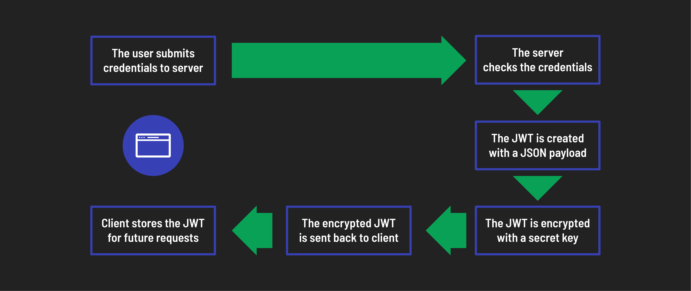

# Express API with JWT Authentication

## Foundations

APIs often require authentication for you to use them - that is, some way of knowing who you are. They’ll also usually manage resource access, which we call authorization. We’ll frequently use these two words together, but they handle two distinct parts of an application.

| Authentication                           | Authorization                              |
| ---------------------------------------- | ------------------------------------------ |
| Confirms users are who they say they are | Manages user access to different resources |

### Token authentication with JWT

There are many ways to manage authentication, but we’ll focus on Token Authentication in this lesson. This style of authentication in HTTP uses tokens, or unique identifier strings, to allow a server to determine who a user is when they make an authenticated request.

JSON Web Tokens (JWT) are a type of token authentication. JWT utilizes a JSON-formatted token that is signed with a secret key. This token is then sent to the client, who sends it back to the server with every request. The server can then verify the token and use its data to authenticate the user.

### Anatomy of a JWT

A JSON Web Token consists of three main parts:

1. **Header**: The header tells us two key things: what type of token this is (which is always JWT) and what method (algorithm) was used to secure it, like HMAC SHA256 or RSA. It’s just a short piece of JSON code that has been encoded to be safe for URLs. Do not confuse with encryption; encoding is simply a way to format data for transmission.

2. **Payload**: This part contains the claims - information about the user or the system that created the token. The payload can include data like the user’s ID or the token’s expiration time. Like the header, it’s encoded to be URL-safe.

3. **Signature**: The signature is used to ensure the token hasn’t been altered after it was issued and to verify that it’s truly from the source it claims to be from. It’s created by taking the encoded header, the encoded payload, and a secret key and then applying the algorithm specified in the header.

These parts are concatenated with dots (.) separating them, forming the compact form of the JWT: header.payload.signature. This structure ensures that JWTs are URL-safe, meaning they can be passed in HTTP environments without causing issues with encoding.

### Authentication flow with JWT

#### Token is generated upon user login (AUTHENTICATION FLOW)

1. **User login**: The user submits their credentials (username and password) to the server.
2. **Verify credentials**: The server checks the credentials. If they are valid, a JWT will be generated.
3. **Create JWT**: The JWT is created with a JSON payload that includes user details such as user ID and username. This payload may also contain roles or permissions.
4. **Encrypt token**: The JWT is then encrypted with a secret key only known to the server, resulting in a secure, encrypted token.
5. **Issue token**: After successful authentication, the encrypted JWT is returned to the client.
6. **Store token**: The client securely stores the JWT, typically in local storage or cookies, ready for future requests.

#### The token is used for future requests to the server (AUTHORIZATION FLOW)

1. **Include token in requests**: For requests to access protected resources, the client includes the stored JWT in the HTTP headers.
2. **Extract and decrypt token**: The server extracts the JWT from the headers, decrypts it with its secret key, and verifies its authenticity.
3. **Verify payload**: The server reads the JSON payload to authenticate the user by verifying details such as user existence, permissions, and token expiry.
4. **Grant access**: The server grants access to the requested resource if the JWT is valid and the user is authenticated.

In conclusion, JWTs are an efficient, modern solution for securing web applications, providing a way to verify users and manage their access to resources in one reusable token. Understanding JWTs helps you build web applications that are both secure and scalable.
