# Intro to Django

## Concepts

### What is Django

Django is by far the most popular Python-based web framework, and its popularity continues to grow thanks to the growth of Python itself.

Django is specifically engineered to develop highly secure web applications rapidly. It provides a rich set of tools and features that streamline the creation of complex, data-driven sites. Django follows the “batteries-included” philosophy, meaning it includes built-in solutions for many of the common challenges in web development, such as user authentication, site maps, and content administration.

These components are designed to work together seamlessly, which allows developers to focus on the unique features of their web applications without worrying about the underlying infrastructure.

### Advantages of Django

- **Object-relational mapper (ORM)**: Django’s ORM provides a high-level abstraction, allowing developers to interact with databases using Python rather than SQL. This enables developers to write database queries using Python code, making it simpler to create, retrieve, update, and delete database entries.
- **Built-in administrative interface**: Django includes a ready-to-use admin interface that allows developers and site administrators to manage database data through a web interface. This powerful tool facilitates quick interactions with databases right out of the box.
- **Comprehensive user authentication**: Its user authentication system handles user accounts, groups, permissions, and cookie-based user sessions. This built-in capability makes it easier to develop secure sites and reduces the amount of code developers need to write.
- **A rich ecosystem of tools and libraries**: Django provides numerous built-in features for common web development needs, such as sending emails, generating RSS feeds, and managing content in various languages.
- **Strong community and documentation**: Django benefits from extensive, well-maintained documentation and a large, active community. This network provides substantial support for troubleshooting, sharing knowledge, and extending the capabilities of your applications through third-party packages.

### Express vs Django

#### Express

Express is characterized as a minimalist framework, offering just enough tools to get started but not much beyond the basics. This approach provides the flexibility to define routes, map controller actions, and render dynamic views according to your project’s needs. The lack of rigid structure means file naming and organization are left largely to the developer’s discretion. When additional functionality is required, it typically involves integrating and configuring middleware or outside libraries. This setup is ideal if you appreciate a “build-it-your-way” philosophy.

#### Django

Transitioning to Django, you’ll encounter a contrastingly different environment. Django is a full-featured framework, designed to include a comprehensive suite of built-in functionalities. It adheres to a strict set of conventions, guiding you on how to structure your code, name your files, and even how to handle database operations. This structured approach is accompanied by numerous helper classes and methods, simplifying tasks that in Express might require additional packages.

## Architecture

### Request/Response Cycle in Django

If you have experience with Express, you’ve learned that interacting with a web application involves a series of HTTP requests and responses:

- User actions like clicking links or submitting forms generate HTTP requests.
- These requests are handled by a server’s routing system, which directs them to the appropriate code.
- The code then executes CRUD operations. Depending on the operation, the server might render dynamic content for ‘Read’ operations or issue redirects for ‘Create’, ‘Update’, or ‘Delete’ operations.

In Django, the HTTP request/response cycle is managed by built-in components, which simplifies much of the setup process. This integration can greatly benefit newcomers to web development or anyone who wants to simplify their application’s infrastructure.

Django adopts the Model-View-Template (MVT) architecture, a variant of the more widely known Model-View-Controller (MVC) architecture. While both architectures aim to separate concerns within an application, Django’s MVT architecture has distinct roles for each component.


- **Model**: Defines the data structure. These are Python classes that define the fields and behaviors of the data you’re storing. Django models can interact with a database seamlessly to retrieve, store, update, and delete data.
- **View**: Handles the business logic and is the bridge between models and templates. In Django, views retrieve data from the models and pass it to the templates. Views in Django perform roles similar to controllers in MVC, essentially directing traffic within the application.
- **Template**: Manages the presentation layer. Templates are HTML files that allow Python-like expressions for dynamic content generation. This separation from the actual business logic in views allows for cleaner, more maintainable code.

### MVC vs Django’s MVT

| Concern                   | MVC        | Django MVT |
| ------------------------- | ---------- | ---------- |
| Database access           | Model      | Model      |
| Code mapped to routes     | Controller | View       |
| Rendering of dynamic HTML | View       | Template   |

### Terminology in Django

Django uses unique terminology for its components, which can initially be confusing:

- **Project**: In Django, what you might typically think of as a web application is called a project. This top-level container for your web application houses the configuration and ties everything together.
- **Apps**: What are often considered features or modules in other frameworks are called apps in Django. An app is a web application that does something such as a blog, a database of public records, or a simple poll app. A project can contain multiple apps, which can be reused in different projects.

A Django **_project_** is a complete website with multiple pages, while a Django **_app_** is a web application that does something specific and can be integrated into any project. This modular approach makes Django apps highly reusable. They can migrate from one project to another or be maintained across multiple projects. A Django project can have many apps, and a Django app can belong to multiple projects.

### Django’s routing methodology

Routing is a core aspect of web development, as it determines how a web application responds to a client’s request to a particular endpoint, which is a URL path in the web application.

Frameworks like Express and Ruby on Rails define routes using both HTTP methods (GET, POST, etc.) and URL paths, allowing for different responses based on the method used. Conversely, Django and ASP.NET Core primarily use the URL path to define routes, omitting the HTTP method. This method simplifies routing but may require additional setup to effectively handle multiple HTTP methods for the same URL path.

Django’s routing is managed through a module named `urls.py`, which is found in each app and sometimes at the project level. This module defines the URL patterns (routes) that direct web requests to the correct view functions based on the URL, organizing the routing process across the application.

## App Setup

### Environment Setup

1. Initialize a new virtual environment inside your project directory and install Django: `pipenv install django`. This command will create a new `Pipfile` and `Pipfile.lock` in your project directory, specifying Django as a dependency.
2. Activate the virtual environment: `pipenv shell`. With your virtual environment activated you should see a slight change in your terminal, with the virtual environment folder name listed to the left of your command line prompt.
3. Start a new Django project within your virtual environment: `django-admin startproject <project-name> .`. The `.` here starts this project inside of our current directory, instead of creating a new one.
4. To deactivate the virtual environment when you’re done, simply type: `exit`.

### URLs and Views

In this part of the lesson, we will set up a new Django app within our project, `catcollector`, which will be dedicated to implementing our core functionality— defining routes for collecting cats!

### `INSTALLED_APPS`

Before we get started, let’s take a look at the `INSTALLED_APPS` list in `catcollector/settings.py`.

In Django, the `INSTALLED_APPS` setting plays a crucial role. It tells Django about all the applications that are active for this project. Each app can provide a set of features that can be reused in multiple projects. By default, Django includes several built-in apps that are essential for any web application, such as:

- `django.contrib.admin` — The admin interface, ready to use.
- `django.contrib.auth` — An authentication system.
- `django.contrib.contenttypes` — A framework for content types.
- `django.contrib.sessions` — A session framework.
- `django.contrib.messages` — A messaging framework.
- `django.contrib.staticfiles` — A framework to manage static files.

These apps add functionalities like the user interface for the admin section, user authentication, and managing static files which are essential components of most web applications.

### Creating Main App

To tailor our `catcollector` project for its specific purpose, we need to create our own app that handles our specific needs—collecting cats. It’s a good practice to give your app a descriptive, yet general name. In this case, we’ll simply name our app `main_app`: `python3 manage.py startapp main_app`.

This command initializes a new Django app with the necessary files and directory structure. You’ll now find a `main_app` folder within the top-level project folder, set up as a Python module.​

Let’s include or “register” it as part of the `catcollector` project by adding it to the `INSTALLED_APPS` in `catcollector/settings.py`:

```python
INSTALLED_APPS = [
    # add main_app here
    'main_app',
    'django.contrib.admin',
    'django.contrib.auth',
    'django.contrib.contenttypes',
    'django.contrib.sessions',
    'django.contrib.messages',
    'django.contrib.staticfiles',
]
```

Adding `main_app` to this list informs Django that it should be included as a part of the project setup, ensuring it integrates with Django’s other core functionalities, like the database and URL dispatcher.

### Run the Server

After setting up our new app, `main_app`, we need to verify that everything is connected properly by running the Django development server. However, before running the server, make sure you are in the project’s root directory where the `manage.py` file is located: `python3 manage.py runserver`.

### Migrating

Now let’s test our database connection by getting rid of the unapplied migration message: `python3 manage.py migrate`. The `migrate` command is used to update the database schema over time as the application evolves.

### Defining Routes - URLs

In web development, as you might recall from working with Express, a route is essential for directing HTTP requests from a browser to the corresponding server-side code. Django handles routes a bit differently:

- It matches the URL (path) of each request **only**, regardless of the HTTP method (like GET or POST).

<h2 id="understanding-django-url-configuration">Understanding Django URL configuration</h2>

<p>In Django, routes are defined in <em>URL configuration</em> modules, typically named <code>urls.py</code>.</p>

<p>While you could add all your routes to the project’s main <code>urls.py</code> (located in <code>catcollector/urls.py</code>), it’s a best practice for each app to manage its own routes and then include those in the project’s URLconf. This makes your app modular and easier to maintain.</p>

<p>Let’s set up the URLconf for main app together:</p>

<ol>
  <li>
    <p>Create a new <code>urls.py</code> in your <code>main_app</code> directory:</p>

    <pre><code class="language-bash">touch main_app/urls.py

</code></pre>

  </li>
  <li>
    <p>Open the <code>catcollector/urls.py</code> file and modify it to include the <code>main_app</code>’s URLs.</p>

    <p>First, import the <code>include</code> function:</p>

    <pre><code class="language-python"># catcollector/urls.py

from django.contrib import admin
from django.urls import path, include
</code></pre>

    <p>Then, add a new line in the <code>urlpatterns</code> list to include <code>main_app</code>’s URLs:</p>

    <pre><code class="language-python">urlpatterns = [
    path('admin/', admin.site.urls),
    path('', include('main_app.urls')), # Mounts main_app's routes at the root URL

]
</code></pre>

    <p>Including <code>main_app/urls.py</code> allows you to manage all routes related to this app separately, keeping your code organized.</p>

    <p>You can now close <code>catcollector/urls.py</code> since all routes we define from this point forward will be defined within <code>main_app/urls.py</code>.</p>

  </li>
  <li>
    <p>Now, let’s define the initial setup inside <code>main_app/urls.py</code>:</p>

    <pre><code class="language-python">from django.urls import path

from . import views # Import views to connect routes to view functions

urlpatterns = [

# Routes will be added here

]
</code></pre>

  </li>
</ol>

<p>In this file, you’ll define all the routes for <code>main_app</code>. The <code>urlpatterns</code> list is where you specify each route, similar to how routes are defined and grouped in controllers in Express.</p>

<h2 id="define-main_apps-home-page-url--view">Define <code>main_app</code>’s home page URL &amp; view</h2>

<p>With the setup done, we’re ready to define our first route to display the Home page.</p>

<p>In <code>main_app/urls.py</code>:</p>

<pre><code class="language-python">urlpatterns = [
    path('', views.home, name='home'),
]
</code></pre>

<p>The above code defines a root path using an <strong>empty string</strong> and maps it to the <code>view.home</code> view function that does not exist yet - making the server unhappy. We’ll remedy this with a new view in the next step.</p>

<p>The <code>name='home'</code> kwarg is technically optional but will come in handy for referencing the URL in other parts of the app, especially from within templates, so we will always use it.</p>

<p>The Home page route has been defined! On to the view…</p>

<h2 id="defining-view-functions">Defining view functions</h2>

<blockquote>
  <p>❓ <strong>What is the equivalent to a Django View Function in Express?</strong></p>
</blockquote>

<p>In Django, a view function is similar to what you may know as a “route handler” in Express. It’s where you define the logic that gets executed in response to a specific HTTP request.</p>

<h3 id="implementing-a-home-view">Implementing a home view</h3>

<p>For our cat-collector application, let’s start by creating a basic view function that will serve as the response for the home page. We’ll define this function in <code>main_app/views.py</code>.</p>

<pre><code class="language-python"># main_app/views.py

from django.shortcuts import render

# Import HttpResponse to send text-based responses
from django.http import HttpResponse

# Define the home view function
def home(request):
    # Send a simple HTML response
    return HttpResponse('&lt;h1&gt;Hello ᓚᘏᗢ&lt;/h1&gt;')
</code></pre>

<h3 id="requests-and-responses-in-django-routes">Requests and responses in Django routes</h3>

<ul>
  <li><strong>Handling Requests</strong>: The <code>home</code> function accepts a single parameter, <code>request</code>, which is analogous to the <code>req</code> object in Express. This <code>request</code> object contains metadata about the request (like headers, method, etc.).</li>
  <li><strong>Importing HttpResponse</strong>: Notice that we import <code>HttpResponse</code> from <code>django.http</code>. This function is used to construct an HTTP response to send back to the browser, similar to <code>res.send()</code> in Express.</li>
</ul>

<h2 id="viewing-your-new-home-page">Viewing your new home page</h2>

<p>Now, when you navigate to <a href="http://127.0.0.1:8000/">http://127.0.0.1:8000/</a> in your browser, you will see a simple greeting message, “<code>&lt;h1&gt;Hello ᓚᘏᗢ&lt;/h1&gt;</code>”, instead of the default Django rocket page. This is your view function responding to the HTTP request.</p>

<blockquote>
  <p>💡 <strong>Understanding HttpResponse</strong>: The <code>HttpResponse</code> object we used is the simplest way to return content in Django. As we progress, we will explore more sophisticated methods such as rendering templates which allow for more dynamic and interactive web pages.</p>
</blockquote>

<h2 id="-you-do-define-another-url-and-view-function">🎓 You do: Define another URL and view function</h2>

<p>In this activity, you’ll add an “About” page to your Django application by defining a new route and corresponding view function.</p>

<ol>
  <li>
    <p><strong>Define a Route</strong>: Create a new route in your <code>urls.py</code> file. The path for this route should be <code>about/</code>. This includes a trailing slash, which is a Django best practice for defining URL paths. Avoid adding a leading slash at the beginning of the path as this is handled by Django itself.</p>
  </li>
  <li>
    <p><strong>Name the Route</strong>: Assign the name <code>'about'</code> to this route. This name will be used for referencing the route in your Django templates and views.</p>
  </li>
  <li>
    <p><strong>Map to a View</strong>: Connect this route to a view function. In your <code>urls.py</code>, map the path to a view called <code>views.about</code>. This means you will need a function named <code>about</code> in your views file.</p>
  </li>
  <li>
    <p><strong>Create the View Function</strong>: Open your <code>views.py</code> file and define a new function named <code>about</code>. This function should return an HTTP response that includes the text <code>&lt;h1&gt;About the CatCollector&lt;/h1&gt;</code>. Make sure to import <code>HttpResponse</code> from <code>django.http</code> if it’s not already imported.</p>
  </li>
</ol>

<blockquote>
  <p>Note: Define the route exactly as written- <code>about/</code> (with a trailing slash instead of a leading slash). This is the convention for Django. If you add a leading slash you will be presented with this warning:</p>

  <p></p>
</blockquote>

<p>Test your work by browsing to <a href="http://127.0.0.1:8000/about">http://127.0.0.1:8000/about</a></p>

<h1>
  <span class="headline">Cat Collector</span>
  <span class="subhead">Django Templates</span>
</h1>

<!--  -->

<p><strong>Learning objective:</strong> By the end of this lesson, students will be able to use Django’s Template Language (DTL) to create, manage, and apply dynamic HTML templates.</p>

<h2 id="using-django-templates">Using Django templates</h2>

<p>In the previous section, we learned how to respond to HTTP requests using Django’s <code>HttpResponse()</code> to send back HTML directly as strings, similar to how you might use <code>res.send()</code> in Express. Now, we’re going to step up our approach by using templates, which allow for more dynamic HTML content.</p>

<h3 id="understanding-djangos-templating-engines">Understanding Django’s templating engines</h3>

<p>Django supports multiple templating engines for rendering HTML:</p>

<ul>
  <li><strong>Django Template Language (DTL)</strong>: This is Django’s own templating engine, designed to be easy to use and secure. DTL is highly integrated with Django and will be our primary tool in this course.</li>
  <li><strong>Jinja2</strong>: This is a popular templating engine for Python, known for its speed and flexibility. Jinja2 is inspired by DTL and can be used in future Django projects if you feel like exploring!</li>
</ul>

<p>For our purposes, we’ll stick with DTL, which is pre-configured in all Django projects and offers a robust set of features for typical web development tasks.</p>

<h3 id="setting-up-templates">Setting up templates</h3>

<p>Django looks for HTML templates in a specific directory structure within each app. To use templates, we need to first set up this structure in our project.</p>

<ol>
  <li>
    <p><strong>Create a Templates Directory</strong>: Each Django app should have its own <code>templates</code> directory where all its templates will be stored. This keeps your project organized and makes templates easy to find.</p>

    <p>Open your terminal and create a <code>templates</code> directory inside your <code>main_app</code> directory:</p>

    <pre><code class="language-bash">mkdir main_app/templates

</code></pre>

  </li>
</ol>

<p>This setup allows Django to automatically find and use templates stored in this directory when rendering responses. By organizing templates this way, you ensure that each component of your application can manage its own presentation layer independently, enhancing modularity and maintainability.</p>

<h3 id="create-an-abouthtml-template">Create an <code>about.html</code> Template</h3>

<p>Let’s start with a simple template for the About page.</p>

<ol>
  <li>In the terminal, create the template file:</li>
</ol>

<pre><code class="language-bash">touch main_app/templates/about.html
</code></pre>

<p>When creating templates in Django, ensure that your template files have a <code>.html</code> file extension. This is standard for HTML files, but when used in Django, these templates can include specific Django Template Language (DTL) syntax that Django will process.</p>

<blockquote>
  <p>To ensure that your development environment recognizes and properly highlights DTL syntax within these <code>.html</code> files, it is recommended to install the Django extension for Visual Studio Code. This extension enhances syntax highlighting and provides IntelliSense for template tags and filters, improving your coding efficiency. Install the <a href="https://marketplace.visualstudio.com/items?itemName=batisteo.vscode-django"><strong>Django extension</strong></a> by following the link and clicking “Install”.</p>
</blockquote>

<ol>
  <li>Open <code>about.html</code> and add the boilerplate (<code>! + tab</code>) and update the <code>&lt;title&gt;</code>:</li>
</ol>

<pre><code class="language-html">&lt;!DOCTYPE html&gt;
&lt;html lang="en"&gt;
  &lt;head&gt;
    &lt;meta charset="UTF-8" /&gt;
    &lt;meta http-equiv="X-UA-Compatible" content="IE=edge" /&gt;
    &lt;meta name="viewport" content="width=device-width, initial-scale=1.0" /&gt;
    &lt;title&gt;Cat Collector&lt;/title&gt;
  &lt;/head&gt;
  &lt;body&gt;&lt;/body&gt;
&lt;/html&gt;
</code></pre>

<ol>
  <li>Add a bit of custom markup within the <code>&lt;body&gt;</code>:</li>
</ol>

<pre><code class="language-html">&lt;h1&gt;About the Cat Collector&lt;/h1&gt;
</code></pre>

<ol>
  <li>Now update the <code>about</code> view in <code>views.py</code> to <code>render</code> the <code>about.html</code> template instead of sending a string response:</li>
</ol>

<pre><code class="language-python"># main_app/views.py

def about(request):
    return render(request, 'about.html')
</code></pre>

<p>The <code>render()</code> shortcut in Django is similar to Express’ <code>res.render()</code>, except for the positional <code>request</code> arg. Also, the <code>.html</code> extension is required. For more on <code>render()</code>, check out more in the <strong><a href="https://docs.djangoproject.com/en/5.1/topics/http/shortcuts/#render">Django docs</a></strong>.</p>

<p>Browse to <a href="http://127.0.0.1:8000/about">http://127.0.0.1:8000/about</a> to see the newly rendered <code>about.html</code> template!</p>

<h1 id="template-inheritance-partials">Template inheritance (Partials)</h1>

<p>Template inheritance is a powerful feature in Django, allowing you to extend base templates and override specific sections with content specific to individual pages. This approach helps maintain the DRY (Don’t Repeat Yourself) principle by avoiding repetitive boilerplate across multiple templates.</p>

<h3 id="how-template-inheritance-works">How Template Inheritance Works</h3>

<ul>
  <li><strong>Extending Templates</strong>: A child template extends a base template using the <code></code> tag. This setup enables a child template to inherit all the html content from a base template.</li>
  <li><strong>Overriding Blocks</strong>: Within these templates, you can define blocks with <code></code> tags. A child template can override these blocks with its own content, replacing the original content from the base template.</li>
</ul>

<p>This method is similar to using partials in other templating languages like EJS for Express, but offers more flexibility and integration with Django’s overall framework. For more details, refer to the official <strong><a href="https://docs.djangoproject.com/en/5.1/ref/templates/language/#template-inheritance">Django documentation on template inheritance</a></strong>.</p>

<p>Let’s take a look at an example:</p>

<p>Base : <code>base.html</code></p>

<pre><code class="language-html">&lt;!DOCTYPE html&gt;
&lt;html lang="en"&gt;
  &lt;head&gt;
    &lt;title&gt;
      
      
    &lt;/title&gt;
  &lt;/head&gt;
  &lt;body&gt;
    
    
  &lt;/body&gt;
&lt;/html&gt;
</code></pre>

<p>Child : <code>index.html</code></p>

<pre><code class="language-html">

  Main Page


&lt;h1&gt;Content!&lt;/h1&gt;

</code></pre>

<p>This produces the following final code that will be delivered to the client when rendering <code>index.html</code>:</p>

<pre><code class="language-html">&lt;!DOCTYPE html&gt;
&lt;html lang="en"&gt;
  &lt;head&gt;
    &lt;title&gt;Main Page&lt;/title&gt;
  &lt;/head&gt;
  &lt;body&gt;
    &lt;h1&gt;Content!&lt;/h1&gt;
  &lt;/body&gt;
&lt;/html&gt;
</code></pre>

<h2 id="creating-a-basehtml-template">Creating a <code>base.html</code> Template</h2>

<p>The <code>base.html</code> file acts as the foundational layout for your Django application. It includes common elements like the <code>&lt;head&gt;</code>, navigation bar, and optional footer that are shared across multiple pages.</p>

<ol>
  <li>
    <p><strong>Create the Template File</strong>: Begin by creating the <code>base.html</code> file in your project’s template directory:</p>

    <pre><code class="language-bash">touch main_app/templates/base.html

</code></pre>

  </li>
  <li>
    <p><strong>Define the Template Structure</strong>: Populate <code>base.html</code> with a basic HTML boilerplate and Django template blocks. This structure should include meta tags for responsiveness, a placeholder for the favicon, a title, and designated blocks for adding custom head elements and main content in child templates.</p>

    <p>Initial setup for <code>base.html</code>:</p>

    <pre><code class="language-html">&lt;!DOCTYPE html&gt;

&lt;html lang="en"&gt;
&lt;head&gt;
&lt;meta charset="UTF-8" /&gt;
&lt;meta http-equiv="X-UA-Compatible" content="IE=edge" /&gt;
&lt;meta name="viewport" content="width=device-width, initial-scale=1.0" /&gt;
&lt;link rel="shortcut icon" type="image/png" href="" /&gt;
&lt;title&gt;Cat Collector&lt;/title&gt;


&lt;/head&gt;
&lt;body&gt;
&lt;header&gt;
&lt;div class="header-logo-container"&gt;
&lt;a href="/"&gt;
&lt;img src="" alt="The Cat Collector Logo" /&gt;
&lt;/a&gt;
&lt;/div&gt;
&lt;nav&gt;
&lt;ul&gt;
&lt;li&gt;&lt;a href="/about"&gt;About&lt;/a&gt;&lt;/li&gt;
&lt;/ul&gt;
&lt;/nav&gt;
&lt;/header&gt;
&lt;main&gt;


&lt;/main&gt;
&lt;/body&gt;
&lt;/html&gt;
</code></pre>

  </li>
</ol>

<p>This template will serve as the base for all other pages, allowing you to maintain a consistent look and feel throughout your application while adhering to DRY principles.</p>

<blockquote>
  <p>Currently, the image reference in the template may lead to a 404 error because the image file is not yet added. We will address this and add the correct image in the next section.</p>
</blockquote>

<h2 id="understanding-template-inheritance-and-blocks-in-django">Understanding template inheritance and blocks in Django</h2>

<p>Template inheritance is a key feature in Django that allows you to build a base “skeleton” template containing elements that are common across multiple pages, such as headers, footers, and common scripts.</p>

<p>The <code>base.html</code> template typically includes placeholder blocks that can be overridden by child templates:</p>

<pre><code class="language-html"> 
</code></pre>

<p>This block is used to inject custom <code>&lt;head&gt;</code> content such as CSS links or scripts specific to a child template.</p>

<p>and</p>

<pre><code class="language-html"> 
</code></pre>

<p>This block is where the main content of each child template is defined.</p>

<h3 id="using-template-tags">Using template tags</h3>

<p>Django’s template system utilizes <strong>template tags</strong>, enclosed within <code></code> delimiters, to inject logic and control flow into templates. The <code>block</code> and <code>endblock</code> tags define areas in a template that can be overridden by child templates. Learn more about <strong><a href="https://docs.djangoproject.com/en/5.1/ref/templates/builtins/#ref-templates-builtins-tags">template tags in Django’s documentation</a></strong>.</p>

<h3 id="template-inheritance">Template inheritance</h3>

<p>When a template extends <code>base.html</code>, it inherits its entire structure. The child template can then define or override content within the blocks established in the base template.</p>

<p>Replace the entire contents of <code>about.html</code> with the following code:</p>

<pre><code class="language-html">

&lt;h1&gt;About the Cat Collector&lt;/h1&gt;
&lt;hr /&gt;
&lt;p class="page-content"&gt;
  I like long romantic walks down the produce aisle. Also, I am currently job
  seeking!
&lt;/p&gt;

</code></pre>

<p>If you refresh your browser you will see the new content displayed within the <code>content</code> block of <code>base.html</code>.
<!--  --></p>

<h1>
  <span class="headline">Cat Collector</span>
  <span class="subhead">Including Static Files in Templates</span>
</h1>

<!--  -->

<p><strong>Learning objective:</strong> By the end of this lesson, students will be able to link static files like CSS, JavaScript, and images in Django templates using the <code></code> template tag.</p>

<h2 id="static-files-in-templates">Static Files in Templates</h2>

<p>As you know, web apps usually have static files such as <code>.css</code>, <code>.js</code>, image files, etc. If we want our Cat Collector app to look better, we’re going to have to be able to define some custom CSS. Django projects are pre-configured with a <code>'django.contrib.staticfiles'</code> app installed for the purpose of serving static files.</p>

<p>At the bottom of <code>settings.py</code>, there is a <code>STATIC_URL = 'static/'</code> variable that tells Django to look for static files like CSS in a directory called “static”.</p>

<p>Let’s create this directory in our <code>main_app</code>:</p>

<pre><code class="language-bash">mkdir main_app/static
</code></pre>

<p>Next, let’s create a directory within <code>static</code> dedicated to CSS:</p>

<pre><code class="language-bash">mkdir main_app/static/css
</code></pre>

<p>Now let’s create a <code>base.css</code>:</p>

<pre><code class="language-bash">touch main_app/static/css/base.css
</code></pre>

<p>For now, just to make sure that <code>base.css</code> is properly loaded, let’s add an eye catching bit of css:</p>

<pre><code class="language-css">/* static/css/base.css  */

body {
  background-color: red;
}
</code></pre>

<p>Now we need to update <code>base.html</code> by adding the <code>load</code> template tag at the top:</p>

<pre><code class="language-html">

&lt;!DOCTYPE html&gt;
</code></pre>

<blockquote>
  <p>If you forget to include this line, Django will present you with errors like this in the browser:</p>

  <p></p>
</blockquote>

<p>Finally, add a link to your style sheet in <code>base.html</code>. Place the <code>&lt;link&gt;</code> before the <code></code> line:</p>

<pre><code class="language-html">&lt;link rel="stylesheet" href="" /&gt;
</code></pre>

<p>Because we just added a static directory Django isn’t tracking it so we need to restart our server so it starts tracking it. Restart the server now.</p>

<p>Navigate to <a href="http://127.0.0.1:8000/about/">http://127.0.0.1:8000/about/</a> and confirm that your background is red!</p>

<p>Once you have confirmed your css loads properly, you can remove the background color.</p>

<blockquote>
  <p>⚠️ Note: Anytime you add or alter a file to your static directory the additions or changes may not immediately appear on a page refesh. In this case, you may need do a hard refresh of your page with <code>Command</code> + <code>Shift</code> + <code>R</code> on macOS or <code>Ctrl</code> + <code>Shift</code> + <code>R</code> on Windows or Linux.</p>
</blockquote>

<h2 id="image-files">Image files</h2>

<p>We’re going to be using some adorable cat pictures in this app. You can get all of the images we’re going to use from <a href="https://git.generalassemb.ly/modular-curriculum-all-courses/cat-collector-assets">this repo</a>. The following steps will guide you through adding these images to your project by cloning them to your device.</p>

<p>All of these images need to go in a new directory inside <code>static</code> called <code>images</code>.</p>

<p>To add these to your project, first <strong>make sure you are in your project’s root directory</strong>.</p>

<blockquote>
  <p>🚨 Check your terminal and ensure you are in your project’s root directory before running the following command!</p>
</blockquote>

<pre><code class="language-bash">git clone https://git.generalassemb.ly/modular-curriculum-all-courses/cat-collector-assets.git ./main_app/static/images
rm -rf ./main_app/static/images/.git
</code></pre>

<p>Your end file structure must look like this:</p>

<pre><code class="language-plaintext">main_app
- migrations
- static
  - css
  - images
    - cat-cone.svg
    - cat-in-box.svg
    - cat-onigiri.svg
    - cool-cat.svg
    - fish.svg
    - happy-cat.svg
    - header-logo.svg
    - kitty-kabob.svg
    - logotype.svg
    - mouse.svg
    - nerd-cat.svg
    - post.svg
    - sk8r-boi-cat.svg
    - splash.svg
    - string.svg
    - teacup-cat.svg
- templates
  - about.html
  - base.html
</code></pre>

<p>With our image files in place we can add a valid <code>href</code> to the favicon in the <code>head</code> of our <code>base.html</code>:</p>

<pre><code class="language-html">&lt;link
  rel="shortcut icon"
  type="image/png"
  href=""
/&gt;
</code></pre>

<p>And also for the header logo:</p>

<pre><code class="language-html">&lt;img src="" alt="The Cat Collector Logo" /&gt;
</code></pre>

<blockquote>
  <p>The <code>static</code> DTL template tag ensures that the correct URL is assigned to the <code>href</code>. You can read more about managing static files in the <strong><a href="https://docs.djangoproject.com/en/5.1/howto/static-files/">Django docs</a></strong>.</p>
</blockquote>

<h3 id="add-base-styles">Add base styles</h3>

<p>We’re going to start adding a lot of CSS to our style files. It might look like there’s too much at first, since we’re including styles for parts of the app we haven’t built yet. Don’t worry, though—we’ll get to all of it as we build out more features. This way, our app will look great and work well on both computers and mobile devices.</p>

<p>Add the following to <code>base.css</code>:</p>

<pre><code class="language-css">/* static/css/base.css  */

html {
  box-sizing: border-box;
}

/* The Universal Selector */
*, /* All elements*/
*::before, /* All ::before pseudo-elements */
*::after {
  /* All ::after pseudo-elements */
  /* height &amp; width will now include border &amp; padding by default
     but can be over-ridden as needed */
  box-sizing: inherit;
}

/* resets font size to be 62.5% of the user preference -
     in most browser configurations this will be 10px */
:root {
  font-size: 62.5%;
}

body {
  margin: 0;
  display: flex;
  flex-direction: column;
  align-items: center;
  font-family: -apple-system, BlinkMacSystemFont, 'Segoe UI', 'Roboto',
    'Oxygen', 'Ubuntu', 'Cantarell', 'Fira Sans', 'Droid Sans',
    'Helvetica Neue', sans-serif;
  min-height: 100vh;
  --nav-bg: rgba(104, 197, 248, 0.7);
  --nav-bg-ff: rgba(104, 197, 248, 0.9);
  --borders: rgb(36, 116, 248) solid 2px;
  --text-color: rgb(17, 20, 17);
  --link-hover-color: rgb(16, 56, 158);
  --button-bg: rgb(245, 245, 245);
  --button-bg-hover: rgb(226, 226, 226);
  --submit: rgb(26, 128, 0);
  --warn: rgb(255, 102, 0);
  --danger: rgb(220, 20, 30);
  --secondary: rgb(57, 57, 57);
  --card-box-shadow: 5px 5px 6px -1px #aaa;
  --font-xtreme: 4.2rem;
  --font-xxl: 3.6rem;
  --font-xl: 2.4rem;
  --font-l: 1.8rem;
  --font-reg: 1.6rem;
  --card-border-radius: 6px;
}

header {
  width: 100%;
  background: var(--nav-bg-ff); /* rgba(104, 197, 248, .9) */
  border-bottom: var(--borders);
}

nav {
  margin: 10px;
}

ul {
  margin: 0;
  list-style: none;
  padding: 0;
}

main {
  width: 100%;
  padding: 0 10px;
}

h2 {
  font-size: var(--font-xl);
}

nav a {
  text-decoration: none;
  color: var(--text-color);
  font-weight: 600;
  font-size: 16px;
}

nav a:hover {
  color: var(--link-hover-color);
}

nav ul {
  display: flex;
  align-items: center;
  justify-content: center;
  flex-wrap: wrap;
}

nav li {
  padding: 5px 8px;
}

.header-logo-container {
  margin: auto;
  padding: 10px 20px 0;
  max-width: 500px;
}

.page-header {
  display: flex;
  align-items: center;
  margin: 20px;
}

.btn {
  font-size: var(--font-l);
  padding: 8px 16px;
  border-radius: 6px;
  border-width: 2px;
  border-style: solid;
  text-decoration: none;
  background-color: var(--button-bg);
  font-weight: 600;
  cursor: pointer;
  font-family: inherit;
  margin-right: 10px;
}

.btn:hover {
  background-color: var(--button-bg-hover);
}

.submit {
  color: var(--submit);
  border-color: var(--submit);
}

.secondary {
  color: var(--secondary);
  border-color: var(--secondary);
}

.warn {
  color: var(--warn);
  border-color: var(--warn);
}

.danger {
  color: var(--danger);
  border-color: var(--danger);
}

.page-header h1 {
  font-size: var(--font-xxl);
  margin: 0;
}

.page-header img {
  height: 40px;
  margin-left: 15px;
}

.page-header img:first-of-type {
  margin-left: 20px;
}

.page-content {
  font-size: var(--font-reg);
}

@media only screen and (min-width: 768px) {
  header {
    position: sticky;
    display: flex;
    flex-direction: row;
    top: 0;
    align-items: center;
  }

  main {
    max-width: 1300px;
    min-height: calc(100vh - 53px);
  }

  nav,
  .header-logo-container {
    margin: 10px 0;
    padding: 0 15px;
  }

  /* visual fix to help align logo */
  .header-logo-container {
    padding-top: 3px;
  }

  nav {
    margin-left: auto;
    display: flex;
    justify-content: center;
  }

  nav ul {
    flex-wrap: nowrap;
  }

  .header-logo-container {
    width: 213px;
  }

  .page-header h1 {
    font-size: var(--font-xtreme);
  }

  .page-header img {
    height: 50px;
    margin-left: 20px;
  }

  .page-header img:first-of-type {
    margin-left: 25px;
  }

  @supports (-webkit-backdrop-filter: none) or (backdrop-filter: none) {
    header {
      background: var(--nav-bg);
      -webkit-backdrop-filter: blur(3px);
      backdrop-filter: blur(3px);
    }
  }
}

@media only screen and (min-width: 1024px) {
  main {
    min-height: calc(100vh - 55px);
  }

  header {
    margin: 20px 20px 0 20px;
    width: calc(100vw - 40px);
    max-width: 1920px;
    top: 20px;
    background-color: transparent;
    border-bottom: none;
  }

  nav,
  .header-logo-container {
    margin: 0;
    background: var(--nav-bg-ff);
    border: var(--borders);
    border-radius: 18px;
  }

  nav {
    margin-left: auto;
  }

  .header-logo-container {
    /* visual fix to help align logo */
    padding-top: 6px;
    width: 256px;
    height: 35px;
  }

  @supports (-webkit-backdrop-filter: none) or (backdrop-filter: none) {
    header {
      -webkit-backdrop-filter: none;
      backdrop-filter: none;
    }

    nav,
    .header-logo-container {
      background: rgba(104, 197, 248, 0.6);
      -webkit-backdrop-filter: blur(3px);
      backdrop-filter: blur(3px);
    }
  }
}
</code></pre>

<p>Refresh the page to see your changes.</p>

<blockquote>
  <p>⚠️ Note: If the changes don’t appear, you may need to do a hard refresh of your page with <code>Command</code> + <code>Shift</code> + <code>R</code> on macOS or <code>Ctrl</code> + <code>Shift</code> + <code>R</code> on Windows or Linux.</p>
</blockquote>

<p>
<!--  --></p>

<h1>
  <span class="headline">Cat Collector</span>
  <span class="subhead">Rendering Data in Templates</span>
</h1>

<!--  -->

<p><strong>Learning objective:</strong> By the end of this lesson, students will be able to render dynamic data within a Django template.</p>

<h2 id="render-data-in-a-template">Render Data in a Template</h2>

<p>To see how data is rendered dynamically using Django templating, we’re going to implement the following user story:</p>

<blockquote>
  <p>As a User, when I click the <strong>All Cats</strong> link, I want to see a page listing all of my cats so that I can see them all one one place.</p>
</blockquote>

<p>For this User story, we need to build an index page to render a list of all our our cats. To make the UI of this page more appealing , we’ll list our cats using “card” style elements in the UI. Each card will have an image placeholder and some brief details about each cat.</p>

<p>Here is a wireframe of the final design:</p>

<p></p>

<h3 id="step-1---identify-the-route">Step 1 - Identify the route</h3>

<p>For this <strong>index</strong> page user story, what would the RESTful route be? <code>/cats</code></p>

<h3 id="step-2---create-the-ui">Step 2 - Create the UI</h3>

<p>For navigation, it makes sense to add an “All Cats” link to the nav bar in <code>base.html</code>:</p>

<pre><code class="language-html">&lt;li&gt;&lt;a href="/cats"&gt;All Cats&lt;/a&gt;&lt;/li&gt;
&lt;li&gt;&lt;a href="/about"&gt;About&lt;/a&gt;&lt;/li&gt;
</code></pre>

<blockquote>
  <p>Note: Be sure to continue to use leading slashes for routes in your HTML</p>
</blockquote>

<p>A quick refresh and we have our link:</p>

<p></p>

<h3 id="step-3---define-the-route">Step 3 - Define the Route</h3>

<p>Add the new route for displaying cats to the <code>main_app/urls.py</code> file. This step involves updating the <code>urlpatterns</code> list by including a path for the cat index view.</p>

<p>Let’s add the new route to <code>main_app/urls.py</code>:</p>

<pre><code class="language-python">urlpatterns = [
  path('', views.home, name='home'),
  path('about/', views.about, name='about'),
  # route for cats index
  path('cats/', views.cat_index, name='cat-index'),
]
</code></pre>

<p>In this setup, we use a single <code>views.py</code> file for all our view functions. By naming the function <code>cat_index</code>, we anticipate potentially adding more index views for other types of resources (like <code>toys</code>) in the future.</p>

<blockquote>
  <p>Because we are referencing a <code>cat_index</code> view that hasn’t been defined yet, attempting to navigate to this route will currently result in an error. We’ll define the <code>cat_index</code> view in the next steps to resolve this.</p>
</blockquote>

<h3 id="step-4---code-the-view-controller-action">Step 4 - Code the View (Controller Action)</h3>

<p>Since we don’t yet have a database model for cats, or the infrastructure to add new cats yet, we’ll initially use mock data to populate our index page.</p>

<h3 id="lets-simulate-some-cats">Let’s simulate some cats</h3>

<p>In the <code>main_app/views.py</code>, we’ll create a simple <code>Cat</code> class and a list of cat instances to simulate a database of cats.</p>

<pre><code class="language-python"># views.py

class Cat:
    def __init__(self, name, breed, description, age):
        self.name = name
        self.breed = breed
        self.description = description
        self.age = age

# Create a list of Cat instances
cats = [
    Cat('Lolo', 'tabby', 'Kinda rude.', 3),
    Cat('Sachi', 'tortoiseshell', 'Looks like a turtle.', 0),
    Cat('Fancy', 'bombay', 'Happy fluff ball.', 4),
    Cat('Bonk', 'selkirk rex', 'Meows loudly.', 6)
]
</code></pre>

<blockquote>
  <p>🧠 Note: Everything in a Python module is automatically exported, thus, the Cat class and the cats list will be accessible in other modules.</p>
</blockquote>

<p>Next, let’s create the <code>cat_index</code> view function that will use this data to render our <code>index</code> page:</p>

<pre><code class="language-python"># views.py

def cat_index(request):
    # Render the cats/index.html template with the cats data
    return render(request, 'cats/index.html', {'cats': cats})
</code></pre>

<p>Two interesting things above:</p>

<ol>
  <li>We organize our templates by creating a dedicated directory for each type of entity. For the cats, we’ll store their templates in <code>templates/cats</code>.</li>
  <li>Just like in Express, where data is passed to templates via an object, in Django, we use a dictionary. This dictionary is passed as the third argument to Django’s <code>render</code> function, allowing the template to access the cat data.</li>
</ol>

<p>This setup not only structures our application neatly but also mimics familiar patterns from other frameworks like Express, making it easier to manage and understand.</p>

<h3 id="step-5---respond-to-the-clients-http-request">Step 5 - Respond to the client’s HTTP request</h3>

<p>Now that we have the code to respond with the <code>render</code> method in our view, let’s set up the template we’ll use for rendering.</p>

<h2 id="creating-the-template-directory">Creating the Template Directory</h2>

<p>First, create a directory to organize templates related to cats:</p>

<pre><code class="language-bash">mkdir main_app/templates/cats
</code></pre>

<h3 id="creating-the-template-file">Creating the template file</h3>

<p>Next, create the <code>cats/index.html</code> template file:</p>

<pre><code class="language-bash">touch main_app/templates/cats/index.html
</code></pre>

<h3 id="populating-the-template">Populating the template</h3>

<p>Now, let’s populate this new template with the necessary HTML and DTL tags. Copy and paste the following content into the <code>cats/index.html</code> file:</p>

<pre><code class="language-html">  
&lt;link
  rel="stylesheet"
  href=""
/&gt;
 

&lt;section class="page-header"&gt;
  &lt;h1&gt;Cat List&lt;/h1&gt;
  &lt;img
    src=""
    alt="A cool cat"
  /&gt;
  &lt;img
    src=""
    alt="A happy cat"
  /&gt;
  &lt;img
    src=""
    alt="A cat in a teacup"
  /&gt;
  &lt;img
    src=""
    alt="A cat in a box"
  /&gt;
&lt;/section&gt;

&lt;section class="card-container"&gt;
  
  &lt;div class="card"&gt;
    &lt;div class="card-content"&gt;
      &lt;div class="card-img-container"&gt;
        &lt;img
          src=""
          alt="A skater boy cat"
        /&gt;
      &lt;/div&gt;
      &lt;h2 class="card-title"&gt;{{ cat.name }}&lt;/h2&gt;
      
      &lt;p&gt;A {{ cat.age }} year old {{ cat.breed }}&lt;/p&gt;
      
      &lt;p&gt;A {{ cat.breed }} kitten.&lt;/p&gt;
      
      &lt;p&gt;&lt;small&gt;{{ cat.description }}&lt;/small&gt;&lt;/p&gt;
    &lt;/div&gt;
  &lt;/div&gt;
  
&lt;/section&gt;


</code></pre>

<h3 id="using-control-flow-in-templates">Using control flow in templates</h3>

<p>Django uses specific template tags to control flow within templates:</p>

<ul>
  <li>
    <p><strong>Looping</strong>: <code></code> and <code></code> tags allow looping over items in a list.</p>
  </li>
  <li>
    <p><strong>Conditional Statements</strong>: <code></code>, <code></code>, and <code></code>, culminating in <code></code>, manage conditional rendering of template sections.</p>
  </li>
</ul>

<blockquote>
  <p>These template tags mimic Python’s syntax but are specifically designed for template logic, not to execute Python code directly.</p>
</blockquote>

<h3 id="template-tags-and-accessing-data">Template tags and accessing data</h3>

<p>Notice the use of double curly braces <code>{{ }}</code> to output variables’ values directly in the HTML, which is a feature of Django’s template system. When accessing methods on objects, they are called automatically without needing parentheses, simplifying the syntax.</p>

<p>For more on how DTL works and its syntax, refer to the <strong><a href="https://docs.djangoproject.com/en/5.1/ref/templates/language/">official Django documentation on template language</a></strong>.</p>

<p>Refresh the page and see your index page come alive!</p>

<h2 id="adding-css-for-cat_index">Adding CSS for <code>cat_index</code></h2>

<p>Our HTML is in place, but right now the images are controlling the layout of the page. Let’s add some custom CSS to better control the appearance and spacing of the elements.</p>

<p>In the terminal create the files:</p>

<pre><code class="language-bash">mkdir main_app/static/css/cats
touch main_app/static/css/cats/cat-index.css
</code></pre>

<p>And add some CSS in that file:</p>

<pre><code class="language-css">.card-container {
  padding: 0 30px;
  display: flex;
  justify-content: center;
  flex-wrap: wrap;
}

.card {
  width: 275px;
  margin: 10px;
  border: var(--borders);
  box-shadow: var(--card-box-shadow);
}

.card-content {
  padding: 10px;
  width: 100%;
}

.usr-img {
  width: 100%;
  border-radius: var(--card-border-radius);
}

.card &gt; a {
  text-decoration: none;
  color: var(--text-color);
}

.card h2 {
  margin: 10px 0;
  font-size: var(--font-xl);
}

.card p {
  margin: 5px 0;
  font-size: var(--font-reg);
}
</code></pre>

<p>Refresh to see your new index page!</p>

<p><br /></p>

<p></p>

<p><br /></p>

<h2 id="-you-do-create-a-template-for-the-home-page">🎓 You Do: Create a template for the home page</h2>

<p>In this exercise, you’ll create a new template for the home page of our application, similar to the index page we just finished.</p>

<h3 id="step-1-create-the-home-page-template-file">Step 1: Create the home page template file</h3>

<ul>
  <li>Start by creating the template file <code>home.html</code> for the home page in the <code>main_app/templates/</code> directory.</li>
</ul>

<h3 id="step-2-update-the-home-view">Step 2: Update the home view</h3>

<ul>
  <li>
    <p>Modify the home view in your <code>main_app/views.py</code> to render the new <code>home.html</code> template.</p>
  </li>
  <li>
    <p>Since you are no longer using HttpResponse directly in this view, you can remove its import statement from the top of the file if it’s no longer used elsewhere.</p>
  </li>
</ul>

<h3 id="step-3-extend-the-base-template-and-add-content">Step 3: Extend the base template and add content</h3>

<ul>
  <li>
    <p>Open your newly created <code>home.html</code> and set it up to extend from the base template.</p>
  </li>
  <li>
    <p>Add some content and link the necessary CSS files with the following:</p>

    <pre><code class="language-html">  

&lt;link
rel="stylesheet"
href=""
/&gt;
 

&lt;section class="logo-container"&gt;
&lt;div class="cat-container"&gt;
&lt;img
src=""
alt="The Cat Collector Cat"
/&gt;
&lt;/div&gt;
&lt;img
src=""
alt="Text reads: Cat Collector"
/&gt;
&lt;/section&gt;


</code></pre>

  </li>
</ul>

<h3 id="step-4-create-a-css-file-for-the-new-home-page">Step 4: Create a CSS file for the new home page</h3>

<ul>
  <li>
    <p>Create a new CSS file <code>home.css</code> in <code>static/css/</code> to style your home page.</p>
  </li>
  <li>
    <p>Add the following CSS code:</p>

    <pre><code class="language-css">main {

display: flex;
align-items: center;
justify-content: center;
flex-wrap: wrap;
height: 100%;
}

main &gt; section {
width: 100%;
padding: 10px 8px;
display: flex;
align-items: center;
justify-content: center;
flex-direction: column;
}

.header-logo-container {
display: none;
}

.logo-container {
max-width: 375px;
}

.cat-container {
width: 80%;
}

.login {
display: flex;
flex-direction: column;
justify-content: center;
align-items: center;
width: 80%;
}

.login h1 {
font-size: clamp(3.2rem, 3vw, 4.8rem);
margin: 10px 0;
}

.login &gt; p {
display: flex;
flex-direction: column;
width: 100%;
margin: 14px 0 0px;
}

.login label {
font-size: var(--font-reg);
margin-bottom: 6px;
}

.login input {
font-size: var(--font-l);
padding: 2px 4px;
}

.login .btn {
align-self: flex-end;
margin-right: 0;
margin-top: 16px;
}

@media only screen and (min-width: 768px) {
main {
justify-content: space-around;
}

main &gt; section {
width: 40%;
}

.login {
border: var(--borders);
padding: 20px;
border-radius: var(--card-border-radius);
box-shadow: var(--card-box-shadow);
width: 100%;
}

.logo-container {
max-width: 520px;
}
}
</code></pre>

  </li>
</ul>

<p>Refresh the browser to see your new home page in action!</p>

<h3 id="progress-recap">Progress recap</h3>

<p>You’ve successfully created a basic yet functional Django application that displays an index page with a dynamically rendered list of Cat objects. Congrats!</p>

<p>At this point, you’re probably familiar with the essentials of Django’s URL configuration and the general structure of a Django app. While we’ve covered the fundamentals of views and Django Template Language, there’s more to explore.</p>

<p>We’re going to get our first look at Models in the next lesson where we’ll use one to replace the current <code>Cat</code> class so that we can save cats in the database!</p>

<!--  -->

<h1>
  <span class="headline">Cat Collector</span>
  <span class="subhead">Django Models</span>
</h1>

<p><strong>Learning objective:</strong> By the end of this lesson, learners will be able to understand the role of the Model layer in the Django architecture, define Models to represent database entities, and perform basic CRUD operations using these Models.</p>

<h2 id="the-model-layer-in-the-django-architecture">The Model Layer in the Django Architecture</h2>

<p>This lesson focuses on the <strong>Model layer</strong> which provides <strong>Views</strong> with access to the <strong>database</strong></p>

<p></p>

<h2 id="whats-a-model">What’s a Model?</h2>

<p><strong>Models</strong> are used to perform CRUD data operations on a database.</p>

<p>Remember <strong>entities</strong> in the Entity-Relationship-Diagrams?</p>

<p>A Django Model represents a single entity from the ERD.</p>

<p>Thus, a Model has a one-to-one mapping with a table in the database and is what allows us to perform create, read, update and delete data operations on that table.</p>

<p>When we retrieve data from the database (using a Model), we will have <strong>model objects</strong>, each of which represents a row in a database table. Model objects are also called <em>instances</em> of the Model. We can work with these instances of the Model just like how we worked with Mongoose documents.</p>

<blockquote>
  <p>Note: Since a “model” can technically refer to the Model class or an instance of that class, we will try to use “Model” (capitalized) to refer to a Model class we use to perform CRUD with and “model” (lowercased) to refer to a model instance.</p>
</blockquote>

<p>Here’s an ERD for the future state of Cat Collector:</p>

<p></p>

<h2 id="models-in-django">Models in Django</h2>

<p>Each Model is defined as a Python class that inherits from <code>django.db.models.Model</code>.</p>

<p>Here’s the <strong>Cat</strong> entity from the ERD and the code to define the equivalent Model:</p>

<p></p>

<h2 id="creating-a-model">Creating a Model</h2>

<p>All of the Models for a Django app are defined in the app’s <code>models.py</code> file.</p>

<p>Let’s create a <code>Cat</code> model in <code>main_app/models.py</code>:</p>

<pre><code class="language-python">from django.db import models

class Cat(models.Model):
    name = models.CharField(max_length=100)
    breed = models.CharField(max_length=100)
    description = models.TextField(max_length=250)
    age = models.IntegerField()
</code></pre>

<blockquote>
  <p>When defining fields in a Django model, each field is represented by a specific Field class, such as <code>CharField</code> for character strings. You can explore all the available field types in the <strong><a href="https://docs.djangoproject.com/en/5.1/ref/models/fields/#model-field-types">Django documentation on model field types</a></strong>, which provides a variety of options to suit different data needs.</p>
</blockquote>

<p>These field types are important for several reasons:</p>

<ol>
  <li>
    <p><strong>Validation</strong>: Django uses the field types to apply automatic data validation in forms, ensuring that data conforms to the expected format before it’s processed or stored.</p>
  </li>
  <li>
    <p><strong>Form Rendering</strong>: The field type also determines the default HTML widget used in forms.</p>
  </li>
</ol>

<p>For example:</p>

<ul>
  <li>A <code>CharField</code> will typically render as an <code>&lt;input type="text"&gt;</code> HTML element.</li>
  <li>A <code>TextField</code> will render as a <code>&lt;textarea&gt;</code>, suitable for longer text inputs.</li>
</ul>

<h2 id="adding-a-__str__-method-in-models">Adding a <code>__str__</code> method in Models</h2>

<p>It’s a best practice to override the <code>__str__</code> method in Models so that they will print in a more helpful way.</p>

<p>For the <code>Cat</code> model, we’ll code <code>__str__</code> to return the cat’s <code>name</code> attribute:</p>

<pre><code class="language-python">class Cat(models.Model):
    name = models.CharField(max_length=100)
    breed = models.CharField(max_length=100)
    description = models.TextField(max_length=250)
    age = models.IntegerField()

    # new code below
    def __str__(self):
        return self.name
</code></pre>

<p>Watch your indentation here! This is a class method so it belongs in the <code>Cat</code> class.</p>

<h2 id="connecting-to-the-database">Connecting to the Database</h2>

<h3 id="installing-the-postgresql-adapter">Installing the PostgreSQL Adapter</h3>

<p>Before we can connect to a PostgreSQL database, we need to install the necessary adapter in our Django project’s virtual environment. Run the following command in your terminal to install the <code>psycopg2-binary</code> package, which allows Django to communicate with PostgreSQL databases:</p>

<pre><code class="language-bash">pipenv install psycopg2-binary
</code></pre>

<p>After installation, you can verify that the package has been added by checking your <code>Pipfile</code>.</p>

<h3 id="creating-the-catcollector-database">Creating the <code>catcollector</code> Database</h3>

<p>In a separate terminal window run the following command:</p>

<pre><code class="language-bash">createdb catcollector
</code></pre>

<p>Verify its creation by entering the <code>psql</code> shell:</p>

<pre><code class="language-bash">psql
</code></pre>

<p>and checking your list of Databases:</p>

<pre><code class="language-bash">\l
</code></pre>

<p>Hit enter to exit this view, and run:</p>

<pre><code class="language-bash">\q
</code></pre>

<p>to exit the shell.</p>

<h3 id="configuring-django-to-use-postgresql">Configuring Django to Use PostgreSQL</h3>

<p>By default, Django uses SQLite3, which is a minimalist DB suitable for development, but might not be robust enough for production environments.</p>

<p>To switch to PostgreSQL:</p>

<ol>
  <li>
    <p><strong>Navigate to the <code>settings.py</code></strong> file located in your project directory <code>catcollector/settings.py</code>.</p>
  </li>
  <li>
    <p><strong>Find the <code>DATABASES</code> configuration</strong>: This setting defines the details of the database connection. Initially, it’s set to use SQLite3, as shown below:</p>

    <pre><code class="language-python">DATABASES = {
    'default': {
        'ENGINE': 'django.db.backends.sqlite3',
        'NAME': os.path.join(BASE_DIR, 'db.sqlite3'),
    }

}
</code></pre>

  </li>
  <li>
    <p><strong>Modify the configuration for PostgreSQL</strong>: Replace the SQLite settings with PostgreSQL settings. You will specify the <code>ENGINE</code> as <code>django.db.backends.postgresql</code>, and you’ll also need to define the database <code>NAME</code> which is the name of your PostgreSQL database.</p>

    <p>After the changes, your setting should look like this:</p>

    <pre><code class="language-python">DATABASES = {
    'default': {
        'ENGINE': 'django.db.backends.postgresql',
        'NAME': 'catcollector',
    }

}
</code></pre>

  </li>
</ol>

<p>This configuration tells Django to use a PostgreSQL database named <code>catcollector</code> for storing all data. Make sure that you have created this database in your PostgreSQL server before running your Django application.</p>

<h2 id="making-and-running-migrations">Making and Running Migrations</h2>

<h3 id="what-are-migrations">What are Migrations?</h3>

<p><strong><a href="https://docs.djangoproject.com/en/5.1/topics/migrations/">Migrations</a></strong> are a way to keep the database schema in sync with your Django models. They track changes to your models and apply these changes to your database schema over time, which is essential as the needs of your application evolve.</p>

<p>While migrations are powerful for evolving your database schema, they can be potentially destructive—especially in a production environment—because they can lead to data loss. It’s important to handle them with care.</p>

<p>To create migrations, Django provides commands that you can run in your terminal. These commands generate Python files that describe the changes to be made to the database.</p>

<h3 id="making-migration-files">Making Migration Files</h3>

<p>Once you’ve defined a model, like our <code>Cat</code> model, the next step is to update the database so it can store data for this model. Before the database knows about our <code>Cat</code> model, we need to create migration files.</p>

<p>Run the command below in your terminal to generate migrations for any models that have been added or changed since your last update:</p>

<pre><code class="language-bash">python3 manage.py makemigrations
</code></pre>

<p>This command prepares migration files, which Django uses to align the database structure with your current model definitions.</p>

<p>The output in the terminal informs us that the following migration file was created: <code>main_app/migrations/0001_initial.py</code></p>

<p>A <code>migrations</code> directory is created for an <strong>app</strong> the first time you run <code>makemigrations</code>.</p>

<h3 id="examining-migration-files">Examining Migration Files</h3>

<p>After creating migration files, you typically don’t need to modify them. However, since this is our first migration, it’s useful to understand what’s inside. Go ahead and open the newly created migration file to see how Django plans to update your database schema.</p>

<blockquote>
  <p>🤯 <strong>Note:</strong> While it’s possible to manually edit migration files, it’s generally not recommended, especially while you are still learning. Manual edits can lead to unexpected database behaviors and complications.</p>
</blockquote>

<h3 id="running-migrations">Running Migrations</h3>

<p>Simply creating migration files does not update the database’s schema.</p>

<p>To synchronize the database with the code in the migration files, we “migrate” using this command in the terminal:</p>

<pre><code class="language-bash">python3 manage.py migrate
</code></pre>

<p>Lots of <code>OK</code> messages is what you are looking for!</p>

<blockquote>
  <p>💡 <strong>Rule of Thumb for Migrations:</strong> Whenever you modify a model, always remember to create and apply migrations. This ensures that your database schema is up-to-date with your model definitions.</p>
</blockquote>

<blockquote>
  <p>🚨 <strong>Team Collaboration:</strong> In a team setting, designate only one person to create migrations to avoid conflicts. However, every team member should apply these migrations to their local development environment.</p>
</blockquote>

<h2 id="what-exactly-was-created-in-the-database">What exactly was created in the database?</h2>

<p>To check out the database to see this table being added, we can use our <code>psql</code> command in the terminal:</p>

<pre><code class="language-bash">psql catcollector
</code></pre>

<p>Then, we can list the tables in the database:</p>

<pre><code class="language-sql">\dt
</code></pre>

<p>You should see a table named <code>main_app_cat</code> listed!</p>

<pre><code class="language-plaintext">
catcollector=# \dt
                     List of relations
 Schema |            Name            | Type  |    Owner
--------+----------------------------+-------+-------------
 public | auth_group                 | table | user
 public | auth_group_permissions     | table | user
 public | auth_permission            | table | user
 public | auth_user                  | table | user
 public | auth_user_groups           | table | user
 public | auth_user_user_permissions | table | user
 public | django_admin_log           | table | user
 public | django_content_type        | table | user
 public | django_migrations          | table | user
 public | django_session             | table | user
 public | main_app_cat               | table | user    &lt;- Our new table!
(11 rows)

catcollector=#

</code></pre>

<p>You’ll find quite a few tables with names like <code>django_*</code>. These tables are used by the framework to track migrations, server-side sessions, etc.</p>

<p>You’ll also find several tables with names like <code>auth_*</code>. These were created by the <code>django.contrib.auth</code> app that’s listed in the <code>INSTALLED_APPS</code> variable within <code>settings.py</code>.</p>

<p>You can now quit the shell using:</p>

<pre><code class="language-bash">\q
</code></pre>

<h1>
  <span class="headline">Cat Collector</span>
  <span class="subhead">Using Django's ORM in the Terminal</span>
</h1>

<p><strong>Learning objective:</strong> By the end of this lesson, learners will be able to perform CRUD operations using Django’s ORM within the Django shell environment, and apply these techniques to manage data effectively in their Django applications.</p>

<h2 id="performing-crud-using-djangos-orm">Performing CRUD using Django’s ORM</h2>

<h3 id="whats-an-orm">What’s an ORM?</h3>

<p>ORM stands for Object-Relational Mapper. It allows developers to work with databases using Python objects instead of writing SQL directly. ORMs create a bridge between the relational database tables and the Python objects.</p>

<p>Benefits of using Django’s ORM:</p>

<ul>
  <li>Developers can write object-oriented code to create, read, update, and delete (CRUD) data without needing to write complex SQL queries.</li>
  <li>The ORM abstracts away the differences between various SQL databases, allowing you to use the same Python code regardless of the underlying database.</li>
  <li>The ORM can generate optimized SQL queries that even experienced developers might find challenging to write manually.</li>
</ul>

<h2 id="djangos-orm">Django’s ORM</h2>

<p>Django’s ORM automatically provides a variety of methods for each Model, making it easy to interact with the database:</p>

<ul>
  <li>Filtering (querying based on criteria)</li>
  <li>Ordering</li>
  <li>Even accessing the data from related Models!</li>
</ul>

<p>Django refers to the ORM functions available as its <strong><a href="https://docs.djangoproject.com/en/5.1/topics/db/queries/">Database API</a></strong>. Additional information can also be found in <strong><a href="https://docs.djangoproject.com/en/5.1/ref/models/">Django’s Model documentation</a></strong>.</p>

<h2 id="performing-crud-in-a-python-interactive-shell">Performing CRUD in a Python interactive shell</h2>

<p>After creating a new Model, you can take it for a test drive using a Python shell that loads the Django environment.</p>

<p>Let’s experiment with our new model in the terminal:</p>

<pre><code class="language-bash">python3 manage.py shell
</code></pre>

<p>You’re now in a Python shell with your Django environment loaded in your terminal!
Your prompt should look like this:</p>

<pre><code class="language-bash">&gt;&gt;&gt;
</code></pre>

<p>Any model you want to work with must be imported just like you would do in the application:</p>

<pre><code class="language-python">from main_app.models import Cat
</code></pre>

<blockquote>
  <p>💡 Key Point: The code we use in the Django shell to perform CRUD operations will be very similar to the code we use in our application’s views. We’ll practice in the shell to get comfortable with the commands, as this will make it easier to apply them in your applications.</p>
</blockquote>

<p>To retrieve all the Cat objects, enter this command:</p>

<pre><code class="language-python">Cat.objects.all()
</code></pre>

<p>This will return a <code>&lt;QuerySet []&gt;</code> containing all the Cat objects in the database. With no cats in our database this QuerySet is currently empty.</p>

<h3 id="django-model-manager">Django model manager</h3>

<p>Any time you want to perform query operations on a <strong>Model</strong> to retrieve model objects (rows) from a database table, it is done via a <strong>Manager</strong> object.</p>

<p>By default, Django adds a Manager to every Model class. This Manager is available through the <code>objects</code> attribute. For example, <code>Cat.objects</code> is the Manager for the <code>Cat</code> model.</p>

<h3 id="the-queryset"><strong>The <code>&lt;QuerySet&gt;</code></strong></h3>

<p>The <code>&lt;QuerySet []&gt;</code> returned from a query represents a database query that can be refined by chaining additional methods to it.</p>

<p>When the app needs the data, for example, to iterate over cats, the query will be executed, and the result will be a list-like object that represents a collection of model instances (rows) from the database.</p>

<p>Besides <code>Cat.objects.all()</code>, there are many other common ORM operations you can perform. Let’s explore!</p>

<h2 id="give-me-a-c">Give me a “C”</h2>

<p>Here’s how we can <code>CREATE</code> an in-memory model (an instance) and then save it to the database.</p>

<p>In the terminal:</p>

<pre><code class="language-python">c = Cat(name='Biscuit', breed='Sphinx', description='Cuddle monster. Hairless.', age=2)
</code></pre>

<p>As you can see, we pass the data for the model’s attributes as kwargs.</p>

<blockquote>
  <p>💡 This model does not currently have an <code>id</code> because it is not yet saved to the database. Let’s do that next!</p>
</blockquote>

<pre><code class="language-python">c.save()
</code></pre>

<p>Now we can reference <code>c</code> and all of its properties, including <code>id</code>:</p>

<pre><code class="language-python">c.id
</code></pre>

<p>We’ve created a cat!</p>

<h2 id="give-me-a-r">Give me a “R”</h2>

<p>If you call <code>Cat.objects.all()</code> again you’ll be able to <code>READ</code> all <code>Cat</code> objects that exist in the database now:</p>

<pre><code class="language-python">Cat.objects.all()
</code></pre>

<p>This action should return:</p>

<pre><code class="language-plaintext">&lt;QuerySet [&lt;Cat: Biscuit&gt;]&gt;
</code></pre>

<p>We’re reading cats! You should also now be able to see Biscuit in the <code>psql</code> interface.</p>

<h2 id="-you-do-create-another-cat">🎓 You Do: Create another cat</h2>

<p>Create a new <code>Cat</code> object with attribute values of your choice. You can use the same terminal variable, like <code>c</code>, for convenience unless you need to keep the current object stored in <code>c</code>.</p>

<p>Check that your cat was added by using <code>Cat.objects.all()</code>.</p>

<h2 id="give-me-a-u">Give me a “U”</h2>

<p>To <code>UPDATE</code> a single attribute value, assign the new value and call <code>save()</code>. Start by getting the cat you want to update—in this case, the first one:</p>

<pre><code class="language-bash">c = Cat.objects.first()
</code></pre>

<p>Confirm it’s the cat you want:</p>

<pre><code class="language-python">c
</code></pre>

<p>This will output something like <code>&lt;Cat: Biscuit&gt;</code>. Let’s change Biscuit’s name:</p>

<pre><code class="language-python">c.name = 'Rubber Biscuit'
</code></pre>

<p>And save this cat:</p>

<pre><code class="language-python">c.save()
</code></pre>

<p>We’ve updated a cat!</p>

<h2 id="give-me-a-d">Give me a “D”</h2>

<p>Finally we can <code>DELETE</code> records easily using the ORM’s build in <code>.delete()</code> method.</p>

<p>First we need a spare cat:</p>

<pre><code class="language-bash">c = Cat(name='Pebbles', breed='alley cat', description='smells like old socks', age=7)
c.save()
</code></pre>

<p>Confirm that a new cat has been added to your collection:</p>

<pre><code class="language-bash">Cat.objects.all()
</code></pre>

<p>Now that we have a cat to spare, let’s set him free again:</p>

<pre><code class="language-bash">c.delete()
</code></pre>

<h2 id="read-one">Read one</h2>

<p>We’ve seen how to use <code>Cat.objects.all()</code> to retrieve lists of objects. However, retrieving a <strong><em>single</em></strong> specific model object from the database, typically by its <code>id</code>, is a common operation.</p>

<h3 id="using-the-get-method">Using the <code>get()</code> method</h3>

<p>For fetching a single object, use the <code>get()</code> method. For example:</p>

<pre><code class="language-python">Cat.objects.get(id=1)
</code></pre>

<p>You can specify multiple conditions by using multiple <code>field=value</code> pairs with the <code>get()</code> method.</p>

<h3 id="handling-errors-with-get">Handling errors with <code>get()</code></h3>

<p>The <code>get()</code> method raises an error if no object is found. It’s important to handle this error appropriately to prevent your application from crashing. This will come in handy when we start querying for cats in our Views.</p>

<p><em>example:</em></p>

<pre><code class="language-python">try:
    cat = Cat.objects.get(id=1)
except Cat.DoesNotExist:
    # Handle the case where the object does not exist
    print("This cat does not exist!")
</code></pre>

<p>This error handling strategy ensures that your application manages the scenario gracefully when an object isn’t found in the database. This syntax might feel familiar, as it’s quite similar to using <code>try-catch</code> blocks in JavaScript to handle exceptions.</p>

<h2 id="filtering-querying-for-records">Filtering (querying) for records</h2>

<p>We can use <strong><a href="https://docs.djangoproject.com/en/5.1/ref/models/querysets/#filter">objects.filter()</a></strong> to query a Model’s table for data that matches specific criteria, similar to the <code>find</code> method in Mongoose.</p>

<p>For example, this query returns all cats with the name “Rubber Biscuit”:</p>

<pre><code class="language-python">Cat.objects.filter(name='Rubber Biscuit')
</code></pre>

<p>Using <code>objects.filter()</code> and <code>objects.exclude()</code> is like writing a <code>WHERE</code> clause in SQL.</p>

<p>The Django ORM provides several helpful <strong><a href="https://docs.djangoproject.com/en/5.1/topics/db/queries/#field-lookups">Field lookups</a></strong>.</p>

<p>For example, to query for all cats whose names <em>contain</em> a specific string:</p>

<pre><code class="language-python">Cat.objects.filter(name__contains='Bis')
</code></pre>

<p>The SQL equivalent of the above query would be:</p>

<pre><code class="language-sql">SELECT * FROM main_app_cat WHERE name LIKE '%Bis%';
</code></pre>

<p>Another example: to find cats that have an age <em>equal to or less than</em> 3:</p>

<pre><code class="language-python">Cat.objects.filter(age__lte=3)
</code></pre>

<blockquote>
  <p>🧠 For basic lookups, the format is: <code>field__lookuptype=value</code> (using a double underscore).</p>
</blockquote>

<p>The SQL equivalent of the above filter operation would be:</p>

<pre><code class="language-sql">SELECT * FROM main_app_cat WHERE age &lt;= 3;
</code></pre>

<p>Filters can even be chained!</p>

<h2 id="ordering-sorting-querysets">Ordering (sorting) querysets</h2>

<p>Django’s <strong><a href="https://docs.djangoproject.com/en/5.1/ref/models/querysets/#order-by">order_by</a></strong> method allows you to sort query results, similar to SQL’s <code>ORDER BY</code> clause.</p>

<h3 id="sorting-in-ascending-order">Sorting in ascending order</h3>

<p>To sort cats by name in ascending order:</p>

<pre><code class="language-python">Cat.objects.order_by('name')
</code></pre>

<h3 id="sorting-in-descending-order">Sorting in descending order</h3>

<p>To sort cats by age in descending order:</p>

<pre><code class="language-python">Cat.objects.order_by('-age')
</code></pre>

<h3 id="accessing-specific-records">Accessing specific records</h3>

<p>The resulting <code>&lt;QuerySet&gt;</code> can be treated like any sequence in Python, allowing you to access specific items or slices:</p>

<pre><code class="language-python"># Retrieves the oldest cat
oldest_cat = Cat.objects.order_by('-age')[0]
</code></pre>

<h3 id="exiting-the-shell">Exiting the shell</h3>

<p>When you’re done experimenting, you can exit the Django shell by calling the <code>quit()</code> method:</p>

<pre><code class="language-python">quit()
</code></pre>

<p>Let’s return to our Views!</p>

<h1>
  <span class="headline">Cat Collector</span>
  <span class="subhead">Using Django's ORM in the App</span>
</h1>

<!--  -->

<p><strong>Learning objective:</strong> By the end of this lesson, learners will be able to integrate Django’s ORM capabilities into their web applications to perform CRUD operations, utilize Django’s administrative dashboard to manage data, and understand how to dynamically generate detail views for objects within a web application.</p>

<h2 id="updating-the-catcollector-views">Updating the <code>catcollector</code> views</h2>

<p>It’s time to integrate Django’s ORM capabilities into our Cat Collector app!</p>

<p>First, update <code>main_app/views.py</code> by removing the <code>class Cat...</code> definition and the hardcoded <code>cats</code> list, as we’ll now be retrieving real data from the database.</p>

<h3 id="fetching-cat-data-with-the-orm">Fetching cat data with the ORM</h3>

<p>Import the <code>Cat</code> model at the beginning of your views file and modify the <code>cat_index</code> function to fetch cat data using the ORM:</p>

<pre><code class="language-python">from django.shortcuts import render
from .models import Cat

def cat_index(request):
    cats = Cat.objects.all()  # look familiar?
    return render(request, 'cats/index.html', {'cats': cats})
</code></pre>

<p>Refresh the page in your browser to see real cats from your Database</p>

<h2 id="i-am-the-admin">I am the admin!</h2>

<p>Hold on to your cats, because there’s something <strong><em>REALLY</em></strong> neat about Django—it comes with a built-in administrator dashboard! Remember seeing <code>django.contrib.auth</code> listed in your <code>INSTALLED_APPS</code>? Well, it’s time to put it to work!</p>

<h3 id="becoming-a-super-user">Becoming a super user</h3>

<p>A <em>super user</em> is essentially the administrator of your site. Once logged in as a super user, you can access the Admin app, where you’re empowered to add users, manage data, and more.</p>

<h4 id="create-your-super-user-account">Create your super user account</h4>

<p>Run the following command in your terminal and follow the prompts:</p>

<pre><code class="language-bash">python3 manage.py createsuperuser
</code></pre>

<p>Django asks for a strong password (at least 8 characters and complex), but if you want to keep things simple for now, just press <code>y</code> when warned about password strength.</p>

<h3 id="explore-the-admin-portal">Explore the admin portal</h3>

<p>After setting up your super user, head over to <code>/admin</code> on your web browser to access the <em>administration</em> portal!</p>

<h4 id="forgot-your-password-no-problem">Forgot your password? No problem!</h4>

<p>If you forgot or mistyped your password when setting up your admin account, no problem. Just run this command to reset it:</p>

<pre><code class="language-bash">python3 manage.py changepassword &lt;user_name&gt;
</code></pre>

<h3 id="registering-models">Registering models</h3>

<p>But I don’t see <strong>Cats</strong> data! To manage <code>Cat</code> data via the admin, you first need to register the <code>Cat</code> Model with the admin portal:</p>

<ol>
  <li>Open <code>main_app/admin.py</code>.</li>
  <li>Register your <code>Cat</code> model by adding the following code:</li>
</ol>

<pre><code class="language-python">from django.contrib import admin
from .models import Cat

admin.site.register(Cat)
</code></pre>

<p>There’s no need to restart your server after registering a model. Just refresh your admin page, and you’ll see the changes.</p>

<p>Now you can add, edit, and remove cat data anytime you need to, all from the <code>/admin</code> route. Neat!</p>

<h2 id="adding-a-cat-details-page">Adding a cat details page</h2>

<p>In this lesson, we’ll design the user interface flow for navigating to a details page for each cat in our application. On the <code>index</code> page, each cat is represented by a card displaying basic details. When a user clicks on a cat’s card, they will be redirected to a detailed page that offers more in-depth information about that specific cat.</p>

<p>Here’s a preliminary wireframe of the details page we’ll develop:</p>

<p>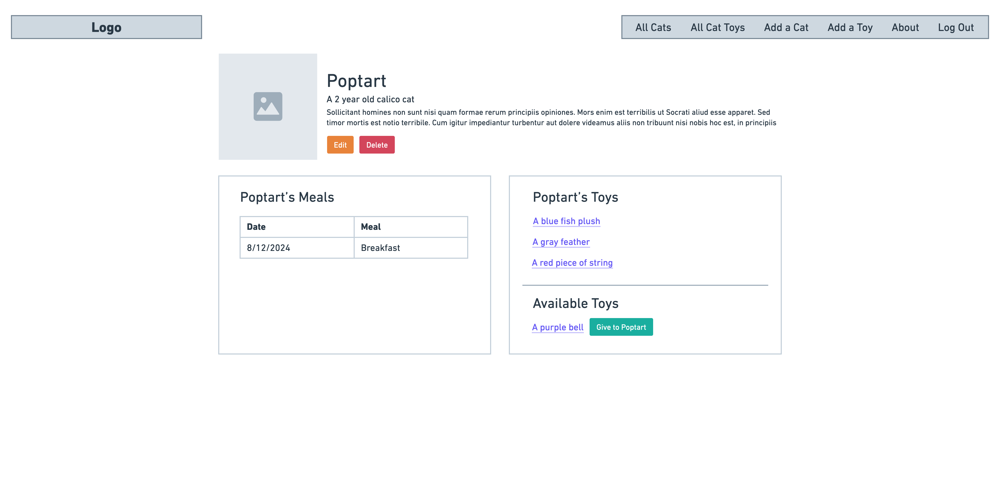</p>

<h3 id="adding-new-pages-to-a-django-app">Adding new pages to a Django app</h3>

<p>For a web application to perform any actions, it requires an HTTP request from the browser. This request informs the server of the desired operation.</p>

<p>When adding new pages or functionality to your Django web application, use the following steps as a guide:</p>

<ol>
  <li><strong>Decide the URL:</strong> Choose the appropriate URL for the route. Unlike some frameworks that use strict RESTful conventions, Django allows you to freely name your URLs.</li>
  <li><strong>Update the User Interface:</strong> Add the necessary UI elements that will initiate the HTTP request to the server. For example, you might add a form for submitting a new cat.</li>
  <li><strong>Define the Route:</strong> Add a new <code>path(...)</code> to the <code>urlpatterns</code> list in your app’s <code>urls.py</code> module. Each path entry specifies the code that executes when a matching URL is requested.</li>
  <li><strong>Create a View Function:</strong> Inside <code>views.py</code>, add the view function referenced by the path. This function handles the logic for CRUD operations and is responsible for generating the server’s response.</li>
  <li><strong>Handle the Response:</strong> If the data was modified, usually respond with a redirect to avoid duplicate submissions. If no data was changed, typically render a template to display information, passing any necessary data to it.</li>
</ol>

<h3 id="step-1--decide-the-url">Step 1 : Decide the URL</h3>

<p>In Django, the URL for accessing a specific cat’s details should include the cat’s ID to ensure the correct information is fetched. Unlike some frameworks that use RESTful conventions strictly, Django allows flexibility in naming URLs. We’ll use a dynamic segment to capture the cat’s ID:</p>

<pre><code class="language-plaintext">cats/&lt;int:cat_id&gt;/
</code></pre>

<p>The <code>int:</code> converter ensures that the URL will only match if the segment is an integer, which is necessary for identifying a specific cat.</p>

<h3 id="step-2--update-the-user-interface">Step 2 : Update the user interface</h3>

<p>To enable users to access a cat’s detailed view, we’ll enhance the UI by making each cat’s card clickable. This involves wrapping the card’s contents within an <code>&lt;a&gt;</code> tag that directs to the detail view of the cat:</p>

<pre><code class="language-html">&lt;section class="card-container"&gt;
  
    &lt;div class="card"&gt;
      &lt;a href="/cats/{{ cat.id }}"&gt;
        &lt;div class="card-content"&gt;
          &lt;div class="card-img-container"&gt;
            &lt;img
              src=""
              alt="A skater boy cat"
            /&gt;
          &lt;/div&gt;
          &lt;h2 class="card-title"&gt;{{ cat.name }}&lt;/h2&gt;
          
          &lt;p&gt;A {{ cat.age }} year old {{ cat.breed }}&lt;/p&gt;
          
          &lt;p&gt;A {{ cat.breed }} kitten.&lt;/p&gt;
          
          &lt;p&gt;&lt;small&gt;{{ cat.description }}&lt;/small&gt;&lt;/p&gt;
        &lt;/div&gt;
      &lt;/a&gt;
    &lt;/div&gt;
  
&lt;/section&gt;
</code></pre>

<p>The above is pretty similar to what we did in EJS templates.</p>

<p>After refreshing the page, hover over a cat card and check the URL in the bottom-left of the browser window. It should look something like: <code>http://127.0.0.1:8000/cats/2</code>.</p>

<h3 id="step-3--define-the-route">Step 3 : Define the route</h3>

<p>Next, define a route that matches the URL pattern and links to the appropriate view function. Add this entry to the <code>urlpatterns</code> in your <code>urls.py</code>:</p>

<pre><code class="language-python">urlpatterns = [
    path('', views.home, name='home'),
    path('about/', views.about, name='about'),
    path('cats/', views.cat_index, name='cat-index'),
    # new route below
    path('cats/&lt;int:cat_id&gt;/', views.cat_detail, name='cat-detail'),
]
</code></pre>

<h3 id="step-4--create-the-view-function">Step 4 : Create the view function</h3>

<p>Within <code>views.py</code>, define the <code>cat_detail</code> function to retrieve and display the details of a specific cat using its ID:</p>

<pre><code class="language-python"># views.py

def cat_detail(request, cat_id):
    cat = Cat.objects.get(id=cat_id)
    return render(request, 'cats/detail.html', {'cat': cat})
</code></pre>

<p>The <code>cat_detail</code> function is using the <code>get</code> method to obtain the cat object by its <code>id</code>.</p>

<blockquote>
  <p>💡 Django will pass any captured URL parameters as a named argument to the view function!</p>
</blockquote>

<h3 id="step-5--handle-the-response">Step 5 : Handle the response</h3>

<p>Lastly, we need to render the cat data within a <code>detail.html</code> template.</p>

<p>The <code>cat_detail</code> view function is passing a dictionary of data (called the <em>context</em>) to a template called <code>detail.html</code>.</p>

<p>Create the <code>detail.html</code> template that will render the individual details of a cat:</p>

<pre><code class="language-bash">touch main_app/templates/cats/detail.html
</code></pre>

<p>Ensure this template extends your base layout and add the necessary styling:</p>

<pre><code class="language-html">


&lt;link rel="stylesheet" href="" /&gt;


&lt;section class="cat-container"&gt;
  &lt;div class="cat-img"&gt;
    &lt;img src="" alt="A skater boy cat" /&gt;
  &lt;/div&gt;
  &lt;div class="cat-details"&gt;
    &lt;h1&gt;{{ cat.name }}&lt;/h1&gt;
    
      &lt;h2&gt;A {{ cat.age }} year old {{ cat.breed }}&lt;/h2&gt;
    
      &lt;h2&gt;A {{ cat.breed }} kitten.&lt;/h2&gt;
    
    &lt;p&gt;{{ cat.description }}&lt;/p&gt;
  &lt;/div&gt;
&lt;/section&gt;

</code></pre>

<p>Let’s complete this page with some CSS! Create a new file:</p>

<pre><code class="language-bash">touch main_app/static/css/cats/cat-detail.css
</code></pre>

<p>And add the following styles:</p>

<pre><code class="language-css">.cat-container {
  padding: 35px 30px;
  display: flex;
  flex-direction: column;
  align-items: center;
  justify-content: center;
}

.cat-img {
  width: 75%;
  max-width: 350px;
}

.usr-img {
  width: 100%;
  border-radius: var(--card-border-radius);
}

.cat-details {
  width: 98%;
}

.cat-actions {
  margin-top: 20px;
}

.feedings-toy-container {
  display: flex;
  flex-direction: column;
  padding-bottom: 20px;
  align-items: center;
}

.subsection-title {
  display: flex;
  align-items: center;
  margin-bottom: 12px;
}

.subsection-content {
  margin: 0 8px;
}

.toy-container {
  display: flex;
  align-items: center;
  flex-wrap: wrap;
}

.color-block {
  opacity: 0.8;
  height: 25px;
  width: 25px;
  margin-right: 10px;
}

.unfed,
.fed,
.no-toys,
.all-toys {
  margin: 0;
  font-weight: bold;
}

.unfed,
.no-toys {
  color: var(--danger);
}

.fed,
.all-toys {
  color: var(--submit);
}

.cat-details h1 {
  font-size: var(--font-xxl);
  margin: 15px 0 3px;
}

.cat-details h2 {
  font-size: var(--font-xl);
  margin: 0 0 10px;
  margin-top: 0;
  margin-bottom: 10px;
}

.cat-details h3 {
  margin: 20px 0 10px;
  font-size: var(--font-l);
}

.cat-details p {
  font-size: var(--font-reg);
  margin: 5px 0;
}

.feedings-toy-container &gt; section {
  width: 80%;
  min-width: 360px;
  border: var(--borders);
  border-radius: var(--card-border-radius);
  padding: 10px;
  box-shadow: var(--card-box-shadow);
  display: flex;
  flex-direction: column;
  justify-content: center;
  margin-bottom: 20px;
}

.subsection-title img {
  height: 42px;
  margin-left: 8px;
}

.subsection-title img:first-of-type {
  margin-left: 16px;
}

.feedings h2,
.toys h2 {
  font-size: 3.2rem;
  margin: 0;
}

.feedings h3,
.toys h3 {
  font-size: var(--font-xl);
  margin: 10px 0;
}

.subsection-content p,
.subsection-content input,
.subsection-content select {
  font-size: var(--font-l);
}

.subsection-content input,
.subsection-content select {
  margin-left: 5px;
  padding: 3px;
}

.feedings table {
  width: calc(100% - 16px);
  text-align: left;
  border-collapse: collapse;
  margin: 0 8px;
}

.feedings td {
  padding: 8px 5px;
  font-size: var(--font-reg);
}

.feedings th {
  font-size: var(--font-l);
  padding: 5px 5px 0;
  border-bottom: rgb(36, 116, 248) solid 2px;
}

.feedings tr:nth-child(even) {
  background-color: #f3f3fd;
}

.toy-container p {
  margin: 12px 0;
}

.toy-container a {
  text-decoration: none;
  color: #111;
}

.toy-container .btn {
  padding: 3px 10px;
  margin-left: 10px;
}

#file-input {
  overflow: hidden;
  position: absolute;
  width: 0.1px;
  height: 0.1px;
}

#file-name {
  margin-bottom: 10px;
}

@media only screen and (min-width: 768px) {
  .cat-container {
    padding: 35px 30px;
    flex-direction: row;
    align-items: center;
    justify-content: start;
  }

  .cat-img {
    width: 25%;
    max-width: 250px;
    margin-right: 25px;
  }

  .feedings-toy-container {
    flex-direction: row;
    justify-content: space-around;
    align-items: flex-start;
  }

  .feedings-toy-container &gt; section {
    width: 45%;
  }
}

@media only screen and (min-width: 1024px) {
  .feedings-toy-container {
    padding: 0 40px;
  }
}
</code></pre>

<p>Refresh and check it out!</p>

<p>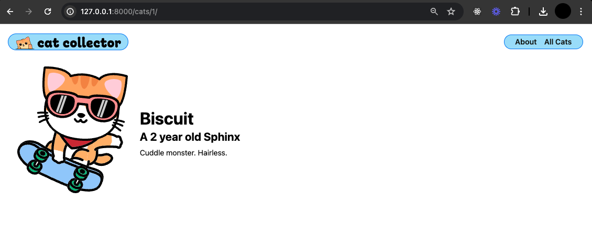</p>

<h2 id="using-dynamic-urls-in-templates">Using dynamic URLs in templates</h2>

<p>Hard-coding URLs in your templates is not recommended, as URLs can change during development, potentially leading to maintenance issues. Instead, Django provides a robust method to generate URLs dynamically, ensuring that links in your templates automatically adjust to any changes in your URL patterns.</p>

<p>For example, in <code>cats/index.html</code>, we find:</p>

<pre><code class="language-html">&lt;div class="card"&gt;&lt;a href="/cats/{{ cat.id }}"&gt;&lt;/a&gt;&lt;/div&gt;
</code></pre>

<p>This is a hard-coded URL!</p>

<p>While this approach works, it’s brittle. If the URL pattern changes in <code>urls.py</code>, you would need to manually update every instance of this link in your templates.</p>

<p>Django has a better way!</p>

<p>Let’s take another look at the <code>urlpatterns</code> in <code>urls.py</code>:</p>

<pre><code class="language-python">urlpatterns = [
    path('', views.home, name='home'),
    path('about/', views.about, name='about'),
    path('cats/', views.cat_index, name='cat-index'),
    path('cats/&lt;int:cat_id&gt;/', views.cat_detail, name='cat-detail'),
]
</code></pre>

<p>Remember the name argument we passed into each <code>path()</code>?</p>

<p>Django uses that <code>name</code> argument to dynamically generate a URL based on the name of the view. This method decouples your template code from your URL configuration.</p>

<p>In <code>cats/index.html</code>, we can replace this code:</p>

<pre><code class="language-html">&lt;a href="/cats/{{cat.id}}"&gt;
</code></pre>

<p>With this code:</p>

<pre><code class="language-html">&lt;a href=""&gt;
</code></pre>

<p>Now, URLs can be changed in one place <code>urls.py</code>, and all corresponding links in templates will automatically update.</p>

<h3 id="adjust-the-nav">Adjust the nav</h3>

<p>Let’s adjust the nav in <code>templates/base.html</code> to use the <code>url</code> template tag instead of hard-coding the URL in the links:</p>

<pre><code class="language-html">&lt;li&gt;&lt;a href=""&gt;All Cats&lt;/a&gt;&lt;/li&gt;
&lt;li&gt;&lt;a href=""&gt;About&lt;/a&gt;&lt;/li&gt;
</code></pre>

<p>This is the Django way!
<!--  --></p>

<h1>
  <span class="headline">Cat Collector</span>
  <span class="subhead">Django Class-Based Views</span>
</h1>

<!--  -->

<p><strong>Learning objective:</strong> By the end of this lesson, students will be able to create new pages using Django’s built in Class-based Views.</p>

<h2 id="what-are-class-based-views">What are class-based views?</h2>

<p><strong><a href="https://docs.djangoproject.com/en/5.1/topics/class-based-views/intro/#introduction-to-class-based-views">Class-based Views (CBVs) in Django</a></strong> provide a structured approach to creating views by using <em>classes</em> rather than <em>functions</em>. These classes are built into Django’s views module, enabling you to organize your views and reuse code by <em>extending</em> Django’s predefined base classes. Let’s step away from cat collector for a moment and think about an application performing CRUD on a <code>Book</code> resource.</p>

<p>For example, let’s say we wanted to implement <em>index</em> (view all) functionality using class-based views. First, we would import and extend the built in <code>ListView</code> class:</p>

<pre><code class="language-python">from django.views.generic import ListView

class BookList(ListView):
    model = Book
</code></pre>

<p>Here, <code>ListView</code> is a predefined generic class-based view that abstracts common patterns into a reusable format. We extend <code>ListView</code> to create our own <code>BookList</code> class, and tell it which model to use:</p>

<pre><code class="language-python">    model = Book
</code></pre>

<p>This tells <code>BookList</code> to fetch all records from the <code>Book</code> model.</p>

<p>Next, we connect this class-based view to a URL in <code>urls.py</code> using the <code>as_view()</code> method of the CBV (which returns a view function) and connect it to a route as usual:</p>

<pre><code class="language-python">from django.urls import path
from books.views import BookList

urlpatterns = [
    path('books/', BookList.as_view(), name='book-index'),
]
</code></pre>

<p>Notice that there’s no call to render? Unlike function-based views, CBVs don’t require explicit render calls. By default, <code>ListView</code> will look for a template named <code>templates/&lt;app_name&gt;/book_list.html</code>, but this can be customized with additional attributes.</p>

<h3 id="types-of-class-based-views">Types of class-based views</h3>

<p>In addition to the <code>ListView</code> used to display the index page for a Model, there are also:</p>

<ul>
  <li><code>DetailView</code> - used to implement the “detail” page for an instance of a Model</li>
  <li><code>CreateView</code> - used to create an instance of a Model</li>
  <li><code>DeleteView</code> - used to delete an instance of a Model</li>
  <li><code>UpdateView</code> - used to update an instance of a Model</li>
</ul>

<p>Everything you would need to perform full crud on a resource!</p>

<p>In this lesson, we will be utilizing the <code>CreateView</code>, <code>UpdateView</code> and <code>DeleteView</code> CBVs to complete our our <code>C U D</code> functionality on cats! We could also replace the existing <code>cat_index</code> and <code>cat_detail</code> view functions with Class-based Views (CBVs). However, we will keep these as function-based views to serve as examples of their structure and functionality.</p>

<h2 id="why-use-class-based-views">Why use Class-based Views?</h2>

<p>Django developed class-based views to minimize the redundancy of common view patterns found in web applications, effectively DRYing up our code base. You can read more about the rationale from <strong><a href="https://docs.djangoproject.com/en/5.1/topics/class-based-views/intro/#introduction-to-class-based-views">Django’s documentation on class-based views</a></strong>. Much of the code we write in CRUD applications repeats certain patterns again and again. As you saw in the above example, we can leverage CBVs to avoid having to write the same repeating code.</p>

<p>CBVs can save time, making us more productive developers. CBVs are also highly configurable by adding class attributes or overriding methods and using decorators.</p>

<p>For example, to change the default template for a list view, set the <code>template_name</code> attribute:</p>

<pre><code class="language-python">class BookList(ListView):
    model = Book
    template_name = 'books/index.html'
</code></pre>

<h2 id="creating-data-using-a-cbv">Creating Data Using a CBV</h2>

<p>Let’s explore class-based views as we add <code>create</code> functionality for cats!</p>

<p>In Django, the naming convention for class-based views (CBVs) that handle creating objects typically involves using the name of the model followed by the type of action the view handles. For creating objects, the common practice is to append “Create” to the model name. For a model called <code>Cat</code> the convention would be <code>CatCreate</code>.</p>

<h2 id="add-the-route">Add the Route</h2>

<p>In an Express application, you typically need to define two separate routes and their corresponding controller actions to handle a form:</p>

<ol>
  <li>A <code>GET</code> route (<code>cats/new</code>) to serve the form page.</li>
  <li>A <code>POST</code> route (<code>/cats</code>) to process the form data and add a new cat to the database.</li>
</ol>

<p>In Django, using the class-based view <code>CreateView</code> simplifies this process by combining these steps:</p>

<ul>
  <li><strong>Automatically handles form creation:</strong> Django uses a ModelForm to automatically generate form inputs based on the Model.</li>
  <li><strong>Renders the form template on a <code>GET</code> request:</strong> When accessed via a <code>GET</code> request, it displays a template containing the <code>&lt;form&gt;</code>.</li>
  <li><strong>Processes the form on a <code>POST</code> request:</strong> On a <code>POST</code> request, it automatically captures the form data to create a new database entry and then redirects to a specified URL.</li>
</ul>

<p>Let’s add a new URL pattern to <code>main_app/urls.py</code> for this classed-based view:</p>

<pre><code class="language-python">urlpatterns = [
    path('', views.home, name='home'),
    path('about/', views.about, name='about'),
    path('cats/', views.cat_index, name='cat-index'),
    path('cats/&lt;int:cat_id&gt;/', views.cat_detail, name='cat-detail'),
    # new route used to create a cat
    path('cats/create/', views.CatCreate.as_view(), name='cat-create'),
]
</code></pre>

<blockquote>
  <p>The <code>path()</code> function still needs a view <strong>function</strong> as its second argument, not a class, and that’s what a CBV’s <code>as_view()</code> method returns.</p>
</blockquote>

<blockquote>
  <p>💡 Did you notice that we didn’t have to put that route above the <code>cats/&lt;int:cat_id&gt;/</code>? Unlike Express, Django won’t match that route unless there’s something that looks like an integer in the second segment, therefore it ignores <code>cats/create/</code></p>
</blockquote>

<p>Now we need to add the <code>views.CatCreate</code> CBV to make the server happy, but first let’s add a link to the nav for adding a cat…</p>

<h2 id="update-the-ui">Update the UI</h2>

<p>Now that we know the path used to <em>both</em>:</p>

<ul>
  <li>View a form for entering cat info; and</li>
  <li>Create the cat when the form is submitted</li>
</ul>

<p>Let’s update <code>base.html</code> to add a link to the nav:</p>

<pre><code class="language-html">&lt;ul&gt;
  &lt;li&gt;&lt;a href=""&gt;All Cats&lt;/a&gt;&lt;/li&gt;
  &lt;li&gt;&lt;a href=""&gt;Add a Cat&lt;/a&gt;&lt;/li&gt;
  &lt;li&gt;&lt;a href=""&gt;About&lt;/a&gt;&lt;/li&gt;
&lt;/ul&gt;
</code></pre>

<p>On to the view!</p>

<h2 id="extending-the-generic-createview">Extending the generic <code>CreateView</code></h2>

<p>First, to use any class-based view in Django, it needs to be imported:</p>

<pre><code class="language-python">from django.shortcuts import render
# Add the following import
from django.views.generic.edit import CreateView
from .models import Cat
</code></pre>

<p>Now we can inherit from <code>CreateView</code> to create our own CBV used to create cats:</p>

<pre><code class="language-python"># main-app/views.py

class CatCreate(CreateView):
    model = Cat
    fields = '__all__'
</code></pre>

<p>The <code>fields</code> attribute is required and can be used to limit or change the ordering of the attributes from the <code>Cat</code> model are generated in the <code>ModelForm</code> passed to the template.</p>

<p>We’ve taken advantage of the special <code>'__all__'</code> value to specify that the form should contain all of the <code>Cat</code> Model’s attributes. Alternatively, we could have listed the fields in a list like this:</p>

<pre><code class="language-python"># main-app/views.py

class CatCreate(CreateView):
    model = Cat
    fields = ['name', 'breed', 'description', 'age']
</code></pre>

<p>This is all the code necessary to display a template containing a form that’s automatically provided, and to create a Cat when the form is submitted (when the request is a <code>POST</code> rather than a <code>GET</code>).</p>

<p>On to the template!</p>

<h2 id="create-the-template-for-creating-cats">Create the template for creating cats</h2>

<p>Consider the following wireframe:</p>

<p>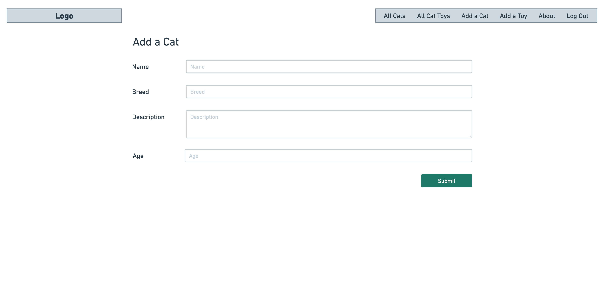</p>

<p>By convention, the <code>CatCreate</code> CBV will look to render a template named <code>templates/main_app/cat_form.html</code>.</p>

<p>All CBVs by default will use a folder inside of the <code>templates</code> folder with a name the same as the app, in our case <code>main_app</code>.</p>

<p>Let’s give <code>CatCreate</code> the template it wants by first creating the <code>templates/main_app</code> folder in the terminal:</p>

<pre><code class="language-bash">mkdir main_app/templates/main_app
</code></pre>

<p>Now create the template file in the terminal:</p>

<pre><code class="language-bash">touch main_app/templates/main_app/cat_form.html
</code></pre>

<p>The <code>CreateView</code> expects a template named <code>&lt;model_name&gt;_form.html</code> by default, where <code>&lt;model_name&gt;</code> is the lowercase name of the model. This convention is suggested in the <strong><a href="https://docs.djangoproject.com/en/5.1/topics/class-based-views/generic-editing/#model-forms">Django documentation</a></strong> to standardize form templates. You can customize this by explicitly setting template_name in your view class.</p>

<p>We’ll discuss the following code as we type it:</p>

<pre><code class="language-html">


&lt;link rel="stylesheet" href="" /&gt;



&lt;div class="page-header"&gt;
  &lt;h1&gt;Add a Cat&lt;/h1&gt;
  &lt;img src="" alt="A cat using a computer" /&gt;
&lt;/div&gt;

&lt;form action="" method="post" class="form-container"&gt;
  
  &lt;table&gt;
    {{ form.as_table }}
  &lt;/table&gt;
  &lt;button type="submit" class="btn submit"&gt;Submit!&lt;/button&gt;
&lt;/form&gt;


</code></pre>

<ol>
  <li>
    <p>Setting the action attribute to an empty string (<code>action=""</code>) means the form will submit to the same URL that served it. This is typical for <code>CreateView</code>, which handles both displaying the form (on GET requests) and processing the form submission (on POST requests).</p>
  </li>
  <li>
    <p>The <code></code> template tag is a security measure that makes it difficult to perform a <a href="https://en.wikipedia.org/wiki/Cross-site_request_forgery"><strong>cross-site-request-forgery</strong></a> by writing a CSRF (pronounced “see-surf”) token that is validated on the server.</p>
  </li>
  <li>
    <p>The <code>form</code> variable represents a Django <code>ModelForm</code> instance that is automatically created by <code>CreateView</code>. This form is linked directly to your model and includes all the fields specified in the form’s Meta class or passed explicitly to the view. <code>{{ form.as_table }}</code> renders the form fields within a table layout. This method is one of several Django provides for rendering forms (others include <code>as_p</code> for paragraph tags and <code>as_ul</code> for unordered lists).</p>
  </li>
</ol>

<h2 id="add-page-styles">Add page styles</h2>

<p>A new page means new CSS! We’ll be using this same form CSS throughout this app, so we’re just going to put it in the main <code>css</code> directory for this application. Run the following command in the terminal:</p>

<pre><code class="language-bash">touch main_app/static/css/form.css
</code></pre>

<p>Add the following styles to that file:</p>

<pre><code class="language-css">.form-container {
  display: flex;
  flex-direction: column;
  width: 100%;
}

table {
  padding: 0 40px;
  width: 100%;
  border-spacing: 0 20px;
}

th {
  text-align: left;
  padding: 6px 20px 0 0;
  font-weight: normal;
  vertical-align: top;
  font-size: var(--font-reg);
}

td {
  max-width: 60%;
}

td &gt; * {
  width: 100%;
  padding: 2px 4px;
  font-size: var(--font-l);
}

td &gt; textarea {
  height: calc(4 * var(--font-l) + 8px);
  font-family: inherit;
}

.btn {
  align-self: flex-end;
  margin-right: 40px;
}
</code></pre>

<p>Let’s refresh the browser and click the <strong><code>Add a Cat</code></strong> link.</p>

<p>Looks great!</p>

<p>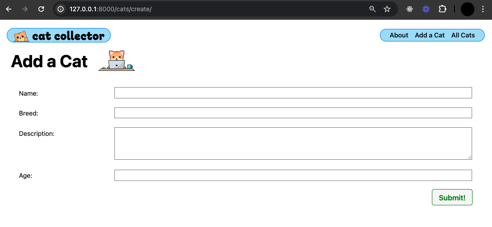</p>

<p>Use the devtools to explore the DOM. You’ll see how Django’s ModelForm wrote the inputs in table rows and columns because we used <code>{{ form.as_table }}</code>.</p>

<p>Other options include:</p>

<ul>
  <li><code>{{ form }}</code> - No wrapper around the <code>&lt;label&gt;</code> &amp; <code>&lt;input&gt;</code> tags</li>
  <li><code>{{ form.as_p }}</code> - Wraps a <code>&lt;p&gt;</code> tag around the <code>&lt;label&gt;</code> &amp; <code>&lt;input&gt;</code> tags</li>
  <li><code>{{ form.as_ul }}</code> - Wraps an <code>&lt;li&gt;</code> tag around the <code>&lt;label&gt;</code> &amp; <code>&lt;input&gt;</code> tags</li>
</ul>

<blockquote>
  <p>Note: To ease custom styling, you can add an id or class to your<code>&lt;table&gt;</code> and/or <code>&lt;form&gt;</code> tags. Also note how Django automatically assigns an id to each input.</p>
</blockquote>

<h2 id="redirecting">Redirecting</h2>

<p>Currently, if you submit the form to create a new cat, while the cat will be successfully created, you will encounter an error. This error occurs because Django does not know where to redirect the user after the form submission.</p>

<p>To resolve this, you need to specify a <code>success_url</code> attribute in your class-based view (CBV). This attribute tells Django the URL to redirect to once the form has been successfully processed.</p>

<pre><code class="language-python">class CatCreate(CreateView):
    model = Cat
    fields = '__all__'
    success_url = '/cats/'
</code></pre>

<p>However, this approach always redirects users to the general <code>/cats/</code> page after a cat is created. Instead, it is often more useful to redirect to the specific page of the cat that was just created.</p>

<h3 id="redirecting-to-a-newly-created-cat-object">Redirecting to a newly created cat object</h3>

<p>Rather than redirecting to a static page, Django allows us to dynamically redirect to the newly created object using the <code>get_absolute_url</code> method on the model.</p>

<p>Let’s update the <code>Cat</code> model to include this method:</p>

<pre><code class="language-python">from django.db import models
from django.urls import reverse

class Cat(models.Model):
    name = models.CharField(max_length=100)
    breed = models.CharField(max_length=100)
    description = models.TextField(max_length=250)
    age = models.IntegerField()

    def __str__(self):
        return self.name

    # Define a method to get the URL for this particular cat instance
    def get_absolute_url(self):
        # Use the 'reverse' function to dynamically find the URL for viewing this cat's details
        return reverse('cat-detail', kwargs={'cat_id': self.id})
</code></pre>

<p>The <strong><a href="https://docs.djangoproject.com/en/5.1/ref/urlresolvers/#reverse">reverse</a></strong> method above will return the correct path for the <code>cat-detail</code> named route. However, since that route requires a <code>cat_id</code> route parameter, its value must be provided as an argument.</p>

<p>Don’t forget to import <code>reverse</code> in <code>models.py</code>:</p>

<pre><code class="language-python">from django.db import models
# Import the reverse function
from django.urls import reverse
</code></pre>

<p>Since <code>CreateView</code> automatically calls <code>get_absolute_url</code> on the model instance if <code>success_url</code> is <strong>not explicitly set</strong>, we must <strong>remove</strong> the previously added <code>success_url</code> from the <code>CatCreate</code> view:</p>

<pre><code class="language-python">class CatCreate(CreateView):
    model = Cat
    fields = '__all__'
    # Remove success_url so Django uses get_absolute_url from Cat
</code></pre>

<p>By removing <code>success_url</code>, Django will now use the <code>get_absolute_url</code> method defined in the <code>Cat</code> model, ensuring the user is redirected to the newly created cat’s detail page.</p>

<h2 id="updating--deleting-cats-with-class-based-views">Updating &amp; deleting cats with class-based views</h2>

<p>Let’s implement the following user stories using class-based view:</p>

<ul>
  <li><em>AAU, when viewing a cat’s detail page, I want to click EDIT to update that cat’s information.</em></li>
  <li><em>AAU, when viewing a cat’s detail page, I want to click DELETE to remove that cat from the database.</em></li>
</ul>

<h2 id="add-the-routes">Add the routes</h2>

<p>Let’s add two new routes for update and delete in <code>main_app/urls.py</code>:</p>

<pre><code class="language-python">    path('cats/create/', views.CatCreate.as_view(), name='cat-create'),
    # Add the new routes below
    path('cats/&lt;int:pk&gt;/update/', views.CatUpdate.as_view(), name='cat-update'),
    path('cats/&lt;int:pk&gt;/delete/', views.CatDelete.as_view(), name='cat-delete'),
</code></pre>

<blockquote>
  <p>By convention, CBVs that work with individual model instances will expect to find a named parameter of <code>pk</code> for “primary key”. This is why we didn’t use <code>cat_id</code> as we did in the <em>detail</em> entry.</p>
</blockquote>

<h2 id="update-the-ui-1">Update the UI</h2>

<p>Now we need to add <code>EDIT</code> and <code>DELETE</code> links on a cat’s details page.</p>

<p>Let’s update <code>templates/cats/detail.html</code> by adding a new <code>&lt;div&gt;</code> we’ll label with the class <code>"cat-actions"</code>. This will contain our link buttons to <code>Edit</code> and <code>Delete</code> routes.</p>

<p>Add the new <em>“cat-actions”</em> <code>&lt;div&gt;</code> inside the <code>detail.html</code> template:</p>

<pre><code class="language-html">&lt;div class="cat-details"&gt;
  &lt;h1&gt;{{ cat.name }}&lt;/h1&gt;
  
    &lt;h2&gt;A {{ cat.age }} year old {{ cat.breed }}&lt;/h2&gt;
  
    &lt;h2&gt;A {{ cat.breed }} kitten.&lt;/h2&gt;
  
  &lt;p&gt;{{ cat.description }}&lt;/p&gt;

  &lt;div class="cat-actions"&gt;
    &lt;a href="" class="btn warn"&gt;Edit&lt;/a&gt;
    &lt;a href="" class="btn danger"&gt;Delete&lt;/a&gt;
  &lt;/div&gt;
&lt;/div&gt;
</code></pre>

<p>Now for the views!</p>

<h2 id="create-subclasses-from-djangos-updateview--deleteview">Create subclasses from Django’s <code>UpdateView</code> &amp; <code>DeleteView</code></h2>

<p>We’ve referenced new <code>CatUpdate</code> and <code>CatDelete</code> views in the routes so we need to create them in <code>views.py</code>.</p>

<p>First, import Django’s <code>UpdateView</code> and <code>DeleteView</code> CBVs to extend from:</p>

<pre><code class="language-python"># Add UdpateView &amp; DeleteView
from django.views.generic.edit import CreateView, UpdateView, DeleteView
</code></pre>

<p>Now we can utilize these minimal view classes:</p>

<pre><code class="language-python">class CatUpdate(UpdateView):
    model = Cat
    # Let's disallow the renaming of a cat by excluding the name field!
    fields = ['breed', 'description', 'age']

class CatDelete(DeleteView):
    model = Cat
    success_url = '/cats/'
</code></pre>

<blockquote>
  <p>Note that when we delete a cat, we’ll need to redirect to the cats <em>index</em> page since that cat doesn’t exist anymore.</p>
</blockquote>

<p>Now we should be able to refresh the page and see our buttons rendered.</p>

<p>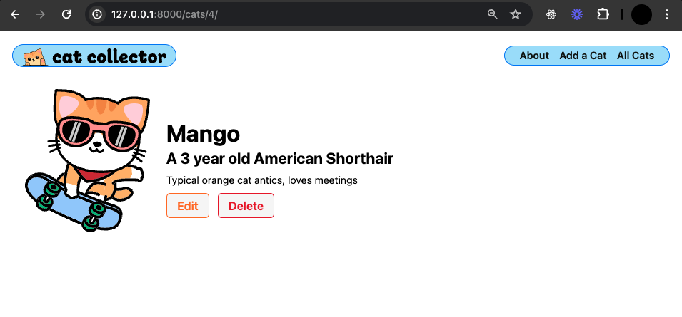</p>

<h2 id="adding-the-templates">Adding the templates</h2>

<p>At this point, the UPDATE functionality is ready for testing, but to fully implement the DELETE functionality, we need to take a few more steps. For both UPDATE and DELETE actions, if we want to introduce customizations or confirmations, modifications to existing templates are necessary.</p>

<p>Instead of creating a new template for the UPDATE action, we will edit the existing <code>cat_form.html</code> template to add custom UI elements. This ensures consistency across different actions like UPDATE and DELETE, where DELETE will require a separate confirmation template to safeguard against accidental deletions.</p>

<h3 id="customize-the-cat_formhtml-template">Customize the <code>cat_form.html</code> Template</h3>

<p>Since we didn’t include <code>'name'</code> in the fields list in <code>CatUpdate</code>, the <code>name</code> attribute isn’t listed in the form.</p>

<p>We’re going to customize <code>cat_form.html</code> to show the name of the Cat being edited, and learn a little more about Django in the process:</p>

<ul>
  <li>
    <p>When using Django’s <code>UpdateView</code> for editing model instances, like a <code>cat</code>, certain context variables are automatically available in the template. These variables help determine whether you’re creating a new instance or editing an existing one.</p>
  </li>
  <li>
    <p>Django passes the model instance being edited as <code>object</code> and also by the lowercase name of the model, which in this case is <code>cat</code>.</p>
  </li>
  <li>
    <p>When using <code>CreateView</code>, these variables (object or cat) will be <code>None</code> because there’s no existing instance to edit.</p>
  </li>
</ul>

<p>Let’s leverage this new knowledge to modify <code>templates/main_app/cat_form.html</code> to show the cat’s name only when we are editing, not creating, a cat:</p>

<pre><code class="language-html">&lt;div class="page-header"&gt;
  &lt;!-- Check if a cat object exists to determine if we're editing --&gt;
  
    &lt;h1&gt;Edit {{ cat.name }}&lt;/h1&gt;
  
    &lt;h1&gt;Add a Cat&lt;/h1&gt;
  
&lt;/div&gt;
</code></pre>

<p>We could also do:</p>

<pre><code class="language-html">&lt;div class="page-header"&gt;
  &lt;!-- Using the generic 'object' variable --&gt;
  
    &lt;h1&gt;Edit {{ object.name }}&lt;/h1&gt;
  
    &lt;h1&gt;Add a Cat&lt;/h1&gt;
  
&lt;/div&gt;
</code></pre>

<p>These two blocks are functionally equivalent and we could use either.</p>

<p>Refresh the browser to see your changes. Looks great!</p>

<p>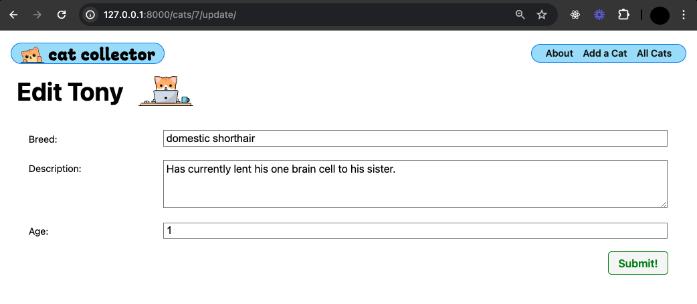</p>

<h3 id="creating-a-confirmation-template-for-deleting-a-cat">Creating a confirmation template for deleting a cat</h3>

<p>When you want to delete data, it’s best practice to ask for confirmation to prevent accidental deletions. Django simplifies this process in its class-based <code>DeleteView</code> by looking for a specific confirmation template.</p>

<p>First, create the necessary confirmation template. By default, <strong><a href="https://docs.djangoproject.com/en/5.1/topics/class-based-views/generic-editing/#model-forms">Django expects this template to be named following a particular convention</a></strong>. For a model named Cat, the template should be named cat_confirm_delete.html.</p>

<p>Run the following in the terminal:</p>

<pre><code class="language-bash">touch main_app/templates/main_app/cat_confirm_delete.html
</code></pre>

<p>Next, define the contents of the template. This template will extend your base layout and include a confirmation form:</p>

<pre><code class="language-html">



&lt;div class="page-header"&gt;
  &lt;h1&gt;Delete Cat?&lt;/h1&gt;
  &lt;img src="" alt="A cat using a computer" /&gt;
&lt;/div&gt;

&lt;h2&gt;Are you sure you want to delete {{ cat.name }}?&lt;/h2&gt;

&lt;form action="" method="post" class="form"&gt;
  
  &lt;a href="" class="btn secondary"&gt;Cancel&lt;/a&gt;
  &lt;button type="submit" class="btn danger"&gt;Yes - Delete!&lt;/button&gt;
&lt;/form&gt;


</code></pre>

<p>Note how we are allowing the user to cancel the delete by providing a link back to the <em>detail</em> page.</p>

<p>Let’s check our progress by refreshing the browser and hitting the delete button.</p>

<p>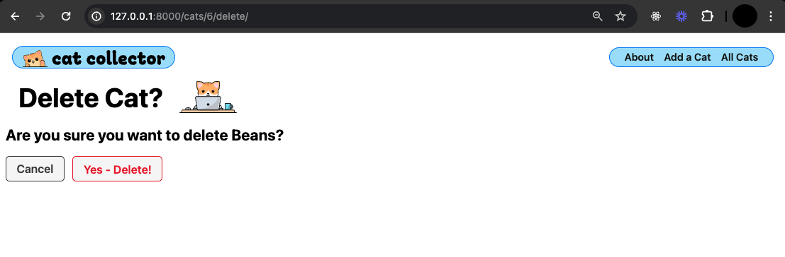</p>

<p><strong>🎉 Congrats, you have implemented full CRUD for cats!</strong>
<!--  --></p>

<h1>
  <span class="headline">Cat Collector</span>
  <span class="subhead">Django One-to-Many Relationships</span>
</h1>

<!--  -->

<p><strong>Learning objective:</strong> By the end of this lesson, learners will be able to implement and manage one-to-many relationships in Django by adding a Feeding model related to the Cat model.</p>

<h1 id="a-cats-got-to-eat">A cat’s got to eat!</h1>

<p>In this lesson, we’ll explore how to add another model in Django to demonstrate working with <strong>one-to-many</strong> relationships.</p>

<p>We’ll use an Entity-Relationship Diagram (ERD) to illustrate this relationship:</p>

<p></p>

<p>In this relationship, each cat will have many feedings, and each feeding will belong to a specific cat.</p>

<h2 id="adding-a-new-feeding-model">Adding a new <code>Feeding</code> Model</h2>

<p>Using the ERD above as a guide, let’s add a new <code>Feeding</code> Model (below the current <code>Cat</code> Model) in our <code>models.py</code>:</p>

<pre><code class="language-python"># Add new Feeding model below Cat model

class Feeding(models.Model):
    date = models.DateField()
    meal = models.CharField(max_length=1)
</code></pre>

<blockquote>
  <p>Note that we’re going to use just a single-character to represent what meal the feeding is for: <strong><em>B</em></strong>reakfast, <strong><em>L</em></strong>unch or <strong><em>D</em></strong>inner.</p>
</blockquote>

<h2 id="fieldchoices">Field.choices</h2>

<p>Django has a feature, <strong><a href="https://docs.djangoproject.com/en/5.1/ref/models/fields/#choices">Field.choices</a></strong>, that will make the single-characters more user-friendly by automatically generating a select dropdown in the form using descriptions that we define.</p>

<p>The first step is to define a tuple of 2-tuples. Because we might need to access this tuple within the <code>Cat</code> class also, let’s define it above both of the Model classes:</p>

<pre><code class="language-python"># A tuple of 2-tuples added above our models
MEALS = (
    ('B', 'Breakfast'),
    ('L', 'Lunch'),
    ('D', 'Dinner')
)


class Cat(models.Model):
</code></pre>

<p>As you can see, the first item in each 2-tuple represents the value that will be stored in the database, e.g. <code>B</code>.</p>

<p>The second item represents the human-friendly “display” value, e.g., <code>Breakfast</code>.</p>

<p>Now let’s enhance the <code>meal</code> field as follows:</p>

<pre><code class="language-python">class Feeding(models.Model):
    date = models.DateField()
    meal = models.CharField(
        max_length=1,
        # add the 'choices' field option
        choices=MEALS,
        # set the default value for meal to be 'B'
        default=MEALS[0][0]
    )
</code></pre>

<h2 id="override-the-__str__-method">Override the <code>__str__</code> Method</h2>

<p>As is common in python classes, we can override the <code>__str__</code> method in Models so that they provide more meaningful output when they are printed:</p>

<pre><code class="language-python">class Feeding(models.Model):
    # Other Feeding class fields here

    def __str__(self):
        # Nice method for obtaining the friendly value of a Field.choice
        return f"{self.get_meal_display()} on {self.date}"
</code></pre>

<p>Check out the convenient <code>get_meal_display()</code> method Django <em>automagically</em> creates to access the human-friendly value of a <code>Field.choice</code> like we have on <code>meal</code>.</p>

<h2 id="add-the-foreign-key">Add the Foreign Key</h2>

<p>Since a <code>Feeding</code> <strong>belongs to</strong> a <code>Cat</code>, it must hold the <code>id</code> of the cat object it belongs to - it needs a <strong>foreign key</strong>!</p>

<p>Here’s how it’s done - Django style:</p>

<pre><code class="language-python">class Feeding(models.Model):
    date = models.DateField()
    meal = models.CharField(
        max_length=1,
        choices=MEALS,
        default=MEALS[0][0]
    )
    # Create a cat_id column for each feeding in the database
    cat = models.ForeignKey(Cat, on_delete=models.CASCADE)

    def __str__(self):
        return f"{self.get_meal_display()} on {self.date}"
</code></pre>

<p>As you can see, the <code>ForeignKey</code> field-type is used to create a one-to-many relationship.</p>

<ul>
  <li>The first argument provides the parent Model, <code>Cat</code>.</li>
  <li>In a one-to-many relationship, the <code>on_delete=models.CASCADE</code> is required. It ensures that if a <code>Cat</code> record is deleted, all of the child <code>Feedings</code> will be deleted automatically as well - thus avoiding <em>orphan</em> records for feedings that are no longer tied to an existing Cat.</li>
</ul>

<blockquote>
  <p>🧠 In the database, the column in the feedings table for the FK will actually be called <code>cat_id</code> because Django by default appends <code>_id</code> to the name of the attribute used in the Model.</p>
</blockquote>

<h2 id="make-and-run-the-migration">Make and Run the Migration</h2>

<p>We changed our <code>models.py</code> file, so it’s that time again! Open your terminal and run:</p>

<pre><code class="language-bash">python3 manage.py makemigrations
</code></pre>

<p>Then run:</p>

<pre><code class="language-bash">python3 manage.py migrate
</code></pre>

<h2 id="use-the-admin-portal-to-create-some-new-feedings">Use the Admin Portal to create some new feedings</h2>

<p>Before we start building the user interface (UI) for our new feedings model, let’s practice adding a few feedings using the Django admin portal. This will give us some data to display and allow us to create our feedings’ index UI first.</p>

<h3 id="registering-the-model">Registering the Model</h3>

<p>To use the built-in Django admin portal for CRUD operations, we must first register the model. Update <code>main_app/admin.py</code> to include the <code>Feeding</code> model:</p>

<pre><code class="language-python">from django.contrib import admin
# Add Feeding to the import
from .models import Cat, Feeding

admin.site.register(Cat)
# Register the new Feeding model
admin.site.register(Feeding)
</code></pre>

<p>Now, navigate to <a href="http://127.0.0.1:8000/admin">http://127.0.0.1:8000/admin</a> and click on the <strong>Feeding +Add</strong> link.</p>

<p>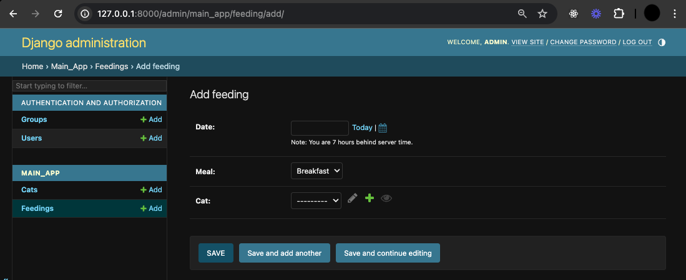</p>

<p>Notice the select drop-downs for assigning both the Meal and the Cat!</p>

<h2 id="custom-field-labels">Custom field labels</h2>

<p>Let’s say though, that you would like a less vague label than <strong>Date</strong>.</p>

<p>If you want to use a more descriptive label than <strong>Date</strong>, you can customize field labels directly in the model. Since <strong><em>Django models are the single source of truth about your data</em></strong>, this is where you should add customizations.</p>

<p>In <code>main_app/models.py</code>, update the <code>Feeding</code> model to include a user-friendly label for the <code>date</code> field:</p>

<pre><code class="language-python">class Feeding(models.Model):
    # The first optional positional argument overrides the label
    date = models.DateField('Feeding date')
    # Other fields below
</code></pre>

<p>After making this change, refresh the admin portal page to see the updated label.</p>

<p>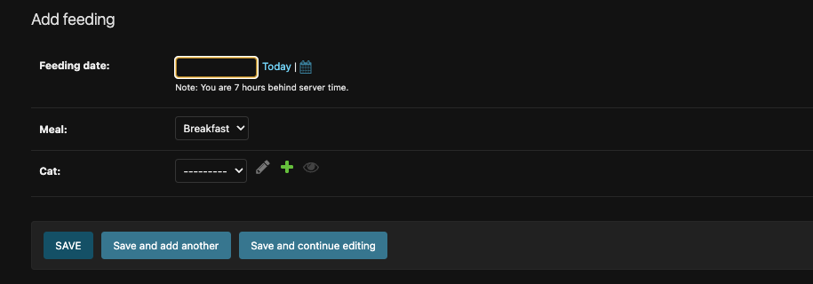</p>

<p>These custom labels will also be used in all of Django’s <code>ModelForms</code>.</p>

<h3 id="add-a-few-feedings">Add a few feedings</h3>

<p>Now, go ahead and add a few feedings for each of your cats using the admin portal. This will populate your database with initial data, which will be useful for building and testing your UI.</p>

<h2 id="displaying-a-cats-feedings">Displaying a Cat’s Feedings</h2>

<p>The cat’s detail page is the perfect place to display a cat’s feedings because it provides a comprehensive view of all the important information about that specific cat in one place. This is similar to how you would see a list of all tasks on a project detail page. By showing feedings on the cat’s detail page, users can easily see the feeding history along with other details about the cat, making the information more accessible and organized.</p>

<p>No additional views or templates are necessary. We only need to update the <code>detail.html</code> template.</p>

<h3 id="update-the-detailhtml-template">Update the <code>detail.html</code> template</h3>

<p>Here’s the new content for <code>detail.html</code>. Copy and paste this markup, and then we’ll review it:</p>

<pre><code class="language-html">&lt;!-- Existing cat-container above --&gt;
&lt;div class="feedings-toy-container"&gt;
  &lt;section class="feedings"&gt;
    &lt;div class="subsection-title"&gt;
      &lt;h2&gt;Feedings&lt;/h2&gt;
      &lt;img
        src=""
        alt="An ice cream cone cat"
      /&gt;
      &lt;img src="" alt="A cat as onigiri" /&gt;
      &lt;img
        src=""
        alt="A kabob of kittens"
      /&gt;
    &lt;/div&gt;
    &lt;table&gt;
      &lt;thead&gt;
        &lt;tr&gt;
          &lt;th&gt;Date&lt;/th&gt;
          &lt;th&gt;Meal&lt;/th&gt;
        &lt;/tr&gt;
      &lt;/thead&gt;
      &lt;tbody&gt;
        
          &lt;tr&gt;
            &lt;td&gt;{{feeding.date}}&lt;/td&gt;
            &lt;td&gt;{{feeding.get_meal_display}}&lt;/td&gt;
          &lt;/tr&gt;
        
      &lt;/tbody&gt;
    &lt;/table&gt;
  &lt;/section&gt;
&lt;/div&gt;


</code></pre>

<ul>
  <li>In this code we have added an html table to present the feeding data in an more structured way.</li>
  <li>The table body (<code>&lt;tbody&gt;</code>) dynamically lists each feeding associated with the cat. This is done through a loop (<code></code>) that iterates over each feeding related to the cat.</li>
  <li>For each feeding, the date is displayed, and the meal type is shown using Django’s <code>get_meal_display</code> method, which translates a database value into a more user-friendly format (such as converting a single character like ‘B’ into “Breakfast”).</li>
</ul>

<p>Refresh your browser and select a cat to see their feedings!</p>

<p>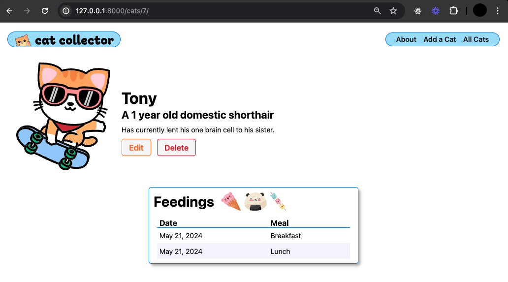</p>

<h2 id="adding-new-feedings-from-the-detail-page">Adding new feedings from the Detail page</h2>

<p>As developers, we can add feedings easily from the admin portal, but this helpful dashboard is not available to users of our application.</p>

<p>Next, we will add functionality for users to add feedings directly from a cat’s detail page. This requires integrating a form on the page that can handle the creation of new feedings linked to that specific cat.</p>

<p>In previous sections, we’ve utilized Django’s class-based views to manage create and update operations. These CBVs automatically handle form generation and data submission by using a <code>ModelForm</code> tied to a specific model behind the scenes.</p>

<p>For adding feedings through the cat’s detail page, we’ll need to add a custom <code>ModelForm</code>. This form will allow us to embed feeding-related inputs within a custom <code>&lt;form&gt;</code> tag, manage form validation, and save new feeding entries to the database.</p>

<h2 id="create-the-modelform-for-the-feeding-model">Create the <code>ModelForm</code> for the <code>Feeding</code> Model</h2>

<p>We could define the <code>ModelForm</code> inside of the <code>models.py</code> module, but we’re going to follow a best practice of defining it inside of a <code>forms.py</code> module instead. Run the following in the terminal:</p>

<pre><code class="language-bash">touch main_app/forms.py
</code></pre>

<p>Let’s open it and add this code:</p>

<pre><code class="language-python">from django import forms
from .models import Feeding

class FeedingForm(forms.ModelForm):
    class Meta:
        model = Feeding
        fields = ['date', 'meal']
</code></pre>

<p>Note that our custom form inherits from <code>ModelForm</code>.</p>

<blockquote>
  <p>Many of the attributes in the <code>Meta</code> class are in common with CBVs because the CBV was using them behind the scenes to create a ModelForm as previously mentioned.</p>
</blockquote>

<p>For more options, check out the <strong><a href="https://docs.djangoproject.com/en/5.1/topics/forms/modelforms/#modelform">Django ModelForms documentation</a></strong>.</p>

<h2 id="passing-an-instance-of-feedingform">Passing an instance of <code>FeedingForm</code></h2>

<p><code>FeedingForm</code> is a class that needs to be instantiated in the <code>cat_detail</code> view function so that it can be rendered inside of <code>detail.html</code>.</p>

<p>Here’s the updated <code>cat_detail</code> view function in <code>main_app/views.py</code>:</p>

<pre><code class="language-python">from .models import Cat
# Import the FeedingForm
from .forms import FeedingForm

# Other view functions above

# update this view function
def cat_detail(request, cat_id):
    cat = Cat.objects.get(id=cat_id)
    # instantiate FeedingForm to be rendered in the template
    feeding_form = FeedingForm()
    return render(request, 'cats/detail.html', {
        # include the cat and feeding_form in the context
        'cat': cat, 'feeding_form': feeding_form
    })
</code></pre>

<p><code>feeding_form</code> is set to an instance of <code>FeedingForm</code> and then it’s passed to <code>detail.html</code> just like <code>cat</code>.</p>

<h2 id="displaying-feedingform-inside-of-detailhtml">Displaying <code>FeedingForm</code> inside of <strong><code>detail.html</code></strong></h2>

<p>Okay, so we’re going to need a form used to submit a new feeding.</p>

<p>We’re going to display a <code>&lt;form&gt;</code> at the top of the feedings column in <strong><code>detail.html</code></strong>.</p>

<p>This is how we can “render” the <code>ModelForm</code>’s inputs within <code>&lt;form&gt;</code> tags. Add this section in <code>templates/cats/detail.html</code> just above the <code>&lt;table&gt;</code> for displaying feedings:</p>

<pre><code class="language-html">&lt;h3&gt;Add a Feeding&lt;/h3&gt;
&lt;!-- Add just above the feedings table --&gt;
&lt;form method="post" class="subsection-content" autocomplete="off"&gt;
  
  {{ feeding_form.as_p }}
  &lt;button type="submit" class="btn submit"&gt;Add Feeding&lt;/button&gt;
&lt;/form&gt;
</code></pre>

<p>As before, we need to include the <code></code> for security purposes.</p>

<p>A form’s <code>action</code> attribute determines the URL that a form is submitted to. For now, we’ll leave it out and come back to it in a bit.</p>

<p>The <code>{{ feeding_form.as_p }}</code> will generate the <code>&lt;input&gt;</code> tags wrapped in <code>&lt;p&gt;</code> tags for each field we specified in <code>FeedingForm</code>.</p>

<p>Let’s see what it looks like - not perfect but it’s a start:</p>

<p>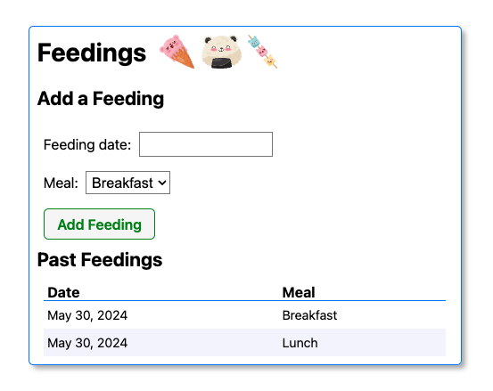</p>

<p>Unfortunately, you may have noticed that the <em>Feeding Date</em> field is just a basic text input. This is what Django uses by default for <code>DateField</code>s. Let’s make it a date picker instead.</p>

<h2 id="use-djangos-dateinput">Use Django’s <code>DateInput</code></h2>

<p>To improve user experience and maintain consistent date formatting, we’ll be adding a “date picker”—a user interface component that lets users easily select dates. This feature is supported by HTML5 and is common in web forms. Django supports this with a built in <code>DateInput</code> widget, which is built on top of the standard HTML date picker to integrate smoothly with Django’s <code>DateField</code>.</p>

<p>For our <code>Feeding</code> model’s form, we specify Django’s built-in date picker as a widget for the date field. This creates a visually pleasing date selection process on the frontend and ensures that date data remains consistent on the backend.</p>

<blockquote>
  <p>In Django forms, the <code>widgets</code> attribute is used to customize how form fields are rendered in the HTML and to add specific HTML attributes to those fields.</p>
</blockquote>

<p>Update the <code>FeedingForm</code> in <code>forms.py</code> to include a new property called <code>widgets</code>:</p>

<pre><code class="language-python">class FeedingForm(forms.ModelForm):
    class Meta:
        model = Feeding
        fields = ['date', 'meal']
        widgets = {
            'date': forms.DateInput(
                format=('%Y-%m-%d'),
                attrs={
                    'placeholder': 'Select a date',
                    'type': 'date'
                }
            ),
        }
</code></pre>

<p>By specifying these attributes and using a <code>DateInput</code> widget, the date field in the form will render as an HTML date input. This allows users to select a date using a mini calendar-style date picker, which is much more user-friendly.</p>

<p>Refresh the page to see your DateInput widget in action:</p>

<p>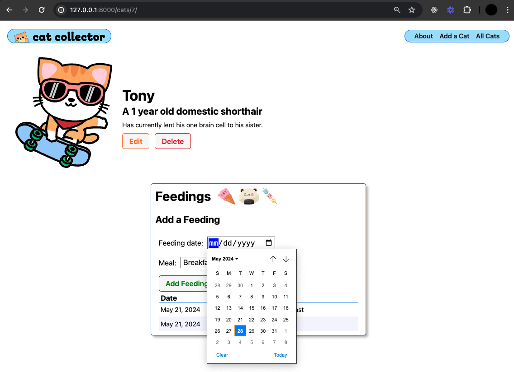</p>

<h2 id="create-new-path-for-feedings">Create new <code>path</code> for feedings</h2>

<p>Its time to complete our form functionality by enabling the route we’ll use as the form action for new <code>Feedings</code>.</p>

<p>Every <code>Feeding</code> object needs a <code>cat_id</code> that holds the primary key of the cat object that it belongs to. Therefore, we need to ensure that the route <code>path</code> includes a <em>URL parameter</em> for capturing the cat’s <code>id</code> like we’ve done in other routes.</p>

<p>Add a route to the <code>urlpatterns</code> list in <strong><code>urls.py</code></strong> like this:</p>

<pre><code class="language-python">urlpatterns = [
    # Existing URL patterns above
    path(
        'cats/&lt;int:cat_id&gt;/add-feeding/',
        views.add_feeding,
        name='add-feeding'
    ),
]
</code></pre>

<p>The above route specifies that the <code>&lt;form&gt;</code>’s <strong>action</strong> attribute will need to look something like <code>/cats/2/add-feeding</code>. Let’s update the form now.</p>

<h2 id="add-the-action-attribute-to-the-form">Add the <code>action</code> Attribute to the <code>&lt;form&gt;</code></h2>

<p>Now that we have a <em>named URL</em>, let’s add the <code>action</code> attribute to the <code>&lt;form&gt;</code> in <code>detail.html</code>:</p>

<pre><code class="language-html">&lt;h3&gt;Add a Feeding&lt;/h3&gt;
&lt;form
  action=""
  method="post"
  class="subsection-content"
  autocomplete="off"
&gt;
  
  {{ feeding_form.as_p }}
  &lt;button type="submit" class="btn submit"&gt;Add Feeding&lt;/button&gt;
&lt;/form&gt;
</code></pre>

<blockquote>
  <p>Note that arguments provided to template tags are always separated using a space, not a comma.</p>
</blockquote>

<p>Once again, we’re using best practice of using the <code>url</code> template tag <code></code> to write out the correct the URL for a route.</p>

<p>Our form is now complete, but before we can test, we need to add the <code>views.add_feeding</code> function.</p>

<h2 id="add-the-view-function">Add the View function</h2>

<p>This view is designed to handle the submission of a feeding form associated with a specific cat.</p>

<p>This form will capture the feeding data entered by the user, but will be missing one key piece of information that we will need to add manually before sending the data to the database- <code>cat_id</code>.</p>

<p>Let’s create an <code>add_feeding</code> view function in <code>main_app/views.py</code> :</p>

<pre><code class="language-python">def add_feeding(request, cat_id):
    # create a ModelForm instance using the data in request.POST
    form = FeedingForm(request.POST)
    # validate the form
    if form.is_valid():
        # don't save the form to the db until it
        # has the cat_id assigned
        new_feeding = form.save(commit=False)
        new_feeding.cat_id = cat_id
        new_feeding.save()
    return redirect('cat-detail', cat_id=cat_id)
</code></pre>

<ol>
  <li>First we capture data from the user via the <code>FeedingForm(request.POST)</code> and prepare it for the database.</li>
  <li>The method <code>form.is_valid()</code> checks if the submitted form data is valid according to the form’s specifications, such as required fields being filled and data types matching the model’s requirements.</li>
  <li>After ensuring that the form contains valid data, we save the form with the <code>commit=False</code> option, which returns an in-memory model object so that we can assign the <code>cat_id</code> before actually saving to the database.</li>
  <li>Finally we will <code>redirect</code> instead of <code>render</code> since data has been changed in the database.</li>
</ol>

<p>Lastly, remember to import <code>redirect</code> at the top of <code>views.py</code>:</p>

<pre><code class="language-python">from django.shortcuts import render, redirect
</code></pre>

<p>With our view complete we can test our form.</p>

<p></p>

<p>Nice Job!</p>

<h2 id="adjust-the-order-of-feedings">Adjust the order of feedings</h2>

<p>Now we have the ability to add feedings, great! But as our list of feedings grows we’ll need to scroll to the bottom to see the latest information. This is not a great user experience. How can we fix this?</p>

<p>We can use a feature in Django that sorts the feedings automatically. This is done by setting an <code>ordering</code> option inside the <code>Feeding</code> model’s <code>class Meta</code>.</p>

<p>Let’s add this to our <code>Feeding</code> model:</p>

<pre><code class="language-python">class Feeding(models.Model):
    # Other Feeding model items above

    def __str__(self):
        # Nice method for obtaining the friendly value of a Field.choice
        return f"{self.get_meal_display()} on {self.date}"

    # Define the default order of feedings
    class Meta:
        ordering = ['-date']  # This line makes the newest feedings appear first
</code></pre>

<p>This <code>ordering</code> option in Django allows us to specify how lists of entries, like our feedings, should be sorted by default. The prefix ‘-‘ before ‘date’ means it sorts the dates in descending order, so the newest feedings appear first.</p>

<h3 id="what-if-there-are-no-feedings-yet">What if there are no feedings yet?</h3>

<p>We can also add some conditional logic in our markup that tells the user whether or not a cat has been fed.</p>

<p>Replace the existing feedings table with the following:</p>

<pre><code class="language-html">&lt;h3&gt;Past Feedings&lt;/h3&gt;

  &lt;table&gt;
    &lt;thead&gt;
      &lt;tr&gt;
        &lt;th&gt;Date&lt;/th&gt;
        &lt;th&gt;Meal&lt;/th&gt;
      &lt;/tr&gt;
    &lt;/thead&gt;
    &lt;tbody&gt;
      
      &lt;tr&gt;
        &lt;td&gt;{{feeding.date}}&lt;/td&gt;
        &lt;td&gt;{{feeding.get_meal_display}}&lt;/td&gt;
      &lt;/tr&gt;
      
    &lt;/tbody&gt;
  &lt;/table&gt;

  &lt;div class="subsection-content"&gt;
    &lt;p&gt;⚠️ {{cat.name}} has not been fed!&lt;/p&gt;
  &lt;/div&gt;

</code></pre>

<p>Now if a cat has a feeding count of <code>0</code> in the database, you’ll see a warning message.</p>

<p>Feed your cats!
<!--  --></p>

<h1>
  <span class="headline">Cat Collector</span>
  <span class="subhead">Adding a Third Model</span>
</h1>

<!--  -->

<p><strong>Learning objective:</strong> By the end of this lesson, learners will be able to implement a new model in Django, and perform CRUD operations using class-based views.</p>

<p>Now it’s time to introduce the third and final model for this application: Toys! We’ll establish a complete set of class-based views to enable full CRUD operations on this new model. Then, we’ll link <code>Cats</code> to <code>Toys</code> using a many-to-many relationship.</p>

<h2 id="toy-model">Toy model</h2>

<p>Let’s start by adding the <code>Toy</code> model to our project.</p>

<p>Add the following at the bottom of <code>models.py</code>:</p>

<pre><code class="language-python"># Add the Toy model
class Toy(models.Model):
    name = models.CharField(max_length=50)
    color = models.CharField(max_length=20)

    def __str__(self):
        return self.name

    def get_absolute_url(self):
        return reverse('toy-detail', kwargs={'pk': self.id})
</code></pre>

<p>This new model with have only two properties for toys <code>name</code> and <code>color</code>.</p>

<p>We’ll also include <code>get_absolute_url(self)</code>. This method uses Django’s reverse function to generate a URL for the specific instance of the Toy model. This URL is meant to point to a detailed view of the toy, identified by its primary key (pk). This is useful in redirecting users to the toy’s detail page after operations such as creating or updating a toy.</p>

<h2 id="register-the-new-toy-model">Register the new toy model</h2>

<p>A new model means a new entry in <code>admin.py</code>. Add the toy model below <code>Cat</code> and <code>Feeding</code>.</p>

<pre><code class="language-python">from django.contrib import admin

from .models import Cat, Feeding, Toy  # import the model

admin.site.register(Cat)
admin.site.register(Feeding)
# Add the Toy model
admin.site.register(Toy)
</code></pre>

<p>A new model also means we need to make migrations and migrate in our terminal:</p>

<pre><code class="language-bash">python3 manage.py makemigrations
python3 manage.py migrate
</code></pre>

<h2 id="adding-toys">Adding Toys</h2>

<p>Lets’ create our first Class-Based View for adding new toys.</p>

<p>Start by adding the URL path for <code>create</code> in <code>main_app/urls.py</code>.</p>

<pre><code class="language-python">path('toys/create/', views.ToyCreate.as_view(), name='toy-create'),
</code></pre>

<blockquote>
  <p>This will cause an error with our server temporarily, because we have not created the view for this new path.</p>
</blockquote>

<p>Add the CBV to create a <code>Toy</code> in <code>main_app/views.py</code>. Make sure you import the <code>Toy</code> model at the top!</p>

<pre><code class="language-python">from .models import Cat, Toy

# Other view functions above

class ToyCreate(CreateView):
    model = Toy
    fields = '__all__'
</code></pre>

<p>And finally create a new template <code>toy_form.html</code> and add the model form:</p>

<pre><code class="language-bash">touch main_app/templates/main_app/toy_form.html
</code></pre>

<p>To save time, we’ll add some conditional logic to set this form up for edit functionality as well, so we don’t need to return to it later.</p>

<pre><code class="language-html">


  &lt;link rel="stylesheet" href="" /&gt;


  &lt;div class="page-header"&gt;
    
      &lt;h1&gt;Edit {{object.name}}&lt;/h1&gt;
    
      &lt;h1&gt;Add a Toy&lt;/h1&gt;
    
    &lt;img src="" alt="A cat using a computer" /&gt;
  &lt;/div&gt;
  &lt;form action="" method="post" class="form-container" autocomplete="off"&gt;
    
    &lt;table&gt;
      {{ form.as_table }}
    &lt;/table&gt;
    &lt;button type="submit" class="btn submit"&gt;Submit!&lt;/button&gt;
  &lt;/form&gt;


</code></pre>

<p>Finally let’s update the <code>base.html</code> with a new link so that we can get to our new page.</p>

<pre><code class="language-html">&lt;ul&gt;
  &lt;li&gt;&lt;a href=""&gt;All Cats&lt;/a&gt;&lt;/li&gt;
  &lt;li&gt;&lt;a href=""&gt;Add a Cat&lt;/a&gt;&lt;/li&gt;
  &lt;!-- Add a new link --&gt;
  &lt;li&gt;&lt;a href=""&gt;Add a Toy&lt;/a&gt;&lt;/li&gt;
  &lt;li&gt;&lt;a href=""&gt;About&lt;/a&gt;&lt;/li&gt;
&lt;/ul&gt;
</code></pre>

<p>Test it out!</p>

<p>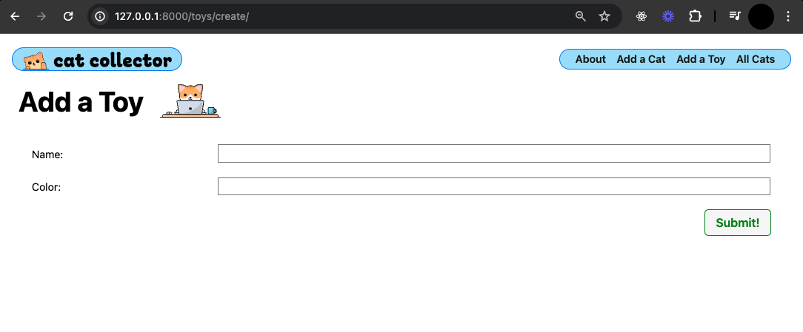</p>

<p>Got an error? Not a problem. Our create operation was successful, but our view function has a redirect to a page that doesn’t exist yet.</p>

<p>You can confirm the creation of new toys in the Admin dashboard.</p>

<p><a href="http://127.0.0.1:8000/admin/">http://127.0.0.1:8000/admin/</a></p>

<p>The next step is to create a place in our UI to view toys and give the server a proper place to redirect.</p>

<h2 id="viewing-toys">Viewing Toys</h2>

<p>We have prepared two wireframes for the toy sections of our application: one for the index page, which lists all toys, and another for the detailed view page of each toy.</p>

<p>Here are some wireframes for what we will build in the next sections.</p>

<h3 id="toy-index-page">Toy Index Page</h3>

<p>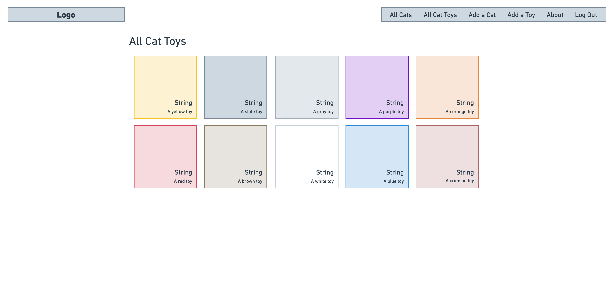</p>

<h3 id="toy-detail-page">Toy Detail Page</h3>

<p></p>

<p>Let’s start by setting up the URLs needed for these views:</p>

<pre><code class="language-python">path('toys/&lt;int:pk&gt;/', views.ToyDetail.as_view(), name='toy-detail'),
path('toys/', views.ToyList.as_view(), name='toy-index'),
</code></pre>

<blockquote>
  <p>This will cause an error with our server temporarily, because we have not created the views for these new paths.</p>
</blockquote>

<p>Now, let’s create the views that will render the list of toys and the details of each toy. These views are defined using Django’s class-based views:</p>

<pre><code class="language-python">from django.views.generic.edit import CreateView, UpdateView, DeleteView
from django.views.generic import ListView, DetailView # add these

# Other view functions above

class ToyList(ListView):
    model = Toy

class ToyDetail(DetailView):
    model = Toy
</code></pre>

<p>Next, let’s add a link to our “All Toys” index view in the nav bar so we can easily browse all toys:</p>

<pre><code class="language-html">&lt;ul&gt;
  &lt;li&gt;&lt;a href=""&gt;All Cats&lt;/a&gt;&lt;/li&gt;
  &lt;!-- Add new link --&gt;
  &lt;li&gt;&lt;a href=""&gt;All Toys&lt;/a&gt;&lt;/li&gt;
  &lt;li&gt;&lt;a href=""&gt;Add a Cat&lt;/a&gt;&lt;/li&gt;
  &lt;li&gt;&lt;a href=""&gt;Add a Toy&lt;/a&gt;&lt;/li&gt;
  &lt;li&gt;&lt;a href=""&gt;About&lt;/a&gt;&lt;/li&gt;
&lt;/ul&gt;
</code></pre>

<p>Lastly, we need templates for these views. Create the template files by running the following commands in the terminal:</p>

<pre><code class="language-bash">touch main_app/templates/main_app/toy_list.html main_app/templates/main_app/toy_detail.html
</code></pre>

<p>Next we’ll add some markup to our <code>toy_list</code> template</p>

<h2 id="all-toys-index-page">All <code>Toys</code> index page</h2>

<p>Add the following markup in <code>toy_list.html</code>:</p>

<pre><code class="language-html">


&lt;link rel="stylesheet" href="" /&gt;



&lt;section class="page-header"&gt;
  &lt;h1&gt;All Cat Toys&lt;/h1&gt;
  &lt;img src="" alt="A ball of string" /&gt;
  &lt;img src="" alt="A mouse" /&gt;
  &lt;img src="" alt="A scratching post" /&gt;
  &lt;img src="" alt="A fishy toy" /&gt;
&lt;/section&gt;

&lt;section class="card-container"&gt;
  
    &lt;div class="card" style="border-color: {{ toy.color }}"&gt;
      &lt;div class="card-bg" style="background-color: {{ toy.color }}"&gt;&lt;/div&gt;
      &lt;a href=""&gt;
        &lt;div class="card-content"&gt;
          &lt;h2&gt;{{ toy.name }}&lt;/h2&gt;
          &lt;p&gt;A {{ toy.color }} toy&lt;/p&gt;
        &lt;/div&gt;
      &lt;/a&gt;
    &lt;/div&gt;
  
&lt;/section&gt;


</code></pre>

<p>This markup includes a cute page header with some cat toy images, as well as a programmatically rendered list of toys from our database.</p>

<p>Test the link in the nav to see the new page.</p>

<h3 id="toy-index-css">Toy <code>index</code> CSS</h3>

<p>Let’s also create a custom CSS directory for this new Model and a file for its index page:</p>

<pre><code class="language-bash">mkdir main_app/static/css/toys
touch main_app/static/css/toys/toy-index.css
</code></pre>

<p>add the following styles in <code>toy-index.css</code>:</p>

<pre><code class="language-css">.card-container {
  padding: 0 40px;
  display: flex;
  justify-content: center;
  flex-wrap: wrap;
}

.card {
  width: 224px;
  height: 224px;
  margin: 10px;
  border: solid 2px;
  box-shadow: var(--card-box-shadow);
  position: relative;
}

.card-bg {
  opacity: 0.4;
  position: absolute;
  display: inline-flex;
  top: 0;
  left: 0;
  width: 100%;
  height: 100%;
}

.card-content {
  padding: 15px;
  height: 100%;
  width: 100%;
  display: flex;
  align-items: flex-end;
  justify-content: flex-end;
  flex-direction: column;
}

.card &gt; a {
  position: absolute;
  top: 0;
  left: 0;
  width: 100%;
  height: 100%;
  display: inline-block;
  text-decoration: none;
  color: var(--text-color);
}

.card h2 {
  margin: 7px 0;
  font-size: var(--font-xl);
}

.card p {
  margin: 0;
  font-size: var(--font-reg);
}

.page-header &gt; img {
  margin-left: 10px;
}

.page-header &gt; img:first-of-type {
  margin-left: 15px;
}
</code></pre>

<p>Refresh to see the final index page!</p>

<p>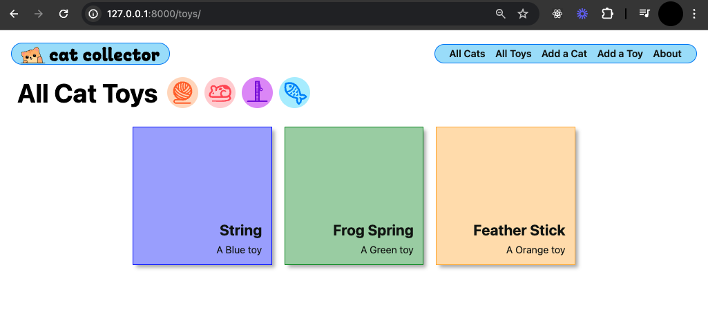</p>

<h2 id="one-toy-detail-page">One <code>Toy</code> detail page</h2>

<p>Now let’s add the markdown for the <code>toy_detail.html</code> page:</p>

<pre><code class="language-html">


&lt;link rel="stylesheet" href="" /&gt;



&lt;div class="card" style="border-color: {{ toy.color }}"&gt;
  &lt;div class="card-bg" style="background-color: {{ toy.color }}"&gt;&lt;/div&gt;
  &lt;div class="card-content"&gt;
    &lt;h2&gt;{{ toy.name }}&lt;/h2&gt;
    &lt;p&gt;A {{ toy.color }} toy&lt;/p&gt;
  &lt;/div&gt;
&lt;/div&gt;
&lt;a href="" class="btn warn"&gt;Edit&lt;/a&gt;
&lt;a href="" class="btn danger"&gt;Delete&lt;/a&gt;


</code></pre>

<p>This markdown contains specific details about one toy, as well as buttons to edit and delete a toy. We’ll connect update and delete functionality to those later.</p>

<blockquote>
  <p>Notice also how we use properties of the toy model to set styles in our CSS. Neat.</p>
</blockquote>

<h3 id="toy-detail-css">Toy <code>detail</code> CSS</h3>

<p>Let’s add another custom CSS file for our details page:</p>

<pre><code class="language-bash">touch main_app/static/css/toys/toy-detail.css
</code></pre>

<p>Add the following styles to your new CSS file:</p>

<pre><code class="language-css">main {
  display: flex;
  align-items: flex-end;
  justify-content: flex-start;
  min-height: auto;
}

.card {
  width: 224px;
  height: 224px;
  margin: 25px 25px 15px 40px;
  border: solid 2px;
  box-shadow: var(--card-box-shadow);
  position: relative;
}

.card-bg {
  opacity: 0.4;
  position: absolute;
  display: inline-flex;
  top: 0;
  left: 0;
  width: 100%;
  height: 100%;
}

.card-content {
  padding: 15px;
  height: 100%;
  width: 100%;
  display: flex;
  align-items: flex-end;
  justify-content: flex-end;
  flex-direction: column;
  color: var(--text-color);
}

.btn {
  margin-bottom: 15px;
}

.card h2 {
  margin: 7px 0;
  font-size: var(--font-xl);
  z-index: 1;
}

.card p {
  margin: 0;
  font-size: var(--font-reg);
  z-index: 1;
}
</code></pre>

<p>Refresh to see your styled details page.</p>

<p>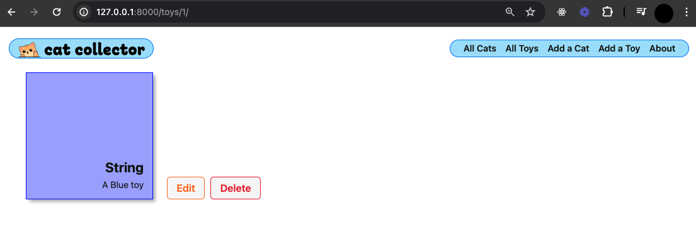</p>

<p>Nice work!</p>

<h2 id="update-and-delete-toys">Update and Delete Toys</h2>

<p>We’re almost finished with our CBV’s, we just need to add the final update and delete functionality for individual toys.</p>

<p>First we’ll create the paths:</p>

<p>In <code>urls.py</code>:</p>

<pre><code class="language-python">    #Existing urls above
    path('toys/&lt;int:pk&gt;/update/', views.ToyUpdate.as_view(), name='toy-update'),
    path('toys/&lt;int:pk&gt;/delete/', views.ToyDelete.as_view(), name='toy-delete'),
</code></pre>

<p>Now we add the views in <code>views.py</code>:</p>

<pre><code class="language-python">class ToyUpdate(UpdateView):
    model = Toy
    fields = ['name', 'color']

class ToyDelete(DeleteView):
    model = Toy
    success_url = '/toys/'
</code></pre>

<p>Update the Edit and Delete buttons on the <code>toy-detail.html</code> page with their new URLs:</p>

<pre><code class="language-html">&lt;a href="" class="btn warn"&gt;Edit&lt;/a&gt;
&lt;a href="" class="btn danger"&gt;Delete&lt;/a&gt;
</code></pre>

<p>Update is now complete. You can test this functionality now. Our delete functionality needs one final step.</p>

<h3 id="create-delete-confirmation-page">Create delete confirmation page</h3>

<p>Let’s make a template that will confirm the delete.</p>

<p>Run the following in the terminal:</p>

<pre><code class="language-bash">touch main_app/templates/main_app/toy_confirm_delete.html
</code></pre>

<p>And add the following markdown:</p>

<pre><code class="language-html">



&lt;div class="page-header"&gt;
  &lt;h1&gt;Delete Toy?&lt;/h1&gt;
  &lt;img src="" alt="A cat using a computer" /&gt;
&lt;/div&gt;
&lt;h2&gt;Are you sure you want to delete {{ object.name }}?&lt;/h2&gt;

&lt;form action="" method="post" class="form"&gt;
  
  &lt;a href="" class="btn secondary"&gt; Cancel &lt;/a&gt;
  &lt;button type="submit" class="btn danger"&gt;Yes - Delete!&lt;/button&gt;
&lt;/form&gt;


</code></pre>

<p>Test your new delete confirmation page.</p>

<p>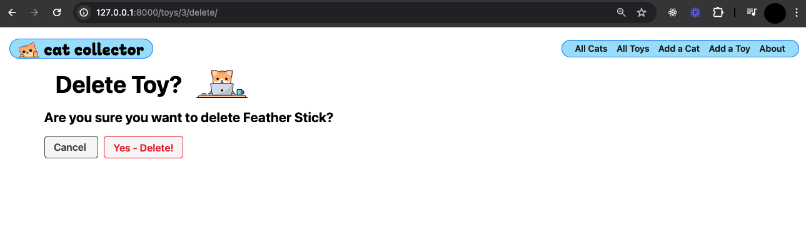</p>

<p>Great job!</p>

<h1>
  <span class="headline">Cat Collector</span>
  <span class="subhead">Django Many-to-Many Relationships</span>
</h1>

<!--  -->

<p><strong>Learning objective:</strong> By the end of this lesson, students will be able to create and manage a many-to-many relationship between Cats and Toys using Django’s built-in features.</p>

<h2 id="many-to-many-relationships-in-relational-databases">Many-to-Many Relationships in Relational Databases</h2>

<p>In relational databases like those used by Django, creating many-to-many relationships between two entities requires an intermediary or join table. This join table, unlike in document-based databases like MongoDB, is essential for managing <code>M:M</code> relationships in SQL databases.</p>

<h3 id="the-role-of-a-join-table">The role of a join table</h3>

<p>A join table acts as a bridge connecting two other tables by storing foreign keys that reference the primary keys of these tables. Each row in a join table represents a link between one entry in each of the connected tables.</p>

<p>For instance, if a <code>Cat</code> can play with many <code>Toys</code>, and each <code>Toy</code> can be used by many <code>Cats</code>, the join table will store pairs of foreign keys pointing to the respective entries in the <code>Cats</code> and <code>Toys</code> tables.</p>

<p>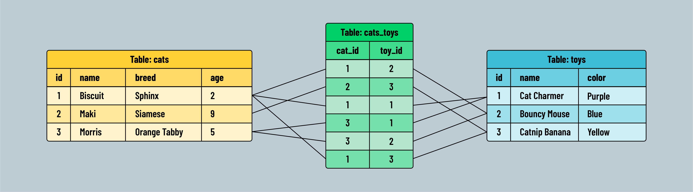</p>

<h3 id="associating-cats-with-toys">Associating <code>Cats</code> with <code>Toys</code></h3>

<p>Now that we have set up full CRUD capabilities for the <code>Toy</code> model, our next step is to define a many-to-many relationship between <code>Cats</code> and <code>Toys</code>. This allows multiple cats to interact with multiple toys interchangeably.</p>

<p>When you associate a <code>Cat</code> with a <code>Toy</code>, you add a row to the join table containing the foreign keys of the cat and toy involved. In reverse, dissociating a <code>Cat</code> from a <code>Toy</code> simply involves removing the corresponding row from the join table, without deleting any records from the <code>Cat</code> or <code>Toy</code> tables themselves.</p>

<h2 id="many-to-many-relationship-in-django">Many-to-Many Relationship in Django</h2>

<p>As usual, the Django framework handles a lot of the heavy lifting when it comes to working with many-to-many relationships between Models.</p>

<p>Forms and templates aside, all we need to do to implement a many-to-many relationship using Django is:</p>

<ol>
  <li>Add a <code>ManyToManyField</code> on one of the Models</li>
  <li>Create the migration and migrate it to update the database</li>
</ol>

<p>Django will ensure that a “hidden” join table is created that links the rows of the other two tables together.</p>

<p>Let’s get started!</p>

<h2 id="add-a-manytomanyfield-on-one-side-of-the-relationship">Add a <code>ManyToManyField</code> on one side of the relationship</h2>

<p>To create a <code>M:M</code> relationship between two models, we need to add a <code>ManyToManyField</code> on one of them.</p>

<p>When you add a <code>ManyToManyField</code> to one of your models, you also choose a name for the relationship. This name is used as the attribute through which you access related objects from that model.</p>

<p>Given that our application’s focus is on <code>Cats</code>, we are more likely interested in a cat’s toys, than a toy’s cats, so we’ll add the new attribute to the <code>Cat</code> model and name it “toys”:</p>

<pre><code class="language-python">class Cat(models.Model):
    name = models.CharField(max_length=100)
    breed = models.CharField(max_length=100)
    description = models.TextField(max_length=250)
    age = models.IntegerField()
    # Add the M:M relationship
    toys = models.ManyToManyField(Toy)
</code></pre>

<blockquote>
  <p>Tip: If you don’t have your <code>Toy</code> model above your <code>Cat</code> model in <code>models.py</code>, you’ll need to move it there now. This will correct any <code>toy not defined</code> server errors.</p>
</blockquote>

<h2 id="make-and-run-the-migration">Make and run the migration</h2>

<p>Because we’ve made a change to a Model that impacts the database’s schema, we need to make a migration and migrate it to update the database:</p>

<p>First, make the migration:</p>

<pre><code class="language-bash">python3 manage.py makemigrations
</code></pre>

<p>Then migrate the created migration to update the schema:</p>

<pre><code class="language-bash">python3 manage.py migrate
</code></pre>

<p>Thats it, the relationship has been made! Now when we navigate to our new cat page we automatically see an option to add a toy in the new cat form. This means the connection was successful, however it’s not the best user experience. What if we don’t want to add a toy when creating a cat?</p>

<p>We need to make a small change to ensure this field isn’t shown when a user is creating a cat.</p>

<p>Navigate to the <code>CatCreate</code> class in <code>main_app/views</code>:</p>

<p>Change the property:</p>

<pre><code class="language-python">fields = '__all__'
</code></pre>

<p>to the following:</p>

<pre><code class="language-python">fields = ['name', 'breed', 'description', 'age']
</code></pre>

<p>This ensures that only the listed fields are shown in the new cat form. We’ll create a separate form for adding toys to cats in a later section.</p>

<h2 id="displaying-a-list-of-all-available-toys">Displaying a list of all available toys</h2>

<p>In this part of the lesson, we will display a list of all toys and provide an option to associate each toy with a cat. This will be achieved by adding an “Add” button next to each toy, which, when clicked, will link the toy to the cat.</p>

<h3 id="update-the-view-to-include-toys">Update the view to include <code>toys</code></h3>

<p>First, update the cat_detail view in your <code>views.py</code> to fetch all toys from the database and pass them to the template:</p>

<pre><code class="language-python">def cat_detail(request, cat_id):
    cat = Cat.objects.get(id=cat_id)
    toys = Toy.objects.all()  # Fetch all toys
    feeding_form = FeedingForm()
    return render(request, 'cats/detail.html', {
        'cat': cat,
        'feeding_form': feeding_form,
        'toys': toys  # Pass toys to the template
    })
</code></pre>

<p>This code ensures that all toys are available in the cats <code>detail</code> page template, enabling us to display them next to the cat’s details.</p>

<h3 id="modify-the-template-to-display-toys">Modify the template to display <code>toys</code></h3>

<p>Now, let’s update the <code>cats/detail.html</code> template to display each toy with an “Give Toy” button that will eventually link the toy to the cat.</p>

<p>Add the following <code>&lt;section&gt;</code> with the class “toys”, below the existing <code>&lt;section&gt;</code> with the class “feedings”:</p>

<pre><code class="language-html">&lt;section class="feedings"&gt;
  &lt;!-- This is a long section --&gt;
&lt;/section&gt;

&lt;section class="toys"&gt;
  &lt;div class="subsection-title"&gt;
    &lt;h2&gt;Toys&lt;/h2&gt;
    &lt;img src="" alt="A ball of string" /&gt;
    &lt;img src="" alt="A mouse" /&gt;
    &lt;img src="" alt="A fishy toy" /&gt;
  &lt;/div&gt;
  &lt;h3&gt;Available Toys&lt;/h3&gt;
  &lt;div class="subsection-content"&gt;
    
      &lt;div class="toy-container"&gt;
        &lt;div class="color-block" style="background-color: {{ toy.color }}"&gt;&lt;/div&gt;
        &lt;p&gt;{{ toy.color }} {{ toy.name }}&lt;/p&gt;
        &lt;form action="" method="post"&gt;
          
          &lt;button type="submit" class="btn submit"&gt;Give Toy&lt;/button&gt;
        &lt;/form&gt;
      &lt;/div&gt;
    
  &lt;/div&gt;
&lt;/section&gt;
</code></pre>

<p>In the code above:</p>

<ul>
  <li>
    <p>Each toy is being programmatically rendered with its <code>color</code> and <code>name</code> properties listed.</p>
  </li>
  <li>
    <p>Each toy is also being rendered with a simple form with a “Give Toy” button, which allows users to associate or “give” a toy to a cat.</p>
  </li>
  <li>
    <p>The form action will be linked to a URL that handles the association.</p>
  </li>
  <li>
    <p>The <code>action</code> attribute is currently empty, as we will implement this feature next once we create the <code>path</code> used to associate cats and toys.</p>
  </li>
</ul>

<p>After making these changes, your user interface will display a list of toys on the cat’s detail page, each with an option to give the toy to the cat.</p>

<p>Take a moment to add toys if you don’t see any listed!</p>

<p>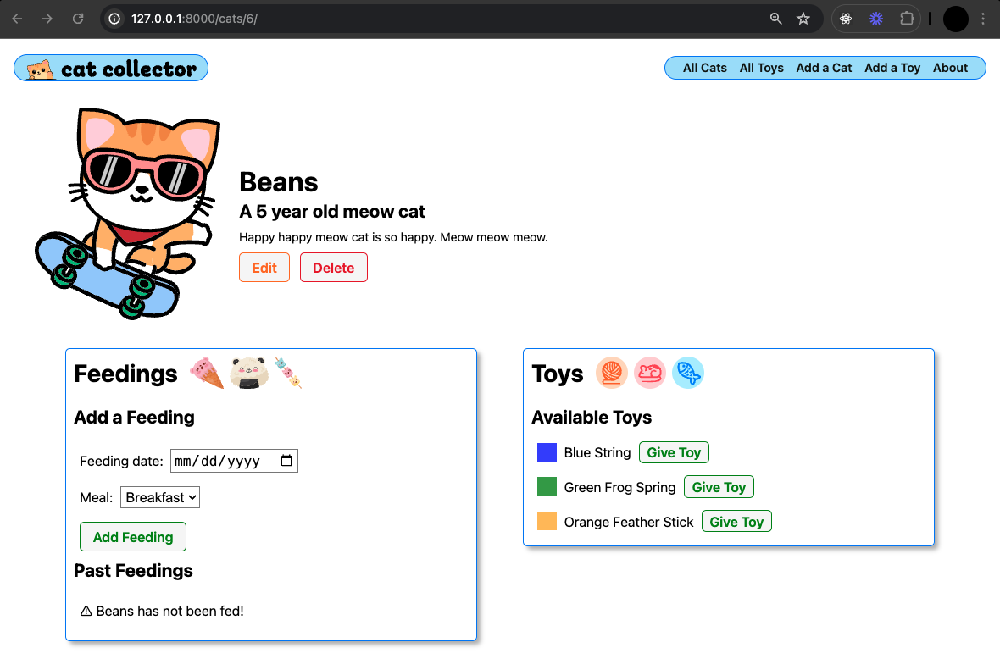</p>

<h2 id="associating-cats-and-toys">Associating cats and toys</h2>

<p>Next, we will implement the functionality to link toys to cats using the many-to-many relationship we created earlier. This involves setting up a new view function that handles the association process when a user clicks the “Give Toy” button next to a toy in the cat’s detail page.</p>

<h3 id="define-the-url-pattern">Define the URL pattern</h3>

<p>First, we’ll add a new URL pattern in the <code>urls.py</code> file. This URL will handle the association between a cat and a toy by capturing their respective <code>ids</code>.</p>

<p>To do this, the server needs to know the <code>id</code> of <strong>both</strong> the cat and the toy being associated:</p>

<pre><code class="language-python"># New URL to associate a toy with a cat
path('cats/&lt;int:cat_id&gt;/associate-toy/&lt;int:toy_id&gt;/', views.associate_toy, name='associate-toy'),
</code></pre>

<p>This URL pattern includes two dynamic segments <code>cat_id</code> and <code>toy_id</code> which will capture the <code>id</code>s from the URL and pass them to the view function.</p>

<blockquote>
  <p>This will cause an error with our server temporarily, because we have not created the view for this new path.</p>
</blockquote>

<h3 id="update-the-form-action-in-the-template">Update the form action in the template</h3>

<p>Next, modify the form in your <code>cat-detail.html</code> template to use this new URL. Ensure that the form’s <code>action</code> attribute is set to the correct URL which will trigger the association when submitted:</p>

<pre><code class="language-html">&lt;form action="" method="post"&gt;
  
  &lt;button type="submit" class="btn submit"&gt;Give Toy&lt;/button&gt;
&lt;/form&gt;
</code></pre>

<p>In this form, the <code></code> template tag dynamically generates the correct URL based on the <code>ids</code> of the cat and the toy. This setup ensures that each “Give Toy” button properly associates its corresponding toy with the current cat.</p>

<blockquote>
  <p>Note how we need to provide both <code>id</code>s as space-separated parameters in the order that they were defined in the path (first the cat’s id, then the toy’s).</p>
</blockquote>

<h3 id="create-the-association-view-function">Create the association view function</h3>

<p>Finally, create the view function in <code>views.py</code> that will execute the association between the cat and the toy using the <code>ids</code> passed from the form:</p>

<p><em>You can add this function anywhere in your views file:</em></p>

<pre><code class="language-python">def associate_toy(request, cat_id, toy_id):
    # Note that you can pass a toy's id instead of the whole object
    Cat.objects.get(id=cat_id).toys.add(toy_id)
    return redirect('cat-detail', cat_id=cat_id)
</code></pre>

<p>Now that we have our view function in place, we can test making associations from the UI by verifying the association in the admin portal.
Give a cat a couple toys and head to the admin portal!</p>

<p><a href="http://127.0.0.1:8000/admin">http://127.0.0.1:8000/admin</a></p>

<p>Toys associated with each cat will appear highlighted in the admin portal.</p>

<p>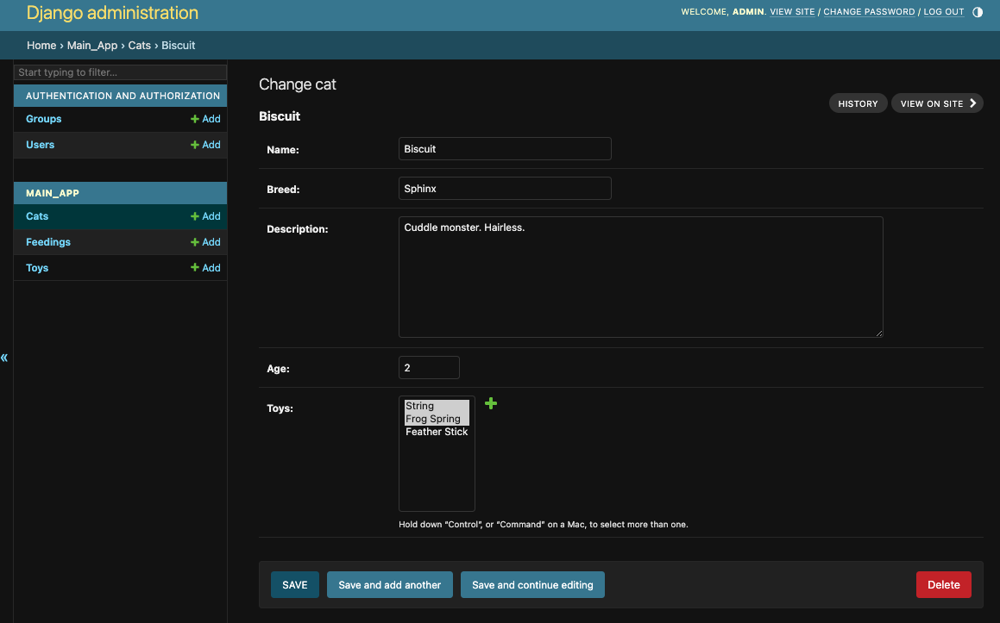</p>

<blockquote>
  <p>Biscuit has been given the two toys highlighted in the toy list.</p>
</blockquote>

<h2 id="displaying-a-list-of-associated-toys">Displaying a list of associated <code>Toys</code></h2>

<p>Now that we have verified we are able to make associations between cats and toys, we should display them back to the user.</p>

<p>Consider the following user story:</p>

<p><em>As a User, when viewing the detail page of a cat, I want to see a list of toys the cat has and be able to give more toys the cat doesn’t already have</em></p>

<p>Displaying a cat’s toys is just a matter of updating <code>/cats/detail.html</code> to show <code>cat.toys.all</code>:</p>

<pre><code class="language-html">&lt;section class="toys"&gt;
  &lt;div class="subsection-title"&gt;
    &lt;h2&gt;Toys&lt;/h2&gt;
    &lt;img src="" alt="A ball of string" /&gt;
    &lt;img src="" alt="A mouse" /&gt;
    &lt;img src="" alt="A fishy toy" /&gt;
  &lt;/div&gt;

  &lt;!-- displaying a cat's toys --&gt;
  &lt;h3&gt;{{ cat.name }}'s Toys&lt;/h3&gt;
  &lt;div class="subsection-content"&gt;
    
      
        &lt;div class="toy-container"&gt;
          &lt;div class="color-block" style="background-color: {{ toy.color }}"&gt;&lt;/div&gt;
          &lt;a href=""&gt;
            &lt;p&gt;A {{ toy.color }} {{ toy.name }}&lt;/p&gt;
          &lt;/a&gt;
        &lt;/div&gt;
      
    
      &lt;p class="no-toys"&gt;{{cat.name}} doesn't have any toys!&lt;/p&gt;
    
  &lt;/div&gt;

  &lt;h3&gt;Available Toys&lt;/h3&gt;
  &lt;div class="subsection-content"&gt;
    &lt;!-- Available toys here --&gt;
  &lt;/div&gt;
&lt;/section&gt;
</code></pre>

<p>In this section, the template checks whether the cat has any associated toys. If the cat has no toys, a message stating <code>"{{cat.name}} doesn't have any toys!"</code> is displayed. If the cat does have toys, we use a loop to list each toy that belongs to the cat.</p>

<h3 id="removing-toys-from-the-available-list">Removing toys from the available list</h3>

<p>As an improvement to the user experience, you might consider removing toys from the available list once they have been given to a cat. To do this we will make a slight change to the way toys are being filtered in the <code>cat_detail</code> view before rendering the data in the <code>detail</code> template.</p>

<p>In the <code>cat_detail</code> view function we will replace the code to get all toys:</p>

<pre><code class="language-python">toys = Toy.objects.all()
</code></pre>

<p>And update this function to the following:</p>

<pre><code class="language-python">def cat_detail(request, cat_id):
    cat = Cat.objects.get(id=cat_id)

    # Only get the toys the cat does not have
    toys_cat_doesnt_have = Toy.objects.exclude(id__in = cat.toys.all().values_list('id'))

    feeding_form = FeedingForm()
    return render(request, 'cats/detail.html', {
        'cat': cat,
        'feeding_form': feeding_form,
        'toys': toys_cat_doesnt_have  # send those toys
    })
</code></pre>

<p>This line of code is designed to fetch all toys that are not currently associated with that specific cat. It’s useful for displaying only those toys that the cat could still “acquire” or be associated with.</p>

<p>It’s a bit complex looking, so let’s break down each part:</p>

<ul>
  <li>
    <p>The first half of this expression <code>Toy.objects.exclude(id__in = </code> retrieves all Toy objects that do not have an <code>id</code> that is in the list of associated toy <code>ids</code>. The <code>exclude()</code> method is the opposite of <code>filter()</code>, which means it will get all toys except those whose <code>ids</code> are listed in the previous query. The <code>id__in</code> is a field lookup that checks if the <code>id</code> field of the <code>Toy</code> model is within the provided list.</p>
  </li>
  <li>
    <p>The second half of this expression <code>cat.toys.all().values_list('id')</code> retrieves a list of <code>ids</code> for all the toys associated with a specific cat. This is done by first accessing all toy instances linked to the cat through the many-to-many relationship <code>(cat.toys.all())</code>, and then narrowing the data down to just the <code>ids</code> of these toys using <code>values_list('id')</code>.</p>
  </li>
</ul>

<p>Now we can update the “Available Toys” section in the UI to only show available toys, and a conditional message once a cat has collected all the available toys:</p>

<pre><code class="language-html">&lt;h3&gt;Available Toys&lt;/h3&gt;
&lt;div class="subsection-content"&gt;
  
    
      &lt;div class="toy-container"&gt;
        &lt;div class="color-block" style="background-color: {{ toy.color }}"&gt;&lt;/div&gt;
        &lt;a href=""&gt;
          &lt;p&gt;A {{ toy.color }} {{ toy.name }}&lt;/p&gt;
        &lt;/a&gt;
        &lt;form action="" method="post"&gt;
          
          &lt;button type="submit" class="btn submit"&gt;Give toy&lt;/button&gt;
        &lt;/form&gt;
      &lt;/div&gt;
    
  
    &lt;p class="all-toys"&gt;{{cat.name}} already has all the available toys 🥳&lt;/p&gt;
  
&lt;/div&gt;
</code></pre>

<p>Looking great!</p>

<p>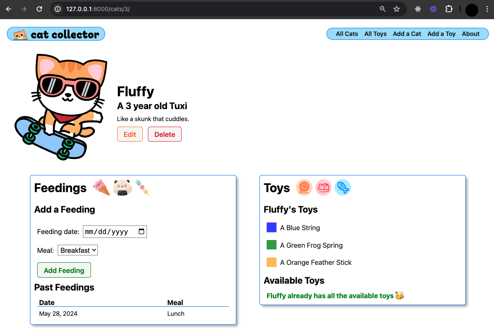</p>

<h2 id="-you-do-remove-a-toy-from-a-cat">🎓 You Do: Remove a <code>Toy</code> from a <code>Cat</code></h2>

<p>Implement the following user story:</p>

<p><em>As a User, when viewing the detail page for a cat, I want to be able to remove a toy from that cat</em></p>

<p>This process will be nearly identical to what we did when adding an association, but with the opposite action.</p>

<ol>
  <li>
    <p>Define the URL.</p>

    <pre><code class="language-python">path('cats/&lt;int:cat_id&gt;/remove-toy/&lt;int:toy_id&gt;/', views.remove_toy, name='remove-toy'),

</code></pre>

  </li>
  <li>
    <p>Create the view function. <em>Hint: Check out Django’s <strong><a href="https://docs.djangoproject.com/en/5.1/ref/models/relations/#django.db.models.fields.related.RelatedManager.remove">.remove()</a></strong> method.</em></p>

    <pre><code class="language-python">def remove_toy(request, cat_id, toy_id):
    # Look up the cat
    # Look up the toy
    # Remove the toy from the cat
    return redirect('cat-detail', cat_id=cat.id)

</code></pre>

  </li>
  <li>
    <p>Update the template. Where should this form be added?</p>

    <pre><code class="language-html">&lt;form action="" method="post"&gt;


&lt;button type="submit" class="btn btn-danger"&gt;Remove Toy&lt;/button&gt;
&lt;/form&gt;
</code></pre>

  </li>
</ol>

<h1>
  <span class="headline">Cat Collector</span>
  <span class="subhead">Django Authentication</span>
</h1>

<!--  -->

<p><strong>Learning objective:</strong> By the end of this lesson, students will be able enable authentication and authorization in a Django app.</p>

<h2 id="authentication-in-django">Authentication in Django</h2>

<p>By default, Django creates projects with authentication and authorization capabilities pre-installed!</p>

<p>Django’s built-in authentication functionality is provided by the <code>'django.contrib.auth'</code> app included within the <code>INSTALLED_APPS</code> list in <code>settings.py</code>:</p>

<pre><code class="language-python">INSTALLED_APPS = [
    'main_app',
    'django.contrib.admin',
    'django.contrib.auth',         # Thank You Django!
    'django.contrib.contenttypes',
    'django.contrib.sessions',
    'django.contrib.messages',
    'django.contrib.staticfiles',
]
</code></pre>

<p>Django provides the common <strong>user</strong> authentication where the user signs up and logs in with a <strong>username</strong> and <strong>password</strong>.</p>

<p>Django relies on server-side sessions, implemented by the <code>'django.contrib.sessions'</code> app, to track when a user is logged in or out.</p>

<h2 id="the-user-model">The <code>User</code> Model</h2>

<p>At the core of Django’s authentication, is the provided <code>User</code> Model which by default has the following attributes:</p>

<ul>
  <li><code>username</code></li>
  <li><code>password</code></li>
  <li><code>email</code></li>
  <li><code>first_name</code></li>
  <li><code>last_name</code></li>
</ul>

<p>Although these attributes are fine for the Cat Collector, some projects may need additional attributes such as <code>birth_date</code>, <code>favorite_color</code>, etc.</p>

<h2 id="creating-the-user---cat-relationship">Creating the <code>User -&lt; Cat</code> relationship</h2>

<p>Currently, our application treats all cats as if they don’t belong to any specific user— free-roaming cats! By the end of this lesson, we will have implemented user authentication, ensuring that each cat is linked to a specific user who “owns” them, the <em>cat collector</em>.</p>

<blockquote>
  <p>Ideally, authentication should be set up early in the development process to simplify code management. However, for educational purposes, we’re integrating it at the end of our project to highlight the changes it requires.</p>
</blockquote>

<h2 id="update-the-cat-model">Update the <code>Cat</code> model</h2>

<p>Adding the relationship of <strong><em>A User has many Cats; and a Cat belongs to a User</em></strong> is much the same as with creating any other one-to-many relationship.</p>

<p>The <code>User</code> Model lives in the <code>django.contrib.auth</code> app, so the first thing we need to do is import it into <code>models.py</code>:</p>

<pre><code class="language-python">from django.db import models
from django.urls import reverse
from datetime import date
# Import the User
from django.contrib.auth.models import User
</code></pre>

<p>One of the Models needs a <em>Foreign Key</em> - <code>User</code> or <code>Cat</code>… Which one makes sense?</p>

<p><strong>Since the <code>Cat</code> Model belongs to another entity, it’s the one to hold the Foreign Key.</strong></p>

<p>Now let’s add the field linking a <code>Cat</code> to a <code>User</code>:</p>

<pre><code class="language-python">class Cat(models.Model):
    # Other Cat class items above
    toys = models.ManyToManyField(Toy)
    # Add the foreign key linking to a user instance
    user = models.ForeignKey(User, on_delete=models.CASCADE)
</code></pre>

<h2 id="migrate-the-change">Migrate the change</h2>

<p>Now that we’ve made a change to a Model that impacts the database, we need to migrate that change.</p>

<p>However, there will now be a <code>FK</code> constraint on cats, which means that every cat record must hold the PK of a user record and because there are existing cats, Django will prompt us with two options.</p>

<p>In your terminal enter the following:</p>

<pre><code class="language-bash">python3 manage.py makemigrations
</code></pre>

<p>Which then presents us with this message:</p>

<pre><code class="language-plaintext">You are trying to add a non-nullable field 'user' to cat without a default;
we can't do that (the database needs something to populate existing rows).
Please select a fix:
 1) Provide a one-off default now (will be set on all existing rows with a null value for this column)
 2) Quit, and let me add a default in models.py
Select an option:
</code></pre>

<p>Option <code>1)</code> is our best option because it will allow us to enter the <code>id</code> of a user, which we created in an earlier lesson (the superuser).</p>

<p>Press <code>1</code> and <code>[enter]</code>, which will then prompt us to enter that value:</p>

<pre><code class="language-plaintext">Please enter the default value now, as valid Python
The datetime and django.utils.timezone modules are available,
so you can do e.g. timezone.now
Type 'exit' to exit this prompt
&gt;&gt;&gt;
</code></pre>

<p>Our superuser’s <code>id</code> should be <code>1</code>, so type <code>1</code> and press <code>[enter]</code>.</p>

<p>The migration file will then be created. Let’s migrate the changes. In your terminal enter the following:</p>

<pre><code class="language-bash">python3 manage.py migrate
</code></pre>

<p>Congrats, the one-to-many relationship between <code>User</code> and <code>Cat</code> has been established and all existing cats have been collected by the superuser!</p>

<h2 id="adding-urls-for-authentication">Adding URLs for authentication</h2>

<p>Excluding login, we’re going to use Django’s built-in authentication features and default settings.</p>

<p>Django provides several class-based views that we can use for handling logging in and logging out.</p>

<p>However, before we can use those views, we’ll need URLs to map to them.</p>

<p>Lucky for us, the <code>django.contrib.auth</code> module contains predefined URLS that we can simply <code>include</code> like this in <strong><code>catcollector/urls.py</code></strong>.</p>

<p>Let’s do so now:</p>

<pre><code class="language-python">    # Other paths above
    path('admin/', admin.site.urls),
    path('', include('main_app.urls')),
    # include the built-in auth urls for the built-in views
    path('accounts/', include('django.contrib.auth.urls')),
</code></pre>

<p>We don’t need to import <code>django.contrib.auth.urls</code> because it’s just a string.</p>

<p>Including the built-in URLs has added the following URL patterns to the app:</p>

<pre><code class="language-python">accounts/login/ [name='login']
accounts/logout/ [name='logout']
accounts/password_change/ [name='password_change']
accounts/password_change/done/ [name='password_change_done']
accounts/password_reset/ [name='password_reset']
accounts/password_reset/done/ [name='password_reset_done']
accounts/reset/&lt;uidb64&gt;/&lt;token&gt;/ [name='password_reset_confirm']
accounts/reset/done/ [name='password_reset_complete']
</code></pre>

<p>Thankfully, not all of these are required. We are able to choose which ones to implement.</p>

<h2 id="logging-in">Logging in</h2>

<h3 id="modifying-the-homehtml-template">Modifying the <code>home.html</code> template</h3>

<p>We’re going to convert the existing <code>home</code> view function to a CBV that inherits from the <code>LoginView</code> class.</p>

<p>First import this class into <code>main_app/views.py</code>:</p>

<pre><code class="language-python">from django.contrib.auth.views import LoginView
</code></pre>

<p>And use it in a class based view that <strong><em>replaces</em></strong> the current home view function.</p>

<pre><code class="language-python">class Home(LoginView):
    template_name = 'home.html'
</code></pre>

<p>Don’t forget to update <code>main_app/urls.py</code> to use the new CBV.</p>

<pre><code class="language-python">path('', views.Home.as_view(), name='home'),
</code></pre>

<p>When <code>LoginView</code> renders the <code>home.html</code> template, it passes in the context a default <code>form</code> object we can display in <code>home.html</code>.</p>

<p>Add it after the existing section:</p>

<pre><code class="language-html">&lt;section&gt;
  &lt;form action="" method="post" class="login"&gt;
    &lt;h1&gt;Login&lt;/h1&gt;
     {{ form.as_p }}
    &lt;input type="hidden" name="next" value="{{ next }}" /&gt;
    &lt;button type="submit" class="btn submit"&gt;Login&lt;/button&gt;
  &lt;/form&gt;
&lt;/section&gt;


</code></pre>

<p>One interesting feature in the above code is the following input:</p>

<pre><code class="language-html">&lt;input type="hidden" name="next" value="{{ next }}" /&gt;
</code></pre>

<p>This is a feature of Django’s authentication that will automatically redirect a user that tries to access a protected route back to that route after they log in!</p>

<p>Here’s our new home page!</p>

<p>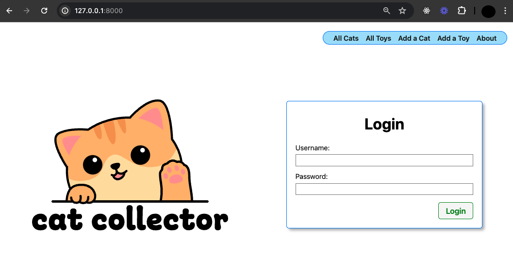</p>

<p>You can log in now, but you’ll get an error because by default, the login view redirects to <code>/accounts/profile</code>, but we can change this…</p>

<h2 id="specifying-the-default-redirect-after-logging-in">Specifying the default redirect after logging in</h2>

<p>In Cat Collector, when a user logs in, we want them to see their cat <em>index</em> page.</p>

<p>The most straight forward way to make this happen is to add a new variable at the bottom of <code>settings.py</code>:</p>

<pre><code class="language-python">STATIC_URL = 'static/'

# Add this variable to specify where successful logins should redirect to
LOGIN_REDIRECT_URL = 'cat-index'
</code></pre>

<p>The <code>django.contrib.auth</code> app uses that value of the <code>LOGIN_REDIRECT_URL</code> variable, if it exists, to redirect to after the user logs in.</p>

<p>Test it out!</p>

<h2 id="updating-the-nav-bar-dynamically">Updating the nav bar dynamically</h2>

<p>In most applications, many of the links displayed in a nav bar usually depend upon whether there is a logged in user or not.</p>

<p>In Cat Collector, if there’s no user logged in, all we want is to show the following links:</p>

<ul>
  <li>About</li>
  <li>Sign Up</li>
  <li>Log In</li>
</ul>

<p>Then, when there is a logged in user, we want to see:</p>

<ul>
  <li>About</li>
  <li>Add a Toy</li>
  <li>View All Toys</li>
  <li>Add a Cat</li>
  <li>View All My Cats</li>
  <li>Log Out</li>
</ul>

<p>Thanks again to the built-in auth, we automatically have a <code>user</code> variable available in every template!</p>

<p>To check if the user is logged in, we simply use <code>user.is_authenticated</code>, which returns <code>True</code> when logged in and <code>False</code> otherwise.</p>

<p>With this knowledge, let’s make the nav bar dynamic in <code>base.html</code>:</p>

<pre><code class="language-html">&lt;nav&gt;
  &lt;ul&gt;
    
      &lt;li&gt;&lt;a href=""&gt;All Cats&lt;/a&gt;&lt;/li&gt;
      &lt;li&gt;&lt;a href=""&gt;All Toys&lt;/a&gt;&lt;/li&gt;
      &lt;li&gt;&lt;a href=""&gt;Add a Cat&lt;/a&gt;&lt;/li&gt;
      &lt;li&gt;&lt;a href=""&gt;Add a Toy&lt;/a&gt;&lt;/li&gt;
      &lt;li&gt;&lt;a href=""&gt;About&lt;/a&gt;&lt;/li&gt;
    
      &lt;li&gt;&lt;a href=""&gt;About&lt;/a&gt;&lt;/li&gt;
      &lt;li&gt;&lt;a href=""&gt;Login&lt;/a&gt;&lt;/li&gt;
    
  &lt;/ul&gt;
&lt;/nav&gt;
</code></pre>

<p>Note how the <strong>Log In</strong> link uses the <code>url</code> template tag along with the built-in named URL patterns (listed above).</p>

<p>However, we’re skipping the <strong>Sign Up</strong> and <strong>Log Out</strong> links for now, because Django requires a bit of extra configuration for these actions.</p>

<p>Now we should see the following nav if not logged in:</p>

<p></p>

<p>When you log in, you’ll see this nav:</p>

<p></p>

<p>Nice!</p>

<p>We also want to prevent the login form from being shown when there is a user logged in. A simple <code>if</code> template tag in <code>home.html</code> will accomplish this:</p>

<pre><code class="language-html">
  &lt;section&gt;
    &lt;form action="" method="post" class="login"&gt;
      &lt;h1&gt;Login&lt;/h1&gt;
       {{ form.as_p }}
      &lt;input type="hidden" name="next" value="{{ next }}" /&gt;
      &lt;button type="submit" class="btn submit"&gt;Login&lt;/button&gt;
    &lt;/form&gt;
  &lt;/section&gt;

</code></pre>

<h2 id="logging-out">Logging out</h2>

<p>Django’s authentication framework provides built-in support for logging out, but <a href="https://docs.djangoproject.com/en/5.1/releases/4.1/#log-out-via-get">recent security practices</a> require that <code>logout</code> actions be submitted via a <code>POST</code> request instead of a <code>GET</code> request. This means we can’t use a simple link to log out; instead, we need a form.</p>

<p>First, we need to integrate a <code>logout</code> form into your existing navbar. Here’s how to place the form in the navbar using an <code>&lt;li&gt;</code> element:</p>

<pre><code class="language-html">  &lt;li&gt;&lt;a href=""&gt;All Cats&lt;/a&gt;&lt;/li&gt;
  &lt;li&gt;&lt;a href=""&gt;All Toys&lt;/a&gt;&lt;/li&gt;
  &lt;li&gt;&lt;a href=""&gt;Add a Cat&lt;/a&gt;&lt;/li&gt;
  &lt;li&gt;&lt;a href=""&gt;Add a Toy&lt;/a&gt;&lt;/li&gt;
  &lt;li&gt;&lt;a href=""&gt;About&lt;/a&gt;&lt;/li&gt;
  &lt;li&gt;
    &lt;form id="logout-form" method="post" action=""&gt;
      
      &lt;button type="submit"&gt;Log out&lt;/button&gt;
    &lt;/form&gt;
  &lt;/li&gt;

  &lt;li&gt;&lt;a href=""&gt;About&lt;/a&gt;&lt;/li&gt;
  &lt;li&gt;&lt;a href=""&gt;Login&lt;/a&gt;&lt;/li&gt;
</code></pre>

<p>Check it out:</p>

<p>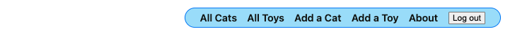</p>

<h3 id="style-the-form-button">Style the form button</h3>

<p>The new form button kinda ruins the aesthetic, but with a bit of styling, we can make these links appear uniform!</p>

<p>Add the following at the bottom of <code>base.css</code>:</p>

<pre><code class="language-css">#logout-form button {
  text-decoration: none;
  color: var(--text-color);
  font-weight: 600;
  font-size: 16px;
  background: none;
  border: none;
  cursor: pointer;
  padding: 0;
  font-family: inherit;
}

#logout-form button:hover {
  color: var(--link-hover-color);
}
</code></pre>

<p>These styles remove default button styling and make the logout button look like a part of the navigation links. Much better!</p>

<p></p>

<h3 id="redirect-after-logging-out">Redirect after logging out</h3>

<p>Finally, specify a redirection path for after users log out. By default, Django redirects to <code>http://127.0.0.1:8000/admin/logout/</code> for the admin, but you can customize this for all users in <code>settings.py</code>:</p>

<pre><code class="language-python">STATIC_URL = 'static/'

LOGIN_REDIRECT_URL = 'cat-index'

# Add this variable to specify where logging out redirects to
LOGOUT_REDIRECT_URL = 'home'
</code></pre>

<p>Logout is complete!</p>

<h2 id="update-the-catcreate-view-to-assign-a-new-cat-to-the-logged-in-user">Update the <code>CatCreate</code> view to assign a new cat to the logged in user</h2>

<p>Since cats belong to a user, before a new cat can be added to the database, its “owner” is going to have to be assigned to the <code>user</code> attribute we added to the model earlier.</p>

<p>To do this, we’re going to have to add some additional code to the <code>CatCreate</code> view as follows:</p>

<pre><code class="language-python">class CatCreate(CreateView):
    model = Cat
    fields = ['name', 'breed', 'description', 'age']

    # This inherited method is called when a
    # valid cat form is being submitted
    def form_valid(self, form):
        # Assign the logged in user (self.request.user)
        form.instance.user = self.request.user  # form.instance is the cat
        # Let the CreateView do its job as usual
        return super().form_valid(form)
</code></pre>

<p>We’re overriding the <code>CreateView</code>’s <code>form_valid</code> method to assign the logged in user, <code>self.request.user</code>. Yes, the built-in auth automatically assigns the user to the <code>request</code> object similarly our middleware in Express.</p>

<p>In Python, methods inherited by the superclass can be invoked by prefacing the method name with <code>super()</code>. Accordingly, after updating the form to include the user, we’re calling <code>super().form_valid(form)</code> to let the <code>CreateView</code> do its usual job of creating the model in the database and redirecting.</p>

<p>Okay, let’s test the refactor by:</p>

<ul>
  <li>Navigating to the <code>/admin</code> route in a separate tab in your browser</li>
  <li>Click on <strong>Cats</strong></li>
  <li>Select a cat and verify the user is assigned to it</li>
  <li>Leave the admin app open, and add a new cat from the “Add a Cat” page</li>
  <li>Back in the admin app, view all cats, select the cat you just added, and verify that the user’s been assigned</li>
</ul>

<p>Nice work!</p>

<h2 id="signing-up-new-users">Signing up new users</h2>

<p>Unfortunately, Django’s built-in auth does not provide a URL or view for signing up new users. We will add this custom functionality ourselves.</p>

<h3 id="add-a-url">Add a URL</h3>

<p>First we’ll add the last URL pattern to this application, which will implement the sign up functionality in <code>main_app/urls.py</code>:</p>

<pre><code class="language-python">path('accounts/signup/', views.signup, name='signup'),
</code></pre>

<p>To stay consistent with Django’s auth-related URLs, we’ll preface the pattern with <code>accounts/</code>.</p>

<p>There’s no generic view available for this function, so we’re going to write a new view function named <code>signup</code>.</p>

<h2 id="add-the-signup-view-function">Add the <code>signup</code> view function</h2>

<p>The <code>signup</code> view function will be the first view we’ve coded that performs two different behaviors based upon whether it was called via a <code>GET</code> or <code>POST</code> request:</p>

<ul>
  <li>If it’s a <strong>GET request</strong>: The view function should render a template with a form for the user to enter their info.</li>
  <li>If it’s a <strong>POST request</strong>: The user has submitted their info and the function should create the user and redirect.</li>
</ul>

<p>Although Django does not include a default URL or view, it <strong>does</strong> include a <code>UserCreationForm</code> that we can use in a template to generate all of the form inputs for a <code>User</code> model.</p>

<p>In addition, we’re also going to use the <code>login</code> function to automatically log in a user when they sign up - users hate signing up and then having to turn around and log in!</p>

<p>Let’s import these methods near the top of <strong><code>views.py</code></strong>:</p>

<pre><code class="language-python"># Other imports above
from django.views.generic import ListView, DetailView
# Add the two imports below
from django.contrib.auth import login
from django.contrib.auth.forms import UserCreationForm
# Other code below
</code></pre>

<p>Now let’s create the <code>signup</code> view function:</p>

<pre><code class="language-python">def signup(request):
    error_message = ''
    if request.method == 'POST':
        # This is how to create a 'user' form object
        # that includes the data from the browser
        form = UserCreationForm(request.POST)
        if form.is_valid():
            # This will add the user to the database
            user = form.save()
            # This is how we log a user in
            login(request, user)
            return redirect('cat-index')
        else:
            error_message = 'Invalid sign up - try again'
    # A bad POST or a GET request, so render signup.html with an empty form
    form = UserCreationForm()
    context = {'form': form, 'error_message': error_message}
    return render(request, 'signup.html', context)
    # Same as:
    # return render(
    #     request,
    #     'signup.html',
    #     {'form': form, 'error_message': error_message}
    # )
</code></pre>

<blockquote>
  <p>When building future projects in Django you can always refer back to this function or Django’s documentation on how to implement this functionality.</p>
</blockquote>

<h2 id="add-the-sign-up-link-to-the-nav">Add the <strong>Sign Up</strong> link to the nav</h2>

<p>Now that we know the URL, we can add a <strong>Sign Up</strong> link to the nav in <code>base.html</code>:</p>

<pre><code class="language-html">
  &lt;li&gt;&lt;a href=""&gt;About&lt;/a&gt;&lt;/li&gt;
  &lt;li&gt;&lt;a href=""&gt;Login&lt;/a&gt;&lt;/li&gt;
  &lt;li&gt;&lt;a href=""&gt;Sign Up&lt;/a&gt;&lt;/li&gt;

</code></pre>

<h2 id="create-the-signuphtml-template">Create the <strong><code>signup.html</code></strong> template</h2>

<p>Run the following in the terminal:</p>

<pre><code class="language-bash">touch main_app/templates/signup.html
</code></pre>

<p>Add the following to <code>signup.html</code>:</p>

<pre><code class="language-html">


&lt;link rel="stylesheet" href="" /&gt;


&lt;div class="page-header"&gt;
  &lt;h1&gt;Sign Up&lt;/h1&gt;
  &lt;img src="" alt="A cat using a computer" /&gt;
&lt;/div&gt;

  &lt;p class="red-text"&gt;{{ error_message }}&lt;/p&gt;

&lt;form action="" method="post" class="form-container" autocomplete="off"&gt;
  
  &lt;table&gt;
    {{ form.as_table }}
  &lt;/table&gt;
  &lt;button type="submit" class="btn submit"&gt;Submit!&lt;/button&gt;
&lt;/form&gt;


</code></pre>

<p>With the above template, clicking the Sign Up in the nav should render the following UI:</p>

<p>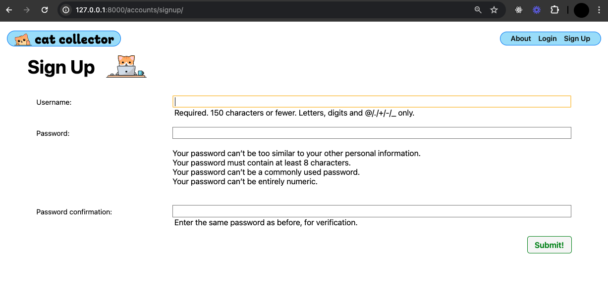</p>

<p>By using the the <code>UserCreationForm</code>, you get helpful messages with all of the validations.</p>

<p>However, notice that the form does not include inputs for the user’s:</p>

<ul>
  <li><code>email</code></li>
  <li><code>first_name</code></li>
  <li><code>last_name</code></li>
</ul>

<p>To include these, you’ll have to create your own <code>ModelForm</code> based upon the <code>User</code> Model.</p>

<p>If you want to remove some of the password validations, you can comment them out or remove them from the <code>AUTH_PASSWORD_VALIDATORS</code> list in <code>settings.py</code>.</p>

<p>You should now be able to sign up!</p>

<h2 id="displaying-only-the-users-cats">Displaying only the user’s cats</h2>

<p>If you sign up or log in with a different user, you’ll notice that all of the cats in the database are still showing up on the <em>index</em> page.</p>

<p>If we take a look at the <code>cat_index</code> view, we’ll see why:</p>

<pre><code class="language-python">def cat_index(request):
    # This reads ALL cats, not just the logged in user's cats
    cats = Cat.objects.all()
    return render(request, 'cats/index.html', { 'cats': cats })
</code></pre>

<p>To display just the logged in user’s cats, we just need to change the query to this:</p>

<pre><code class="language-python">def cat_index(request):
    cats = Cat.objects.filter(user=request.user)
    # You could also retrieve the logged in user's cats like this
    # cats = request.user.cat_set.all()
    return render(request, 'cats/index.html', { 'cats': cats })
</code></pre>

<p>Last step, coming up!</p>

<h2 id="implement-authorization">Implement Authorization</h2>

<p>Now that authentication has been implemented, the last step is to protect the routes that are dependent upon a user being logged in.</p>

<p>Yes, the dynamic nav bar helps prevent access, but users can still type something like <code>http://127.0.0.1:8000/cats</code> in the address bar when nobody is logged in, which will raise an error.</p>

<p>Django provides an easy way to protect both function and class-based views.</p>

<h2 id="implement-authorization-on-view-functions">Implement Authorization on view functions</h2>

<p>To protect view functions, we will use the <code>login_required</code> decorator.</p>

<p>First we need to import it near the top of <code>views.py</code>:</p>

<pre><code class="language-python"># Other imports above
from django.contrib.auth.forms import UserCreationForm
# Import the login_required decorator
from django.contrib.auth.decorators import login_required
</code></pre>

<p>Now we can simply “decorate” any view function that requires a user to be logged in like this:</p>

<pre><code class="language-python">@login_required
def cat_index(request):
    # cat_index function code here
</code></pre>

<p>Trying to browse to <a href="http://127.0.0.1:8000/cats">http://127.0.0.1:8000/cats</a> while logged out - it throws an error!</p>

<p>To complete this, we need to tell Django where we want these decorators and mixins to redirect to. We just need to add a <code>LOGIN_URL</code> to our <code>settings.py</code> file and have it redirect to the <code>'home'</code> URL:</p>

<pre><code class="language-python">STATIC_URL = '/static/'

# Add this variable to specify where decorators and mixins should redirect to
LOGIN_URL = 'home'

LOGIN_REDIRECT_URL = 'cat-index'

LOGOUT_REDIRECT_URL = 'home'
</code></pre>

<p>You’ll now be navigated to the login page if you try to navigate to a protected URL without signing in.</p>

<p>Be sure to add the <code>@login_required</code> to these remaining view functions:</p>

<ul>
  <li><code>cat_detail</code></li>
  <li><code>add_feeding</code></li>
  <li><code>associate_toy</code></li>
  <li><code>remove_toy</code></li>
</ul>

<h2 id="implement-authorization-on-class-based-views">Implement Authorization on class-based views</h2>

<p>Protecting class-based views is slightly different, it uses what’s called a <code>mixin</code>, which is another class to inherit from - in OOP, we call this <em>multiple inheritance</em>.</p>

<p>As usual, we’ll need to import it:</p>

<pre><code class="language-python"># Other imports above
from django.contrib.auth.decorators import login_required
# Import the mixin for class-based views
from django.contrib.auth.mixins import LoginRequiredMixin
</code></pre>

<p>Finally, we can protect class-based views like this:</p>

<pre><code class="language-python">class CatCreate(LoginRequiredMixin, CreateView):
    # CatCreate class code here
</code></pre>

<p>Not all OOP languages support the concept of multiple inheritance, but Python does.</p>

<p>Be sure to add <code>LoginRequiredMixin</code> to these remaining classes:</p>

<ul>
  <li><code>CatUpdate</code></li>
  <li><code>CatDelete</code></li>
  <li><code>ToyCreate</code></li>
  <li><code>ToyList</code></li>
  <li><code>ToyDetail</code></li>
  <li><code>ToyUpdate</code></li>
  <li><code>ToyDelete</code></li>
</ul>

<h2 id="summary">Summary</h2>

<p>Authentication is a crucial component of most applications, as it determines user access to various features.</p>

<p>Understanding who is using your app is essential for delivering personalized and secure experiences. That’s why it’s best practice to implement authentication early in the development process. Typically, this should follow the initial user story for anonymous visitors:</p>

<p><em>As a Visitor, when I browse to the application, I want [insert feature here].</em></p>

<p>Congrats! You have completed <em>Cat Collector</em>!
<!--  --></p>

<h1>
  <span class="headline">Cat Collector</span>
  <span class="subhead">Adding a Custom Date Picker</span>
</h1>

<!--  -->

<p><strong>Learning objective:</strong> By the end of this lesson, learners will be able to integrate a custom date picker into a Django form using MCDatepicker.</p>

<h2 id="integrating-mcdatepicker-for-a-custom-date-picker">Integrating <code>MCDatepicker</code> for a custom date picker</h2>

<p>We’re enhancing the user experience on the cat details page by incorporating the <a href="https://mcdatepicker.netlify.app/"><strong>MCDatepicker</strong></a>, a feature-rich date picker. This tool will allow users to easily select dates through a visually appealing interface. Start by including its necessary files through their CDN links in the HTML head of the detail page. Place these links before your existing CSS to ensure styles load correctly.</p>

<p>In <code>detail.html</code>:</p>

<pre><code class="language-html">
&lt;!-- New MCDatepicker CSS --&gt;
&lt;link
  href="https://cdn.jsdelivr.net/npm/mc-datepicker/dist/mc-calendar.min.css"
  rel="stylesheet"
/&gt;
&lt;link rel="stylesheet" href=""&gt;
&lt;!-- MCDatepicker JS --&gt;
&lt;script
  src="https://cdn.jsdelivr.net/npm/mc-datepicker/dist/mc-calendar.min.js"
&gt;
&lt;/script&gt;
&lt;!-- Existing CSS --&gt;
&lt;link rel="stylesheet" href="" /&gt;

</code></pre>

<p>Next, create a new CSS file specifically for styling the MCDatepicker elements:</p>

<pre><code class="language-bash">touch main_app/static/css/mcdp.css
</code></pre>

<p>In this new CSS file, adjust the sizing and spacing of the MCDatepicker’s display elements to better fit the theme of your application:</p>

<pre><code class="language-css">.mc-display__day,
.mc-display__date,
.mc-display__month,
.mc-display__year,
.mc-select__data,
.mc-btn--danger,
.mc-btn--success,
.mc-date,
.mc-table__weekday,
.mc-picker__footer {
  font-size: 1.6rem;
  padding: .5rem;
}

.mc-display__date {
  font-size: clamp(8rem, 40vw, 11.2rem);
}

.mc-select__data--month,
.mc-select__data--month span,
.mc-select__data--year,
.mc-select__data--year span {
  width: auto;
  min-width: 8rem;
  max-width: 10rem;
}
</code></pre>

<h3 id="setting-up-javascript-for-mcdatepicker">Setting up javaScript for MCDatepicker</h3>

<p>For JavaScript functionality, create a new directory for scripts and add a new script file:</p>

<pre><code class="language-bash">mkdir main_app/static/js
touch main_app/static/js/cat-detail.js
</code></pre>

<p>Inside this new script file, initialize the MCDatepicker on the feeding date input field. Make sure the script loads after the DOM is ready by using the <code>defer</code> attribute:</p>

<pre><code class="language-html">&lt;script defer src=""&gt;&lt;/script&gt;
</code></pre>

<p>Implement the MCDatepicker setup in the <code>cat-detail.js</code>:</p>

<pre><code class="language-jsx">const dateInput = document.getElementById('id_date'); // Select the date input by ID

// Create a date picker instance
const picker = MCDatepicker.create({
  el: '#id_date',
  dateFormat: 'yyyy-mm-dd', // Set the desired date format
  closeOnBlur: true, // Close picker when clicking outside
  selectedDate: new Date() // Default to today's date
});

// Open the date picker when the input is clicked
dateInput.addEventListener("click", () =&gt; {
  picker.open();
});
</code></pre>

<p>With these steps, you’ve not only improved the functionality of your application but also made the date selection process more intuitive and visually pleasing. Test the new date picker by interacting with the Feeding Date input on the cat detail page. You should see a modern, easy-to-use calendar pop up, making date selection smoother and more integrated with your site’s design.</p>

<p>Refresh and test it out by clicking inside of Feeding date input - you should see an awesome date-picker pop up like this:</p>

<p>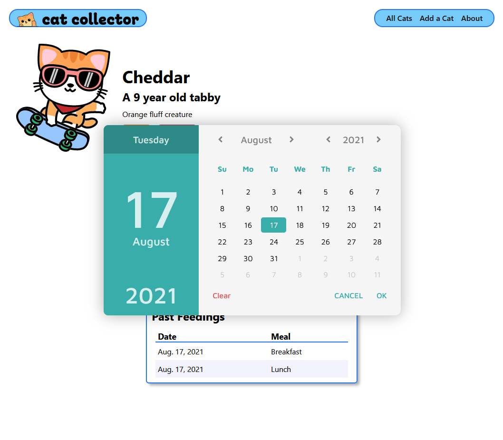</p>

<h1>
  <span class="headline">Cat Collector</span>
  <span class="subhead">Adding Custom Model Methods</span>
</h1>

<!--  -->

<p><strong>Learning objective:</strong> By the end of this lesson, learners will be able to implement custom methods within Django models to manage and display business logic, specifically to check and display a cat’s daily feeding status.</p>

<p>In this lesson, we’re enhancing our cat feedings by adding notifications that indicate whether a cat has been fed for the day.</p>

<h2 id="adding-a-custom-method-to-check-the-feeding-status">Adding a custom method to check the feeding status</h2>

<p>A good practice in application development is to place business logic within the models, a concept known as “fat models / skinny views.” This practice helps keep your code clean and avoids repetition.</p>

<blockquote>
  <p>“Business logic” is a set of rules that determine how data can be created, stored, and changed. This logic includes any calculations or decisions that the application needs to make according to what the business requires. In the business of feeding cats, this includes messages to the user about whether their cats have been fed or not.</p>
</blockquote>

<p>We will add a method to the <code>Cat</code> Model that determines if the cat has received enough feedings for the day, matching the number of <code>MEALS</code> defined.</p>

<h3 id="visual-indicators-for-feeding-status">Visual indicators for feeding status</h3>

<p>When a cat has not been fully fed for the day, we’ll show:</p>

<p>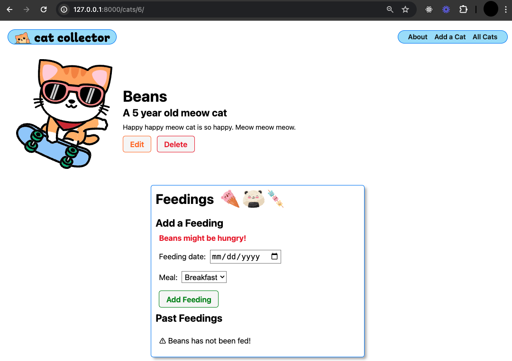</p>

<p>When the cat has received all its meals for the day:</p>

<p>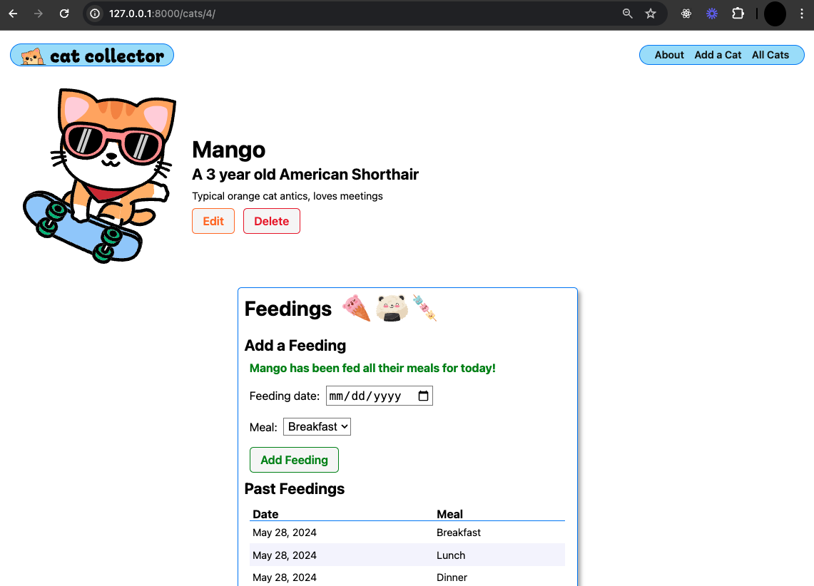</p>

<h2 id="the-fed_for_today-custom-model-method">The <code>fed_for_today</code> Custom Model Method</h2>

<p>Now, we’ll implement a method in the Cat Model to check if the cat is fed enough for the day:</p>

<pre><code class="language-python">from django.db import models
from django.urls import reverse
from datetime import date  # Import date at the top of the models file

class Cat(models.Model):
    # Other class items here

    # add this new method
    def fed_for_today(self):
        return self.feeding_set.filter(date=date.today()).count() &gt;= len(MEALS)
</code></pre>

<p>This method uses <code>filter()</code> to gather today’s feedings into a <code>&lt;QuerySet&gt;</code>, then uses <code>count()</code> to determine if the count meets or exceeds the number of meals. This method is more efficient than fetching all objects just to count them, as it avoids unnecessary data transfer from the database.</p>

<h2 id="update-the-detailhtml-template">Update the <code>detail.html</code> Template</h2>

<p>Lastly, we update the <code>detail.html</code> template to display the feeding status:</p>

<pre><code class="language-html">&lt;form
  action=""
  method="post"
  class="subsection-content"
&gt;
  
  &lt;p class="fed"&gt;{{cat.name}} has been fed all their meals for today!&lt;/p&gt;
  
  &lt;p class="unfed"&gt;{{cat.name}} might be hungry!&lt;/p&gt;
  
  
  {{ feeding_form.as_p }}
  &lt;button type="submit" class="btn submit"&gt;Add Feeding&lt;/button&gt;
&lt;/form&gt;
</code></pre>

<blockquote>
  <p>Notice the classes to change the color of the text to <code>red</code> or <code>green</code> based on the feeding status.</p>
</blockquote>

<p>This template now dynamically displays a message based on whether the cat has been fully fed for the day.</p>

<p>Congrats on using a custom Model method to implement business logic!
<!--  --></p>
