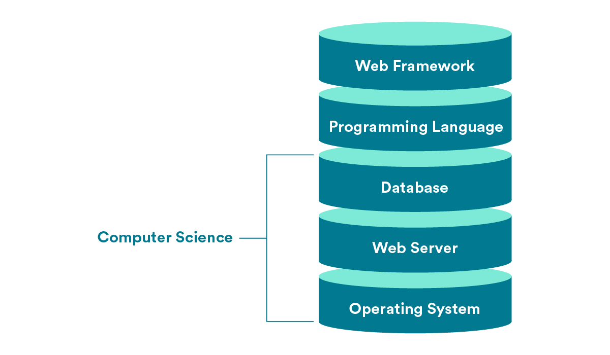

# Intro to Computer Science

Computer science is the study of the nature of computation; in other words, the study of problems, standardized solutions to those problems, and how to make those solutions more efficient.

## Layers of Abstraction

Computer science is, by definition, an abstract field of study.

The way that most people use computers — sending emails, browsing websites, creating documents — is like sitting in the driver’s seat of a car. Even writing code and building web applications is similarly abstract. You’re using functions, tools, and languages created by other engineers to make cool stuff.

Computer science studies all of the “under the hood” mechanics of computers that most people don’t think about. What actually is a programming language? Isn’t it crazy that they can be read across so many different machines? And how do you get from binary 0s and 1s to what you see on your screen?

In computer science, we’re cutting through those layers of abstraction down to how stuff really works.

Computer science deals mostly with parts of the tech stack you may not be interacting with all that much. Most of the programming you’re doing — building applications and websites that users interact with — sits at higher levels in the stack.

But computer science comes into play much lower in the stack, when you’re thinking about interactions between a database, a server, and your operating system.

## Computer Science Interviews

Here are the sorts of CS questions you might encounter in a job interview. (Spoiler alert: You may not know what all of these questions are about, but by the end of this computer science unit, you will!)

## Our Focus in Computer Science (CS)

We’ll focus on the principles of computing — in other words, how computers approach and solve problems. The two important factors here are:

- **Algorithms**, or step-by-step processes for solving a problem.
- **Data structures**, or the way that information is organized in order to solve a problem.

Algorithms and data structures are two areas of computer science that come up frequently in technical interviews. The concepts we’ll cover here are ones that you may be asked to think through and whiteboard out.
